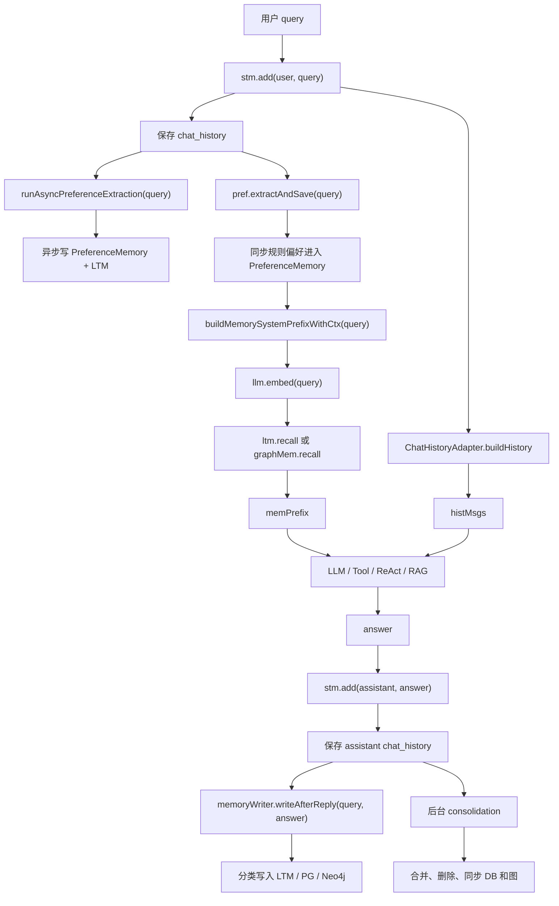

# 32-记忆系统完整例子跑一遍

## 1. 一句话结论

这一篇只做一件事：

```text
用一轮真实对话，把短期记忆、偏好记忆、长期记忆、图记忆、召回、写入、合并全部串起来。
```

你面试时不要只背：

```text
我做了短期记忆、长期记忆、图记忆。
```

要能讲成一条链路：

```text
用户问题进来
短期记忆先写入
偏好同步/异步抽取
长期/图记忆同步召回
拼进 prompt
LLM 生成回答
回答写回短期记忆
回答后异步抽长期记忆
必要时后台 consolidation
再把内存、PostgreSQL、Neo4j 同步到最终一致
```

---

## 2. 这一篇在记忆系统里的位置

前面 00~31 是拆开学。

这一篇是合起来跑。

对应源码入口是：

```text
AGI-saber-java/src/main/java/com/agi/assistant/service/agent/UnifiedAgentService.java
```

核心方法是：

```java
private ChatResponse processInternal(String query, ChatRequest req, Consumer<StreamEvent> onEvent)
```

你可以把它理解成：

```text
一轮用户对话的总调度方法。
```

用户说一句话后，记忆系统大部分动作都能从这个方法里串起来。

---

## 3. 本例先准备一个用户问题

假设用户输入：

```text
我叫小李，我喜欢 Java 逐行解释。帮我复习图记忆怎么召回，顺便查一下上海天气。
```

这句话里同时包含 4 类信息：

```text
1. 身份信息：我叫小李
2. 偏好信息：我喜欢 Java 逐行解释
3. 学习问题：图记忆怎么召回
4. 工具/外部信息问题：上海天气
```

这也是为什么记忆系统不能只靠一招。

它需要：

```text
短期记忆保存最近上下文
偏好记忆保存用户稳定习惯
长期记忆保存值得以后使用的事实
图记忆保存记忆之间的顺序和相似关系
```

---

## 4. 一轮对话的总流程图



---

## 5. 第一步：用户问题进入短期记忆

源码：

```java
stm.add("user", query);
infra.saveChatHistory("user", query);
```

先说它在干什么：

```text
用户刚说的话，先写进最近聊天记录。
同时保存一份到数据库聊天历史。
```

生活类比：

```text
ShortTermMemory 像桌面上的便签纸。
当前聊天要用的最近几句话，先贴在桌面上。

chat_history 像档案柜。
就算程序重启，也能从数据库里查到历史聊天。
```

此时内存里的短期记忆大概是：

```text
ConversationMessage{
  role = "user",
  content = "我叫小李，我喜欢 Java 逐行解释。帮我复习图记忆怎么召回，顺便查一下上海天气。",
  timestamp = 当前时间
}
```

这里要注意：

```text
短期记忆保存的是原始对话。
它不负责判断这句话值不值得长期记住。
```

---

## 6. 第二步：偏好抽取有两条路

源码里有两条偏好抽取：

```java
runAsyncPreferenceExtraction(query);

String[] extracted = pref.extractAndSave(query);
```

这两条路不一样。

### 6.1 同步规则偏好抽取

源码：

```java
String[] extracted = pref.extractAndSave(query);
```

先说它在干什么：

```text
用简单规则从 query 里找“我叫”“我喜欢”“我爱”这类明显偏好。
```

特点：

```text
同步执行。
不调用大模型。
速度快。
但理解能力弱。
```

比如这句话：

```text
我叫小李，我喜欢 Java 逐行解释。
```

规则抽取可能会识别出：

```text
姓名 = 小李
喜好 = Java 逐行解释
```

但规则也可能切得不准。

例如它看到：

```text
我叫小李，我喜欢 Java 逐行解释。帮我复习图记忆怎么召回
```

如果规则写得粗，可能把后面一大段都当成姓名或偏好。

所以同步规则适合：

```text
简单、明显、格式固定的偏好。
```

不适合：

```text
复杂语义判断。
多意图句子。
隐含偏好。
```

### 6.2 异步 LLM 偏好抽取

源码：

```java
runAsyncPreferenceExtraction(query);
```

里面会启动新线程：

```java
new Thread(() -> {
    Map<String, String> kvs = llm.extractPreferences(query);
    ...
}, "preference-extract").start();
```

先说它在干什么：

```text
让大模型从用户原话里抽取更准确的偏好。
```

特点：

```text
异步执行。
会调用大模型。
理解能力更强。
但完成时间不稳定。
```

它可能抽出：

```text
{
  "姓名": "小李",
  "回答偏好": "喜欢 Java 逐行解释"
}
```

然后写入：

```text
PreferenceMemory
PostgreSQL preferences 表
LongTermMemory
PostgreSQL long_term_memory 表
如果启用图记忆，还会写 Neo4j
```

关键点：

```text
异步 LLM 偏好抽取不保证本轮回答一定用上。
它主要稳定影响后续对话。
```

---

## 7. 第三步：回答前同步召回长期/图记忆

这是你刚问过的重点。

结论：

```text
召回不是异步。
召回是回答前同步执行。
```

源码：

```java
String memPrefix = buildMemorySystemPrefixWithCtx(query);
```

继续进入：

```java
List<Double> queryEmb = llm.embed(query);

List<MemoryItem> recalled = (graphMem != null
        ? graphMem.recall(query, cfg.getMemory().getLongTermTopK(), queryEmb)
        : ltm.recall(query, cfg.getMemory().getLongTermTopK(), queryEmb));
```

先说它在干什么：

```text
在回答用户之前，系统先拿 query 去长期记忆里找相关内容。
找到后拼进 system prompt，让 LLM 带着记忆回答。
```

为什么必须同步？

```text
因为召回结果会直接影响当前回答质量。
如果召回还没完成就回答，LLM 就看不到相关记忆。
```

所以当前链路是：

```text
先召回
再回答
```

不是：

```text
边回答边召回
```

---

## 8. 第四步：长期记忆召回怎么做

长期记忆里存的是 `MemoryItem`。

例子：

```text
MemoryItem A
id = 101
content = "用户正在学习 AGI-saber 记忆系统"
importance = 0.8
category = "general"
tags = ["记忆系统", "面试"]
embedding = [0.12, -0.03, 0.44, ...]

MemoryItem B
id = 102
content = "用户喜欢 Java 代码逐行解释"
importance = 0.7
category = "preference"
tags = ["Java", "代码解释"]
embedding = [0.18, 0.21, -0.09, ...]

MemoryItem C
id = 103
content = "用户默认查询城市是上海"
importance = 0.7
category = "preference"
tags = ["城市", "天气"]
embedding = [0.31, 0.02, 0.15, ...]
```

召回时先把用户问题转成向量：

```text
queryEmbedding = llm.embed("帮我复习图记忆怎么召回，顺便查一下上海天气")
```

然后和每条记忆算相似度：

```text
sim(query, MemoryItem.embedding)
```

最后算 score：

```text
score = sim * 0.7 + importance * 0.3
```

例子：

```text
Memory A:
sim = 0.82
importance = 0.8
score = 0.82 * 0.7 + 0.8 * 0.3 = 0.814

Memory B:
sim = 0.65
importance = 0.7
score = 0.65 * 0.7 + 0.7 * 0.3 = 0.665

Memory C:
sim = 0.70
importance = 0.7
score = 0.70 * 0.7 + 0.7 * 0.3 = 0.70
```

然后按 score 排序取 topK。

---

## 9. 分类过滤不能太细

如果做了改进版分类召回，推荐是：

```text
先 category 粗过滤
再 embedding + score 排序
tags 只在非常明确时做细过滤
```

为什么？

因为本例是多意图 query：

```text
帮我复习图记忆怎么召回，顺便查一下上海天气
```

它同时涉及：

```text
图记忆学习
上海天气
用户回答偏好
```

如果你把过滤条件写成：

```text
requiredTags = ["图记忆", "天气", "上海", "面试"]
```

当前 `requiredTags` 是 AND 关系。

意思是：

```text
一条记忆必须同时包含这 4 个 tag 才能通过。
```

这会导致：

```text
“用户正在学习图记忆”被过滤掉，因为它没有天气 tag。
“用户默认查询城市是上海”被过滤掉，因为它没有图记忆 tag。
```

所以更合理的是：

```text
1. 先把 query 拆成子意图
2. 每个子意图单独召回
3. 合并结果
4. 再按 score 排序
```

例如：

```text
子 query 1：
帮我复习图记忆怎么召回

子 query 2：
查一下上海天气
```

这样才能同时召回：

```text
图记忆学习相关记忆
城市/天气偏好相关记忆
```

---

## 10. 第五步：图记忆召回怎么加进来

如果启用了图记忆，代码走：

```java
graphMem.recall(query, topK, queryEmbedding)
```

它不是完全替代长期记忆。

它是在长期记忆召回基础上多做一步图扩展。

流程是：

```text
1. 先 ltm.recall 找 seed 记忆
2. 拿 seedIds 去 Neo4j 扩展邻居
3. 把邻居节点对应的 MemoryItem 也加入结果
4. 合并排序，取 topK
```

例子：

长期记忆先召回 seed：

```text
seed = ID=101 "用户正在学习 AGI-saber 记忆系统"
```

Neo4j 里有边：

```text
(101)-[:SIMILAR_TO]->(108)
(100)-[:FOLLOWS]->(101)
```

那么图扩展可能拿到：

```text
expandedIds = [108, 100]
```

如果内存 `items` 里还能找到这些 ID，就加入召回结果。

图记忆的价值是：

```text
有些记忆本身和 query 向量不一定特别像，
但是它和 seed 记忆在图上关系很近，
所以也可能对回答有帮助。
```

---

## 11. 第六步：memPrefix 和 histMsgs 分别是什么

回答前会构造两个东西：

```java
String memPrefix = buildMemorySystemPrefixWithCtx(query);
List<Map<String, String>> histMsgs = ChatHistoryAdapter.buildHistory(stm, query);
```

### 11.1 memPrefix

`memPrefix` 是给 system prompt 用的。

里面通常包括：

```text
用户偏好
相关长期记忆
```

例子：

```text
【用户偏好】
姓名: 小李
回答偏好: 喜欢 Java 逐行解释

【相关记忆】
用户正在学习 AGI-saber 记忆系统
用户默认查询城市是上海
```

它的作用：

```text
告诉 LLM：回答这个用户时，你要参考这些稳定信息。
```

### 11.2 histMsgs

`histMsgs` 是最近几轮聊天记录。

例子：

```text
[
  {"role": "user", "content": "上次我们学到长期记忆召回"},
  {"role": "assistant", "content": "长期记忆召回是..."},
  {"role": "user", "content": "我叫小李，我喜欢 Java 逐行解释。帮我复习图记忆怎么召回，顺便查一下上海天气。"}
]
```

它的作用：

```text
让 LLM 知道当前对话上下文。
```

两者区别：

```text
memPrefix：
偏稳定的用户信息和召回记忆，放 system prompt。

histMsgs：
最近对话原文，放 messages。
```

---

## 12. 第七步：LLM / Tool / ReAct 使用这些上下文

源码里会先决策模式：

```java
String mode = ChatRouter.decideMode(query, req.isExplicit(), req.isUseRag(),
        req.getSelectedTools(), rag.isLoaded());
```

然后分支：

```java
switch (mode) {
    case "react" -> reactLoop.runStream(resp, query, toolset, memPrefix, histMsgs, cancelled, onEvent);
    case "tool" -> toolHandler.run(resp, query, toolset, memPrefix, histMsgs);
    case "rag" -> { ... }
    default -> {
        String sp = ChatHistoryAdapter.buildSystemPrompt(memPrefix,
                "你是一个简洁的AI助手。结合你掌握的用户信息，使回答更个性化。");
        resp.setAnswer(llm.chat(sp, histMsgs));
    }
}
```

这说明：

```text
不管是普通 chat、tool、react，
都会拿到 memPrefix 和 histMsgs。
```

区别是：

```text
chat：
直接把 memPrefix + histMsgs 给 LLM。

tool：
LLM 决定工具参数，工具执行后再组织回答。

react：
LLM 可能多轮 Thought / Action / Observation，连续调用多个工具。
```

本例里：

```text
复习图记忆怎么召回
```

适合普通 chat。

```text
查一下上海天气
```

适合 tool 或 react 调天气工具。

如果 query 同时有学习和工具意图，实际系统要看 `ChatRouter.decideMode` 怎么决策。

---

## 13. 第八步：回答写回短期记忆

LLM 生成回答后：

```java
stm.add("assistant", resp.getAnswer());
infra.saveChatHistory("assistant", resp.getAnswer());
```

先说它在干什么：

```text
把 AI 这次回答也写进短期记忆。
同时保存到数据库聊天历史。
```

这样下一轮用户问：

```text
刚才那个再解释一遍
```

系统才能从短期记忆里知道“刚才那个”是什么。

此时短期记忆大概是：

```text
ConversationMessage(role="user", content="我叫小李...")
ConversationMessage(role="assistant", content="图记忆召回是...")
```

---

## 14. 第九步：MemoryWriter 这一路在回答后写长期记忆

先纠正一个容易说错的点：

```text
长期记忆不是只有回答后才写。
```

当前 Java 版长期记忆有两个主要写入时机：

```text
第一条：
用户 query 进来后，runAsyncPreferenceExtraction(query) 异步启动。
它抽偏好，并把偏好转成长期记忆。

第二条：
LLM 回答结束后，memoryWriter.writeAfterReply(query, answer) 异步启动。
它从 assistant answer 中分类抽取长期记忆。
```

所以这一节讲的是：

```text
MemoryWriter 这一条写入路径为什么在回答后执行。
```

源码：

```java
memoryWriter.writeAfterReply(query, resp.getAnswer());
```

进入 `MemoryWriter`：

```java
public void writeAfterReply(String query, String answer) {
    new Thread(() -> {
        try { writeNow(query, answer); }
        catch (Exception e) { log.warn("MemoryWriter 写入失败: {}", e.getMessage()); }
    }, "memory-writer").start();
}
```

先说它在干什么：

```text
回答结束后，再从 AI 的回答里抽取值得长期保存的信息。
```

为什么 MemoryWriter 这一路要回答后才写？

```text
因为回答里可能已经整理出了更清晰、更规范的事实。
```

例如用户问得很乱：

```text
我叫小李，我喜欢 Java 逐行解释。帮我复习...
```

AI 回答后可能包含更清晰的表达：

```text
用户正在学习 AGI-saber 的图记忆召回链路。
用户偏好 Java 代码逐行解释。
```

MemoryWriter 会让 LLM 对 answer 分类：

```text
identity
preference
tool_failure
policy
general
```

然后按类别写入。

注意：

```text
这不代表所有长期记忆都回答后才写。
偏好抽取那一路在用户提问后就异步启动了。
只是它完成时间不确定，不保证当前轮回答一定用上。
```

例子：

```text
Classified{
  category = "preference",
  content = "用户偏好 Java 代码逐行解释",
  tags = ["Java", "代码解释"]
}

Classified{
  category = "general",
  content = "用户正在学习 AGI-saber 图记忆召回链路",
  tags = ["记忆系统", "图记忆"]
}
```

---

## 15. 第十步：长期记忆具体怎么加入

`MemoryWriter.persist(c)` 里会做：

```java
double importance = importanceFor(c.category);
String slotHint = slotHintFor(c.category);
List<Double> emb = llm.embed(c.content);

boolean added;
if (graphMem != null) {
    added = graphMem.storeClassified(c.content, importance, emb, c.category, c.tags, slotHint).added();
} else {
    added = ltm.storeClassified(c.content, importance, emb, c.category, c.tags, slotHint);
}
```

先说它在干什么：

```text
把一条分类后的自然语言事实，变成 MemoryItem。
```

importance 来自类别：

```text
identity      0.9
policy        0.8
preference    0.7
tool_failure  0.6
general       0.5
```

embedding 来自：

```text
llm.embed(c.content)
```

也就是：

```text
不是对原始 query 做 embedding。
而是对这条准备保存的记忆事实做 embedding。
```

新增成功后写 PostgreSQL：

```java
int pgId = infra.saveLongTermItemClassified(
        c.content,
        importance,
        embJson,
        c.category,
        tagsJson,
        slotHint
);
```

然后同步 ID：

```java
if (graphMem != null) graphMem.syncLastItemPGID(pgId);
else ltm.syncLastItemPGID(pgId);
```

这一步的意思是：

```text
刚加入内存的 MemoryItem 一开始用的是内存临时 ID。
写入 PostgreSQL 后，数据库返回真正的自增 ID。
系统把内存里最后一条 MemoryItem.id 改成这个数据库 ID。
```

为什么要这样？

```text
为了让内存 MemoryItem.id
PostgreSQL id
Neo4j mem_id
三者一致。
```

---

## 16. 第十一步：图记忆写入时做什么

如果启用 `graphMem`，新增长期记忆会走：

```java
graphMem.storeClassified(...)
```

里面先写长期记忆：

```java
boolean added = ltm.storeClassified(content, importance, embedding, category, tags, slotHint);
```

如果不是重复记忆，才创建图节点：

```java
kg.upsertMemoryNode(newId, content, importance);
```

然后可能创建两类边：

```text
FOLLOWS
SIMILAR_TO
```

### FOLLOWS

如果上一条记忆 ID 存在：

```java
kg.addMemoryEdge(prevId, newId, "FOLLOWS", 1.0);
```

意思是：

```text
上一条记忆 -> 当前新记忆
表示写入顺序。
```

注意：

```text
FOLLOWS 是顺序关系，不是因果关系。
```

### SIMILAR_TO

系统会拿新记忆和最近一批旧记忆做相似度比较：

```java
double sim = LongTermMemory.cosine(old.getEmbedding(), newItem.getEmbedding());
if (sim >= simThreshold) {
    kg.addMemoryEdge(old.getId(), newId, "SIMILAR_TO", sim);
}
```

意思是：

```text
如果两条记忆 embedding 很像，
就在 Neo4j 里建立 SIMILAR_TO 边。
```

---

## 17. 第十二步：什么时候触发 consolidation

回答后还会启动一个后台线程：

```java
new Thread(() -> {
    if (graphMem != null && graphMem.needConsolidation()) {
        LongTermMemory.ConsolidationResult result = graphMem.graphAwareConsolidate();
        syncConsolidationToDB(result);
    } else if (ltm.needConsolidation()) {
        LongTermMemory.ConsolidationResult result = ltm.consolidate();
        syncConsolidationToDB(result);
    }
}).start();
```

触发条件：

```java
return consolidationCfg != null
        && consolidationCfg.getTriggerInterval() > 0
        && storeCount >= consolidationCfg.getTriggerInterval();
```

翻译成人话：

```text
consolidationCfg 不为空：
说明开启了记忆整理配置。

triggerInterval > 0：
说明配置了多少次新增后整理一次。

storeCount >= triggerInterval：
说明新增记忆数量达到了触发线。
```

例如：

```text
triggerInterval = 10
storeCount = 10
```

就触发整理。

---

## 18. 第十三步：consolidation 整理什么

`ltm.consolidate()` 做三件事：

```text
1. Decay：按时间衰减 importance
2. Dedup + Merge：两两比较，去重或合并
3. Expire：过期且不重要的记忆删除
```

### 18.1 去重

如果两条记忆相似度非常高：

```text
sim >= dedupThreshold
```

认为重复。

处理方式：

```text
保留 importance 更高的那条。
删除另一条。
```

### 18.2 合并

如果两条记忆比较相似，但还没到重复：

```text
sim >= similarityThreshold
但 sim < dedupThreshold
```

会调用：

```java
MemoryItem merged = mergeItems(items.get(i), items.get(j));
```

合并规则：

```text
保留更重要那条的 ID。
content 互不包含时，用分号拼接。
importance 取更高值。
embedding 用 importance 加权平均。
```

embedding 加权平均例子：

```text
A importance = 0.8
A embedding = [0.6, 0.2, 0.4]

B importance = 0.2
B embedding = [0.1, 0.8, 0.6]

合并后：
第 1 维 = (0.6 * 0.8 + 0.1 * 0.2) / (0.8 + 0.2) = 0.5
第 2 维 = (0.2 * 0.8 + 0.8 * 0.2) / (0.8 + 0.2) = 0.32
第 3 维 = (0.4 * 0.8 + 0.6 * 0.2) / (0.8 + 0.2) = 0.44

merged embedding = [0.5, 0.32, 0.44]
```

这个术语可以叫：

```text
加权平均
Weighted Average
Weighted Vector Average
```

### 18.3 过期删除

如果记忆太旧，而且重要性太低：

```text
days > ttlDays
importance < minImportance
```

就删除。

---

## 19. 第十四步：合并后怎么保证内存、DB、图一致

先说结论：

```text
当前 Java 版不是强一致。
它是最终一致。
```

合并时先改内存：

```text
ltm.consolidate() 会重建 LongTermMemory.items。
```

同时生成一张变更清单：

```java
public static class ConsolidationResult {
    public int deduped;
    public int merged;
    public int expired;
    public List<Integer> deleteFromDB = new ArrayList<>();
    public List<MemoryItem> updateInDB = new ArrayList<>();
}
```

这张清单的意思：

```text
deleteFromDB：
哪些数据库 ID 要删除。

updateInDB：
哪些合并后的记忆要更新回数据库。
```

然后同步 PostgreSQL：

```java
syncConsolidationToDB(result);
```

里面做：

```text
infra.deleteLongTermItems(result.deleteFromDB)
infra.updateLongTermItem(...)
```

如果启用图记忆，`graphAwareConsolidate()` 还会：

```text
1. 根据 deleteFromDB 查 Neo4j 中心度
2. 入度 >= 3 的节点从 deleteFromDB 里过滤掉
3. 剩余 ID 异步 kg.deleteMemoryNode(id)
```

三边能对齐靠统一 ID：

```text
内存：MemoryItem.id
PostgreSQL：long_term_memory.id
Neo4j：Memory.mem_id
```

例子：

```text
合并前：
ID=10 "用户喜欢 Java"
ID=12 "用户喜欢 Java 后端"

合并后保留 ID=12，删除 ID=10。

ConsolidationResult:
deleteFromDB = [10]
updateInDB = [MemoryItem(id=12, content="用户喜欢 Java 后端；用户喜欢 Java")]
```

结果：

```text
内存 items：
只保留 ID=12

PostgreSQL：
删除 id=10
更新 id=12

Neo4j：
删除 mem_id=10 节点和相关边
```

但要记住边界：

```text
consolidation 是后台线程。
Neo4j 删除也是异步线程。
所以短时间内可能出现内存已经整理完，DB 或 Neo4j 还没同步完。
```

还有一个图模式限制：

```text
graphAwareConsolidate() 是先 ltm.consolidate() 改内存，
再做 Neo4j 中心度保护。

所以图保护主要保护 DB 和 Neo4j 不删除，
不能严格保证被保护节点还留在当前 JVM 内存 items 里。
```

---

## 20. 哪些动作影响当前轮，哪些影响下一轮

这是复习时最容易混的地方。

### 当前轮稳定生效

```text
stm.add("user", query)
pref.extractAndSave(query)
buildMemorySystemPrefixWithCtx(query)
ltm.recall / graphMem.recall
ChatHistoryAdapter.buildHistory
```

解释：

```text
这些都在 LLM 回答前同步完成。
所以它们会影响当前回答。
```

### 不保证当前轮生效

```text
runAsyncPreferenceExtraction(query)
memoryWriter.writeAfterReply(query, answer)
consolidation
Neo4j 删除
```

解释：

```text
这些都在新线程里跑。
它们主要影响后续对话。
```

所以准确说法是：

```text
召回同步，影响当前回答。
写入和整理异步，主要影响后续回答。
```

---

## 21. 用完整例子跑一遍

用户输入：

```text
我叫小李，我喜欢 Java 逐行解释。帮我复习图记忆怎么召回，顺便查一下上海天气。
```

### 21.1 写短期记忆

```text
ShortTermMemory.items 新增：

ConversationMessage{
  role="user",
  content="我叫小李，我喜欢 Java 逐行解释。帮我复习图记忆怎么召回，顺便查一下上海天气。"
}
```

### 21.2 同步规则偏好

```text
PreferenceMemory.data 可能新增：

姓名 = 小李
喜好 = Java 逐行解释
```

如果规则不够准，也可能抽歪。

这是规则抽取的局限。

### 21.3 异步 LLM 偏好

后台线程可能抽出：

```text
姓名 = 小李
回答偏好 = 喜欢 Java 逐行解释
```

然后写：

```text
PreferenceMemory
PostgreSQL preferences
LongTermMemory
PostgreSQL long_term_memory
Neo4j Memory 节点
```

但这一步不保证当前轮完成。

### 21.4 回答前同步召回

系统同步执行：

```text
queryEmbedding = llm.embed(query)
recalled = graphMem.recall(query, topK, queryEmbedding)
```

可能召回：

```text
MemoryItem 101：用户正在学习 AGI-saber 记忆系统
MemoryItem 102：用户喜欢 Java 代码逐行解释
MemoryItem 103：用户默认查询城市是上海
```

### 21.5 拼 prompt

`memPrefix`：

```text
【用户偏好】
姓名: 小李
喜好: Java 逐行解释

【相关记忆】
用户正在学习 AGI-saber 记忆系统
用户喜欢 Java 代码逐行解释
用户默认查询城市是上海
```

`histMsgs`：

```text
[
  {"role": "user", "content": "我叫小李，我喜欢 Java 逐行解释。帮我复习图记忆怎么召回，顺便查一下上海天气。"}
]
```

### 21.6 生成回答

普通 chat 会调用：

```text
llm.chat(systemPrompt, histMsgs)
```

tool/react 会把：

```text
memPrefix
histMsgs
toolset
```

交给工具调用链路。

### 21.7 回答后写短期记忆

```text
ShortTermMemory.items 新增：

ConversationMessage{
  role="assistant",
  content="图记忆召回是先长期记忆召回 seed，再扩展 Neo4j 邻居..."
}
```

### 21.8 回答后写长期记忆

后台 MemoryWriter 可能抽出：

```text
Classified{
  category="general",
  content="用户正在学习图记忆召回链路",
  tags=["图记忆", "记忆系统"]
}
```

写入：

```text
LongTermMemory.items
PostgreSQL long_term_memory
Neo4j Memory 节点和边
```

### 21.9 达到条件后整理

如果：

```text
consolidationCfg 不为空
triggerInterval > 0
storeCount >= triggerInterval
```

触发：

```text
ltm.consolidate()
或 graphMem.graphAwareConsolidate()
```

整理后同步：

```text
内存先整理
PostgreSQL 根据 result 删除/更新
Neo4j 根据 result 删除节点
```

---

## 22. 面试怎么说

可以这样讲：

```text
我会按一轮对话讲记忆系统。用户 query 进来后，系统先同步写入 ShortTermMemory 和 chat_history；然后同步做轻量级规则偏好抽取，同时异步启动 LLM 偏好抽取。回答前会调用 buildMemorySystemPrefixWithCtx，同步生成 query embedding，并从 LongTermMemory 或 GraphMemory 召回相关记忆，召回结果和偏好一起组成 memPrefix，短期记忆通过 ChatHistoryAdapter 转成 histMsgs。然后根据 ChatRouter 决策走 chat、tool、react 或 rag。

回答生成后，assistant answer 会写回短期记忆和 chat_history。随后 MemoryWriter 在后台从回答里分类抽取长期记忆，分类包括 identity、preference、policy、tool_failure、general；不同 category 会映射不同 importance，写入 LongTermMemory、PostgreSQL，如果启用图记忆还会写 Neo4j 节点，并建立 FOLLOWS 和 SIMILAR_TO 边。

当新增记忆数量达到 triggerInterval 后，后台触发 consolidation。consolidation 会做 importance 衰减、重复删除、相似合并和过期清理。合并后通过 ConsolidationResult 记录 deleteFromDB 和 updateInDB，再同步 PostgreSQL；图模式还会根据 deleteFromDB 删除 Neo4j 节点。当前实现是最终一致，不是强事务一致，召回是同步影响当前回答，写入和整理是异步主要影响后续回答。
```

---

## 23. 自检题

1. 当前轮回答前，哪些记忆动作是同步的？
2. 召回为什么不能异步？
3. `memPrefix` 和 `histMsgs` 分别放什么？
4. 偏好规则抽取和 LLM 偏好抽取有什么区别？
5. MemoryWriter 为什么在回答后执行？
6. 长期记忆写入时 embedding 是对 query 做，还是对记忆 content 做？
7. `importance` 是怎么来的？
8. `score` 是什么时候算的？
9. 图记忆召回为什么要先 seed 再扩展邻居？
10. `FOLLOWS` 表示因果还是顺序？
11. `SIMILAR_TO` 什么时候创建？
12. `requiredTags` 为什么不能随便塞很多？
13. consolidation 的三个阶段是什么？
14. 合并后 `deleteFromDB` 和 `updateInDB` 分别表示什么？
15. 为什么说内存、PostgreSQL、Neo4j 是最终一致，不是强一致？
