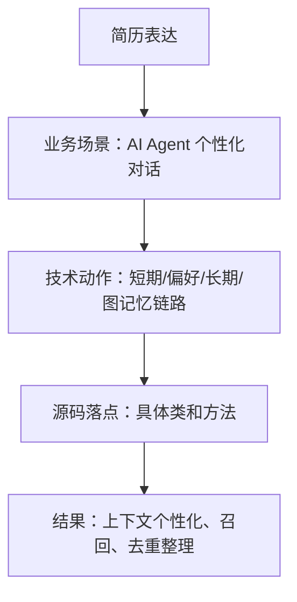

# 34-记忆系统简历说法

## 1. 一句话结论

简历里不要写“独立设计完整 AGI 记忆系统”这种过度包装，更稳的说法是：参与记忆系统链路梳理、功能同步、代码阅读和文档化，能讲清楚短期、偏好、长期、图记忆的工程实现。

## 2. 在记忆系统里的位置

这部分适合放在项目经历里：

```text
AI Agent 记忆系统 / 长短期记忆 / 图记忆 / 工具调用上下文
```

重点体现：

```text
读懂真实源码
梳理主链路
补齐 Java 版功能理解
形成面试可讲的工程文档
```

## 3. 源码位置和核心对象

简历可落到这些代码对象：

```text
UnifiedAgentService.processInternal
ShortTermMemory
PreferenceMemory
LongTermMemory
GraphMemory
MemoryWriter
KGStore
```

不要只写概念，要能落到方法：

```text
buildMemorySystemPrefixWithCtx
storeClassified
recall
graphAwareConsolidate
syncConsolidationToDB
```

## 4. 核心流程图



## 5. 源码讲解

可以写的方向：

```text
参与 AI Agent 记忆系统链路梳理，围绕 UnifiedAgentService.processInternal 梳理用户 query 从短期记忆写入、偏好抽取、长期/图记忆召回，到回复后 MemoryWriter 异步沉淀长期记忆的完整流程。
```

更技术一点：

```text
分析并整理短期记忆 ShortTermMemory、偏好记忆 PreferenceMemory、长期记忆 LongTermMemory 与图记忆 GraphMemory 的数据结构和调用关系，明确 memPrefix 与 histMsgs 在 LLM 调用中的不同职责。
```

更偏工程风险：

```text
梳理长期记忆 storeClassified、recall、consolidate 等方法，说明 embedding 去重、score 加权召回、ID 同步、Neo4j 图扩展和后台 consolidation 的实现细节及潜在并发一致性风险。
```

## 6. 真实例子：在流程中怎么运行

简历 bullet 示例：

```text
参与 AI Agent 记忆系统 Java 版链路梳理，围绕 UnifiedAgentService 主流程分析短期记忆、偏好抽取、长期记忆召回与回复后异步写入机制，沉淀方法级代码解析文档，支持面试中解释 memPrefix、histMsgs、MemoryItem、GraphMemory 等核心对象。
```

如果要更强一点：

```text
梳理长期记忆去重与整理机制，分析 storeClassified 中基于 embedding 的 dedupThreshold 去重、recall 中 sim 与 importance 加权 score 计算，以及 consolidate 中衰减、两两比较、合并和过期清理规则，形成可复用技术文档。
```

图记忆方向：

```text
分析图记忆 GraphMemory 与 Neo4j KGStore 的集成方式，梳理 Memory 节点、FOLLOWS 顺序边、SIMILAR_TO 相似边的创建条件，以及 recall 中 seed 召回和邻居扩展的实现逻辑。
```

## 7. 容易混淆的点

简历不要写没有证据的量化结果。

例如不要写：

```text
召回准确率提升 30%
线上性能提升 50%
独立设计全套记忆系统
```

除非你有真实测试数据或项目证据。

稳妥表达是：

```text
参与梳理
分析实现
补充文档
支持面试讲解
定位潜在风险
```

## 8. 面试怎么说

可以这样说：

```text
我主要做的是 Java 版记忆系统链路梳理和方法级代码解析。重点看了 UnifiedAgentService 的一轮对话主流程，拆清楚短期记忆、偏好记忆、长期记忆和图记忆的读写顺序，并整理了 storeClassified、recall、consolidate、GraphMemory.recall 等核心方法。这个过程让我能从源码层面解释记忆如何进入 prompt、如何召回、如何去重、如何同步数据库和 Neo4j。
```

