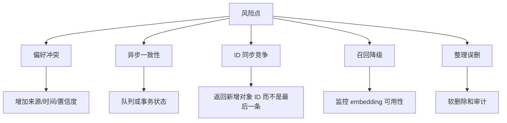

# 35-记忆系统改进点和风险

## 1. 一句话结论

这套记忆系统能跑通主链路，但面试时要能说出风险：异步写入一致性、偏好冲突、ID 同步竞争、embedding 不可用降级、图节点和数据库同步、consolidation 删除风险。

## 2. 在记忆系统里的位置

风险主要集中在：

```text
偏好抽取：规则和 LLM 结果可能冲突
长期写入：内存新增、DB 保存、ID 同步不是事务
图写入：Neo4j 异步写入可能滞后
召回：embedding 不可用时降级到词袋
整理：consolidation 会删除和合并记忆
```

## 3. 源码位置和核心对象

风险对应源码：

```text
runAsyncPreferenceExtraction
PreferenceMemory.save / saveBatch
LongTermMemory.storeClassified
LongTermMemory.syncLastItemPGID
GraphMemory.storeClassified
GraphMemory.syncLastItemPGID
LongTermMemory.consolidate
syncConsolidationToDB
```

## 4. 核心流程图



## 5. 源码讲解

偏好冲突：

```java
data.put(key, value); // ConcurrentHashMap 同 key 会覆盖旧值
```

风险：

```text
规则抽取和 LLM 抽取可能得到不同 value。
当前没有来源、时间、置信度，也没有冲突仲裁。
```

ID 同步竞争：

```java
items.get(items.size() - 1).setId(pgId); // 默认最后一条就是刚新增的记忆
```

风险：

```text
如果多个线程同时写长期记忆，最后一条不一定属于当前这次 DB 保存。
```

图异步写入：

```java
new Thread(() -> {
    kg.upsertMemoryNode(newId, content, importance);
    ...
}, "graph-memory-store").start();
```

风险：

```text
内存和 DB 已经写完，但 Neo4j 节点或边还没写完。
```

embedding 降级：

```java
if (!cfg.isRealEmbedding()) return null;
```

风险：

```text
没有 embedding key 或 API 失败时，长期召回会降级到本地词袋，相似度质量会下降。
```

consolidation 删除：

```java
infra.deleteLongTermItems(result.deleteFromDB);
```

风险：

```text
一旦判断重复、合并或过期，会删除数据库记录。
如果阈值设置不合理，可能误删有价值记忆。
```

## 6. 真实例子：在流程中怎么运行

偏好冲突例子：

```text
用户说：我叫小李，我喜欢 Java
规则抽取可能得到：姓名 = 小李，我喜欢 Java
LLM 抽取可能得到：姓名 = 小李，喜好 = Java
```

当前结果取决于谁后写入同一个 key。

ID 同步例子：

```text
线程 A 新增 MemoryItem A
线程 B 新增 MemoryItem B
线程 A 保存 DB 返回 pgId=10
线程 A 调 syncLastItemPGID(10)
如果此时最后一条已经是 B，就可能同步错 ID
```

改进方向：

```text
storeClassified 返回新增 MemoryItem 引用或临时 ID
DB 保存和 ID 同步放入同一临界区
图节点以数据库 ID 为准后再创建
```

## 7. 容易混淆的点

指出风险不是否定系统。

面试时说风险要带改进方案：

```text
问题：偏好冲突
方案：给偏好增加 source、updatedAt、confidence，按策略合并

问题：ID 同步依赖最后一条
方案：store 返回新增对象或临时 ID，避免并发错配

问题：consolidation 直接删除
方案：软删除、审计日志、灰度阈值
```

## 8. 面试怎么说

可以这样说：

```text
这套实现主链路是完整的，但我会重点关注几个工程风险。第一，偏好由规则和 LLM 两条路径写入，当前同 key 会覆盖，缺少冲突仲裁。第二，长期记忆 ID 同步依赖 items 最后一条，在并发写入下有错配风险。第三，GraphMemory 和 MemoryWriter 都有异步写入，内存、DB、Neo4j 之间可能短时间不一致。第四，consolidation 会删除和合并记忆，生产上最好增加软删除、审计和阈值灰度。
```

