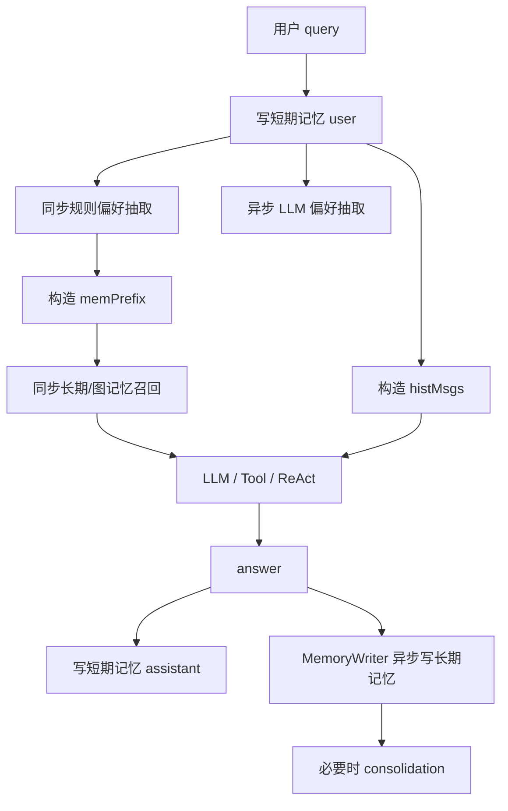

# 00-记忆系统一页总览

## 1. 一句话结论

这个记忆系统解决的是：

```text
让 AI 不只看当前一句话，而是能参考最近聊天、用户偏好、长期事实，以及记忆之间的图关系。
```

面试时先讲：

```text
短期记忆解决“最近聊了什么”。
偏好记忆解决“用户稳定习惯是什么”。
长期记忆解决“哪些事实以后还要用”。
图记忆解决“记忆之间有什么顺序和相似关系”。
```

---

## 2. 四种记忆总览

| 类型 | 存什么 | 什么时候读 | 什么时候写 | 存在哪里 |
|---|---|---|---|---|
| 短期记忆 | 最近几轮 user/assistant 原文 | 回答前 | 用户输入后、AI 回答后 | JVM 内存 + chat_history |
| 偏好记忆 | 姓名、默认城市、回答风格 | 回答前 | query 后同步规则抽取 + 异步 LLM 抽取 | PreferenceMemory + preferences |
| 长期记忆 | 值得以后使用的自然语言事实 | 回答前召回 | query 后偏好写入 + answer 后 MemoryWriter 写入 | LongTermMemory + PostgreSQL |
| 图记忆 | Memory 节点和 FOLLOWS/SIMILAR_TO 边 | 长期召回 seed 后扩展邻居 | 新增长期记忆时 | Neo4j |

---

## 3. 一轮对话核心链路



---

## 4. 必背 5 句话

```text
1. 回答前读：偏好 + 相关长期/图记忆进入 memPrefix，短期历史进入 histMsgs。

2. 召回同步：长期/图记忆召回影响当前回答，所以必须在 LLM 回答前完成。

3. 长期写入两条异步路径：query 后偏好抽取写长期记忆，answer 后 MemoryWriter 写长期记忆。

4. 图记忆不是替代长期记忆，而是在长期记忆 seed 基础上扩展 Neo4j 邻居。

5. consolidation 是后台整理，通过 ConsolidationResult 同步 PostgreSQL 和 Neo4j，属于最终一致。
```

---

## 5. 高频源码

```text
UnifiedAgentService.processInternal
UnifiedAgentService.buildMemorySystemPrefixWithCtx
UnifiedAgentService.runAsyncPreferenceExtraction

ShortTermMemory
PreferenceMemory
LongTermMemory
GraphMemory
MemoryWriter
KGStore
```

---

## 6. 面试开场

```text
我会按一轮对话来讲。用户 query 进来后，系统先写短期记忆，同时做同步规则偏好抽取和异步 LLM 偏好抽取。回答前会同步召回长期/图记忆，并和偏好一起拼成 memPrefix；短期聊天历史会转成 histMsgs。LLM 或工具链路回答后，assistant answer 写回短期记忆，MemoryWriter 再异步分类写长期记忆。后台 consolidation 会定期做去重、合并、过期清理，并同步 PostgreSQL 和 Neo4j。
```

