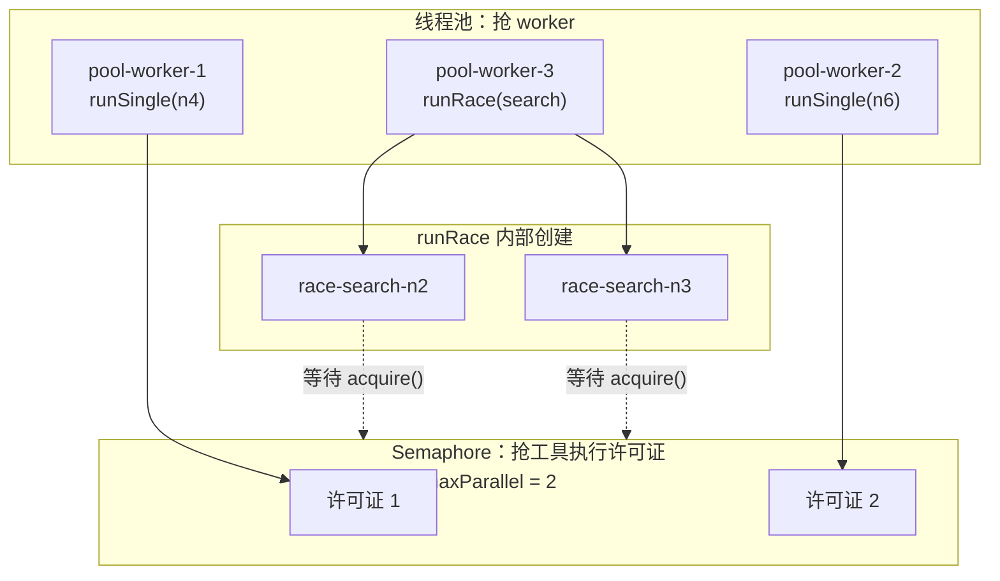

# 24-GraphRuntime-execute

## 1. 这个方法解决什么问题

上一页 `TaskGraph.topologicalLevels()` 只算出“哪些节点属于同一层”：

```text
levels = [
  [n1],
  [n2, n3, n4],
  [n5]
]
```

它不执行工具，也不启动线程。

`GraphRuntime.execute()` 才是真正执行整张任务图的方法。它负责把 `levels` 变成真实调度：

```text
第 0 层：执行 n1，等 n1 结束
第 1 层：n2/n3/n4 同层，可以并行；其中 n2/n3 如果同 raceGroup，就走竞速
第 2 层：等第 1 层全部结束后，再执行 n5
```

这个方法做 6 件事：

```text
1. 向 TaskGraph 要拓扑层级 levels
2. 把整张图的初始状态推给前端 graphReady
3. 创建线程池 pool
4. 按层遍历 levels
5. 每层内部按 raceGroup 分组，然后提交 runRace 或 runSingle
6. 等所有层执行完，组装 GraphResult 返回给 ReActLoop
```

一句话：

```text
topologicalLevels() 负责算执行顺序
GraphRuntime.execute() 负责按这个顺序真正调度执行
```

## 2. 方法入口、输入和输出

源码位置：

```text
GraphRuntime.java:123-200
```

方法签名：

```java
public GraphResult execute()
```

它没有参数，因为需要的东西已经在 `GraphRuntime` 构造方法里放进成员变量了：

```text
graph      = TaskGraph，里面有所有 Node 和依赖关系
cfg        = 图执行配置，比如最大并发、竞速开关、竞速超时
tools      = 可调用工具表，toolName -> Tool
subAgents  = 子 Agent 注册表
taskQuery  = 用户原始问题
cancelled  = 用户是否取消执行的共享标志
onEvent    = SSE/流式事件回调
sem        = Semaphore，并发上限控制器
```

### 2.1 先把几个并发词讲清楚

这几个词不是 `List / Map` 那种“存数据的数据结构”。更准确地说：

```text
daemon 线程       = Thread 的一种属性
Semaphore         = Java 并发工具类，中文叫“信号量”
sem               = 代码里的变量名，类型是 Semaphore
CountDownLatch    = Java 并发工具类，常叫“倒计时锁 / 闭锁”
latch             = 代码里的变量名，类型是 CountDownLatch
innerLatch        = 代码里的变量名，类型也是 CountDownLatch
```

**daemon 线程是什么**

daemon 线程中文一般叫“守护线程”。

它不是数据结构，而是线程的一种身份：

```java
Thread t = new Thread(r, "graph-runtime");
t.setDaemon(true);
```

普通线程和 daemon 线程最大的区别是：

```text
普通线程还活着时，JVM 通常不会退出
只剩 daemon 线程时，JVM 可以直接退出
```

在这里，`graph-runtime` 线程是后台执行图节点的线程。设置成 daemon 的意思是：它不应该单独撑住整个 Java 进程不退出。

**Semaphore 是什么**

`Semaphore` 中文叫“信号量”。

它可以先理解成一个“许可证计数器”：

```text
Semaphore(2) 表示有 2 张许可证

线程 A acquire() -> 拿走 1 张，还剩 1 张
线程 B acquire() -> 拿走 1 张，还剩 0 张
线程 C acquire() -> 没许可证了，阻塞等待
线程 A release() -> 归还 1 张，线程 C 才能继续
```

所以它控制的是“同一时间最多允许几个节点真正执行”。

项目里成员变量叫：

```java
private final Semaphore sem;
```

构造时创建：

```java
this.sem = new Semaphore(this.cfg.maxParallel);
```

如果 `cfg.maxParallel = 2`，意思就是：

```text
就算同一层有 10 个节点被提交到线程池
同一时间最多也只有 2 个节点能通过 sem.acquire() 真正执行
```

所以：

```text
pool = 提供线程
sem  = 限制并发数量
```

**CountDownLatch 是什么**

`CountDownLatch` 常翻译成“倒计时锁”或“闭锁”。

它也是一个计数器，但用途和 `Semaphore` 不一样：

```text
Semaphore      = 控制有多少线程能进去执行
CountDownLatch = 让一个线程等待其他任务完成
```

它的用法是：

```java
CountDownLatch latch = new CountDownLatch(3);

latch.countDown(); // 3 -> 2
latch.countDown(); // 2 -> 1
latch.countDown(); // 1 -> 0

latch.await();     // 等计数变成 0 才继续
```

在 `execute()` 里有两个 latch：

```text
latch      = 当前层的等待器，等这一层所有组结束
innerLatch = 普通组的等待器，等普通组内所有节点结束
```

举例：

```text
当前层有两个组：
1. 普通组 [n4, n6]
2. 竞速组 [n2, n3]
```

那么：

```text
latch = new CountDownLatch(2)
```

因为当前层有 2 个组要等。

普通组 `[n4,n6]` 里面还有 2 个普通节点，所以：

```text
innerLatch = new CountDownLatch(2)
```

执行过程：

```text
n4 完成 -> innerLatch: 2 -> 1
n6 完成 -> innerLatch: 1 -> 0
普通组结束 -> latch: 2 -> 1

竞速组结束 -> latch: 1 -> 0

execute 主线程从 latch.await() 放行，进入下一层
```

记一句就行：

```text
sem 是“最多同时进去几个”
latch 是“等几个任务结束”
```

返回值是 `GraphResult`：

```java
public static class GraphResult {
    public List<String> observations = new ArrayList<>();
    public Map<String, NodeResult> nodeResults = new LinkedHashMap<>();
    public boolean interrupted;
    public String interruptedAt = "";
    public String interruptedMsg = "";
}
```

里面每个 `NodeResult` 是：

```java
public static class NodeResult {
    public final NodeStatus status;
    public final String result;
    public final String error;
}
```

字段含义：

```text
observations   = 所有成功节点的结果，用来给 Generator LLM 综合回答
nodeResults    = 每个节点最终状态，包含 DONE/FAILED/SKIPPED/CANCELLED 等
interrupted    = 整图执行是否被中断
interruptedMsg = 中断原因
```

## 3. 方法源码

下面是 `execute()` 的完整源码，加了教学注释：

```java
/**
 * 位置：GraphRuntime.java:123-200
 */
public GraphResult execute() {
    List<List<String>> levels;                                      // ① 拓扑层级
    try {
        levels = graph.topologicalLevels();                         // ② 计算每一层执行哪些节点
    } catch (Exception e) {
        log.warn("GraphRuntime: 图校验失败 {}", e.getMessage());
        GraphResult r = new GraphResult();                          // ③ 图不合法，直接返回中断结果
        r.interrupted = true;
        r.interruptedMsg = "图校验失败: " + e.getMessage();
        return r;
    }

    // 转为字符串状态供前端订阅
    Map<String, Object> nodeView = new LinkedHashMap<>();            // ④ 前端展示用的节点快照
    for (Map.Entry<String, Node> e : graph.getNodes().entrySet()) {
        Node n = e.getValue();
        Map<String, Object> v = new LinkedHashMap<>();
        v.put("id", n.getId());
        v.put("tool", n.getToolName());
        v.put("name", n.getName());
        v.put("depends_on", n.getDependsOn());
        v.put("race_group", n.getRaceGroup());
        v.put("status", n.getStatus().value());
        nodeView.put(e.getKey(), v);
    }
    onEvent.accept(StreamEvent.graphReady(levels, nodeView));        // ⑤ 推送 graphReady 事件

    // 调度 ExecutorService（同时给 race 用作 attempt pool）
    ExecutorService pool = Executors.newCachedThreadPool(r -> {      // ⑥ 创建线程池
        Thread t = new Thread(r, "graph-runtime");
        t.setDaemon(true);
        return t;
    });
    try {
        for (int li = 0; li < levels.size(); li++) {                 // ⑦ 按层执行
            if (cancelled.get()) {                                   // ⑧ 层开始前检查用户是否取消
                return interrupted("在第 " + li + " 层执行前被中断");
            }

            List<String> level = levels.get(li);                     // ⑨ 当前层节点
            List<RaceGroup> groups = groupByRace(level);             // ⑩ 当前层按 raceGroup 分组
            CountDownLatch latch = new CountDownLatch(groups.size());// ⑪ 等待当前层所有组完成

            for (RaceGroup g : groups) {
                if (!g.raceGroup.isEmpty()
                        && cfg.enableRacing
                        && g.nodeIds.size() > 1) {                   // ⑫ 满足条件，走竞速组
                    pool.execute(() -> {
                        try {
                            runRace(pool, g);
                        } finally {
                            latch.countDown();                       // ⑬ 竞速组结束，当前层完成一个组
                        }
                    });
                } else {
                    // 独立并行：组内每个节点都是一个独立子任务
                    CountDownLatch innerLatch = new CountDownLatch(g.nodeIds.size()); // ⑭ 等普通组内所有节点
                    for (String id : g.nodeIds) {
                        pool.execute(() -> {
                            try {
                                runSingle(id);                       // ⑮ 普通节点独立执行
                            } finally {
                                innerLatch.countDown();              // ⑯ 普通组内完成一个节点
                            }
                        });
                    }
                    pool.execute(() -> {
                        try {
                            innerLatch.await();                      // ⑰ 普通组全部节点结束
                        } catch (InterruptedException ignored) {
                            Thread.currentThread().interrupt();
                        } finally {
                            latch.countDown();                       // ⑱ 普通组结束，当前层完成一个组
                        }
                    });
                }
            }

            try {
                latch.await();                                       // ⑲ 主线程等待当前层全部组结束
            } catch (InterruptedException e) {
                Thread.currentThread().interrupt();
                return interrupted("等待第 " + li + " 层时线程被中断");
            }

            if (cancelled.get()) {                                   // ⑳ 层结束后再检查一次取消
                return interrupted("在第 " + li + " 层执行后被中断");
            }
        }
    } finally {
        pool.shutdown();                                             // ㉑ 关闭线程池
        try {
            pool.awaitTermination(5, TimeUnit.SECONDS);
        } catch (InterruptedException ignored) {
            Thread.currentThread().interrupt();
        }
    }

    return buildResult();                                            // ㉒ 汇总整图执行结果
}
```

## 4. 总流程先看一遍

`execute()` 的主流程可以画成这样：

```text
execute()
  |
  |-- graph.topologicalLevels()
  |     得到 levels，例如 [[n1], [n2, n3, n4], [n5]]
  |
  |-- 构造 nodeView
  |     把每个 Node 转成前端可展示的 Map
  |
  |-- onEvent.graphReady(levels, nodeView)
  |     前端知道图结构和初始状态
  |
  |-- 创建线程池 pool
  |
  |-- for each level
  |     |
  |     |-- 检查 cancelled
  |     |-- groupByRace(level)
  |     |-- 创建外层 latch
  |     |-- for each group
  |     |     |
  |     |     |-- 竞速组：pool.execute(runRace)
  |     |     |
  |     |     |-- 普通组：pool.execute(runSingle) * N
  |     |
  |     |-- latch.await()
  |     |     等当前层所有组结束
  |     |
  |     |-- 再检查 cancelled
  |
  |-- pool.shutdown()
  |
  |-- buildResult()
        返回 observations + nodeResults
```

注意一个边界：

```text
execute() 会执行工具和子 Agent
execute() 不会生成最终自然语言回答
```

最终回答是 `ReActLoop.runStream` 拿到 `GraphResult` 后，再调用：

```java
generator.generate(query, gr.observations, memPrefix, histMsgs)
```

## 5. 逐段解释

**①② `levels = graph.topologicalLevels()`**

这里先向 `TaskGraph` 要拓扑层级。

例如图是：

```text
        n1
     /  |  \
   n2  n3  n4
     \  |  /
       n5
```

可能得到：

```text
levels = [
  [n1],
  [n2, n3, n4],
  [n5]
]
```

`execute()` 只按这个层级执行：

```text
先执行 levels[0]
levels[0] 全部完成后，执行 levels[1]
levels[1] 全部完成后，执行 levels[2]
```

如果 `topologicalLevels()` 抛异常，说明图已经不合法，比如存在循环依赖。此时不会启动任何节点，直接返回：

```text
GraphResult.interrupted = true
GraphResult.interruptedMsg = "图校验失败: ..."
```

**③ 图校验失败时返回中断结果**

这里不是抛异常给上层，而是把异常包装成 `GraphResult`：

```java
GraphResult r = new GraphResult();
r.interrupted = true;
r.interruptedMsg = "图校验失败: " + e.getMessage();
return r;
```

这样 `ReActLoop.runStream` 可以用统一逻辑处理：

```text
如果 gr.interrupted=true
就走中断响应
```

**④ `nodeView` 是给前端看的图快照**

源码会遍历所有节点：

```java
for (Map.Entry<String, Node> e : graph.getNodes().entrySet()) {
    Node n = e.getValue();
    Map<String, Object> v = new LinkedHashMap<>();
    ...
    nodeView.put(e.getKey(), v);
}
```

假设节点 `n2` 是：

```text
id        = n2
toolName  = search_web
name      = 搜索天气建议
dependsOn = [n1]
raceGroup = search
status    = PENDING
```

转成 `nodeView` 后大概是：

```text
nodeView["n2"] = {
  id: "n2",
  tool: "search_web",
  name: "搜索天气建议",
  depends_on: ["n1"],
  race_group: "search",
  status: "pending"
}
```

`nodeView` 不是执行结果，它只是“执行前的图结构和初始状态”。

**⑤ `onEvent.accept(StreamEvent.graphReady(levels, nodeView))`**

这一步会推送一个流式事件：

```text
graphReady(
  levels = [[n1], [n2, n3, n4], [n5]],
  nodeView = 每个节点的初始展示信息
)
```

前端拿到这个事件后，可以先画出任务图：

```text
L0: n1 pending
L1: n2 pending, n3 pending, n4 pending
L2: n5 pending
```

节点真正开始执行、完成、失败，会由 `runSingle/runRace/doExecuteNode` 推送其他事件。

**⑥ `Executors.newCachedThreadPool(...)`**

这里创建线程池：

```java
ExecutorService pool = Executors.newCachedThreadPool(r -> {
    Thread t = new Thread(r, "graph-runtime");
    t.setDaemon(true);
    return t;
});
```

这个线程池负责运行：

```text
runRace 任务
runSingle 任务
等待普通组 innerLatch 的任务
```

线程名统一叫 `graph-runtime`，并且是 daemon 线程。

注意：线程池本身不是最大并发控制器。真正控制“同时执行几个节点”的是 `Semaphore sem`：

```text
runSingle() 开头 acquire()
runRace() 中每个候选节点执行前 acquire()
执行完 sem.release()
```

所以关系是：

```text
pool      = 提供线程来跑任务
sem       = 限制同一时间真正执行的节点数量
cfg.maxParallel = sem 的许可数量
```

### 5.1 Thread pool 和这些东西到底是什么关系：先看最简单版本

先别看竞速，先看最简单情况：

```text
当前层只有两个普通节点：

level = [n1, n2]
```

这两个节点没有依赖关系，所以可以一起跑。

如果不用线程池，代码只能这样：

```java
runSingle("n1");
runSingle("n2");
```

这叫串行：

```text
n1 跑完
  -> n2 才开始跑
```

如果 `n1` 调工具要 3 秒，`n2` 调工具也要 3 秒，总共大概要 6 秒。

用了线程池后，代码变成：

```java
pool.execute(() -> runSingle("n1"));
pool.execute(() -> runSingle("n2"));
```

意思是：

```text
execute 主线程：
  我不自己跑 n1/n2
  我把 n1/n2 这两个任务交给线程池

线程池：
  找线程 A 去跑 n1
  找线程 B 去跑 n2
```

这样就是并行：

```text
n1 开始跑
n2 也开始跑
```

如果两个工具都要 3 秒，总耗时接近 3 秒，而不是 6 秒。

所以线程池最简单的作用就是：

```text
让同一层里互不依赖的节点，有机会同时执行
```

### 5.2 线程池不是“工具执行器”，它只是派线程

线程池不懂工具，也不懂天气、搜索、RAG。

它只认识一种东西：

```text
Runnable 任务
```

比如这段：

```java
pool.execute(() -> runSingle(id));
```

意思不是“线程池执行工具”。

真实意思是：

```text
把这个 Runnable 丢给线程池：
  () -> runSingle(id)

线程池找一个空闲线程：
  你去执行 runSingle(id)
```

真正的工具调用还在更深处：

```text
pool worker 线程
  -> runSingle(id)
      -> doExecuteNode(id, null)
          -> invoke(node)
              -> t.getExecute().apply(params)
```

所以：

```text
线程池负责“找线程跑任务”
runSingle/doExecuteNode/invoke 负责“真正调用工具”
```

### 5.3 为什么有线程池了，还要 Semaphore

这里最容易混。

线程池解决的是：

```text
有没有线程可以跑任务
```

`Semaphore` 解决的是：

```text
最多允许几个节点同时真正执行工具
```

举个例子：

```text
当前层有 5 个节点：
n1, n2, n3, n4, n5

execute 把 5 个任务都提交给线程池
```

线程池可能很快安排 5 个线程：

```text
线程 A -> runSingle(n1)
线程 B -> runSingle(n2)
线程 C -> runSingle(n3)
线程 D -> runSingle(n4)
线程 E -> runSingle(n5)
```

但是每个 `runSingle` 一开始都会：

```java
acquire();
```

假设配置是：

```text
cfg.maxParallel = 2
```

那 `Semaphore` 里只有 2 张许可证。

于是：

```text
n1 拿到许可证，开始真正执行工具
n2 拿到许可证，开始真正执行工具
n3 没拿到许可证，卡在 acquire()
n4 没拿到许可证，卡在 acquire()
n5 没拿到许可证，卡在 acquire()
```

这就是它俩的区别：

```text
线程池让 5 个任务都有线程承载
Semaphore 只放 2 个任务真正进入工具执行
```

再短一点：

```text
pool = 车队，有很多车可以接活
sem  = 收费站，只开 cfg.maxParallel 个通道
```

就算车很多，收费站只开 2 个通道，也最多 2 辆车同时通过。

### 5.4 为什么有线程池了，还要 CountDownLatch

线程池负责把任务跑起来。

但 `execute()` 还有一个要求：

```text
当前层全部结束后，才能进入下一层
```

例如：

```text
levels = [
  [n1, n2],
  [n3]
]
```

`n3` 依赖上一层，所以必须：

```text
n1 和 n2 都结束
  -> 才能开始 n3
```

线程池只负责跑：

```text
n1 开始跑
n2 开始跑
```

但它不会自动告诉 `execute()`：

```text
这一层已经全部结束了，你可以去下一层了
```

所以需要 `CountDownLatch`。

可以把 `latch` 理解成一个倒计时牌：

```text
当前层有 2 个任务要等
latch = 2

n1 结束 -> latch 变成 1
n2 结束 -> latch 变成 0

execute 主线程一直 latch.await()
直到 latch = 0 才继续
```

所以三者关系是：

```text
线程池负责派线程干活
Semaphore 负责限制最多几个活儿能真正开跑
CountDownLatch 负责让 execute 主线程等大家干完
```

### 5.5 对应回源码：普通节点怎么跑

普通节点提交进去的是：

```java
pool.execute(() -> {
    try { runSingle(id); }
    finally { innerLatch.countDown(); }
});
```

这段可以翻译成：

```text
execute 主线程
  -> 把 runSingle(id) 交给线程池

线程池 worker
  -> 执行 runSingle(id)

runSingle(id)
  -> acquire()，先抢 Semaphore 许可证
  -> doExecuteNode(id, null)，真正执行节点
  -> sem.release()，归还许可证
  -> innerLatch.countDown()，告诉普通组：我这个节点结束了
```

这里注意两句话：

```text
pool.execute 只是“提交任务”
runSingle 里面才真正进入节点执行
```

普通节点完整链路：

```text
execute
  -> pool.execute(...)
      -> pool worker
          -> runSingle
              -> acquire
              -> doExecuteNode
              -> invoke
              -> getExecute().apply(params)
              -> release
              -> innerLatch.countDown
```

### 5.6 对应回源码：竞速组怎么跑

竞速组提交进去的是：

```java
pool.execute(() -> {
    try { runRace(pool, g); }
    finally { latch.countDown(); }
});
```

这段可以翻译成：

```text
execute 主线程
  -> 把 runRace(g) 交给线程池

线程池 worker
  -> 执行 runRace(g)

runRace(g)
  -> 给组内每个候选节点 new Thread
  -> 每个候选线程自己跑 doExecuteNode(id, winnerFound)
  -> 谁先成功谁赢
  -> runRace interrupt 其他候选线程
  -> runRace 结束
  -> latch.countDown()，告诉当前层：这个竞速组结束了
```

竞速组比普通节点多一层：

```text
普通节点：
  pool worker 直接跑 runSingle

竞速组：
  pool worker 先跑 runRace
  runRace 再自己创建 race-* 线程跑候选节点
```

为什么竞速候选节点不用 `pool.execute()`？

因为 `runRace` 要能定点打断失败者：

```java
t.interrupt();
```

要打断谁，就必须保存谁的 `Thread` 对象。

所以竞速候选节点使用：

```java
Thread t = new Thread(...);
t.start();
```

而不是：

```java
pool.execute(...);
```

### 5.7 runRace 和 runSingle 会抢线程吗

会，但要分清楚它们抢的是哪一层资源。

在这套代码里，至少有三种“抢”：

```text
第一层：抢线程池 worker
第二层：抢 Semaphore 许可证
第三层：竞速组内部抢 winnerFound 赢家标志
```

#### 第一层：runSingle 和 runRace 会抢线程池 worker

`execute()` 会把普通节点和竞速组都提交给同一个线程池：

```java
pool.execute(() -> runSingle(id));
pool.execute(() -> runRace(pool, g));
```

所以它们会一起排队等线程池 worker 来执行。

假设当前层有：

```text
普通节点 n4
普通节点 n6
竞速组 search = [n2, n3]
```

提交到线程池的是三个任务：

```text
任务 A：runSingle(n4)
任务 B：runSingle(n6)
任务 C：runRace(search)
```

如果线程池有空闲 worker，可能变成：

```text
pool-worker-1 -> runSingle(n4)
pool-worker-2 -> runSingle(n6)
pool-worker-3 -> runRace(search)
```

这里 `runSingle` 和 `runRace` 是在抢线程池 worker：

```text
谁先拿到 worker，谁先开始执行自己的外壳逻辑。
```

但是注意：

```text
抢到线程池 worker，不等于已经能调用工具。
```

#### 第二层：真正调用工具前，还要抢 Semaphore 许可证

普通节点 `runSingle` 里面会：

```java
acquire();
doExecuteNode(id, null);
sem.release();
```

竞速组 `runRace` 里面，每个候选 `race-*` 线程也会：

```java
acquire();
doExecuteNode(id, winnerFound);
sem.release();
```

所以普通节点和竞速候选节点，最后都会抢同一个 `Semaphore sem`。

也就是说：

```text
没有“runSingle 的 maxParallel”和“runRace 的 maxParallel”两套东西。
整个 GraphRuntime 只有一个 sem。
这个 sem 是用同一个 cfg.maxParallel 创建出来的。
```

源码里是：

```java
private final Semaphore sem;

this.sem = new Semaphore(this.cfg.maxParallel);
```

所以 `cfg.maxParallel = 2` 的意思是：

```text
普通节点 + 竞速候选节点，加起来最多 2 个同时真正执行工具。
```

例如：

```text
cfg.maxParallel = 2
```

当前已经有：

```text
n4 runSingle 拿到许可证
n6 runSingle 拿到许可证
```

这时 `runRace(search)` 虽然已经被线程池 worker 执行了，也创建了：

```text
race-search-n2
race-search-n3
```

但它们进工具调用前会卡在：

```java
acquire();
```

因为 `Semaphore` 的 2 张许可证已经被 `n4` 和 `n6` 拿走了。

等 `n4` 或 `n6` 执行完：

```text
sem.release()
```

`race-search-n2` 或 `race-search-n3` 才有机会拿到许可证，继续执行工具。

可以画成这样：



这张图的意思是：

```text
runRace 抢到了线程池 worker，不代表它里面的候选节点马上能执行工具；
候选节点还要继续抢 Semaphore 许可证。
```

#### 第三层：竞速组内部还要抢赢家标志

如果 `race-search-n2` 和 `race-search-n3` 都拿到了许可证并执行工具，那它们还要抢最后一个东西：

```java
winnerFound.compareAndSet(false, true)
```

谁先成功返回，并且第一个把 `winnerFound` 从 `false` 改成 `true`，谁就是赢家。

所以完整理解是：

```text
runSingle 和 runRace 会抢线程池 worker。
runSingle 和 race-* 候选线程会抢 Semaphore 许可证。
race-* 候选线程之间会抢 winnerFound 赢家标志。
```

一句话：

```text
线程池决定谁有线程跑外壳；
Semaphore 决定谁能真正进入工具调用；
winnerFound 决定竞速组里谁最终获胜。
```

### 5.8 用一个具体例子串起来

假设当前层：

```text
n4 普通节点
n6 普通节点
search 竞速组：[n2, n3]

cfg.maxParallel = 2
```

`execute` 会提交三个“组任务”：

```text
pool.execute(runSingle(n4))
pool.execute(runSingle(n6))
pool.execute(runRace(search))
```

线程关系大概是：

```text
pool-worker-A -> runSingle(n4)
pool-worker-B -> runSingle(n6)
pool-worker-C -> runRace(search)
                  -> race-search-n2
                  -> race-search-n3
```

虽然看起来很多线程都启动了，但真正能同时执行工具的只有 2 个，因为：

```text
cfg.maxParallel = 2
sem 只有 2 张许可证
```

可能出现：

```text
n4 acquire 成功，开始执行工具
n6 acquire 成功，开始执行工具
n2 卡在 acquire()
n3 卡在 acquire()
```

等 `n4` 执行完：

```text
n4 sem.release()
n2 acquire 成功，开始执行工具
```

等 `n6` 执行完：

```text
n6 sem.release()
n3 acquire 成功，开始执行工具
```

所以这句话最重要：

```text
线程启动数量，不等于工具同时执行数量
```

工具同时执行数量由 `Semaphore` 控制。

### 5.9 最短记法

记成四句话：

```text
pool：
  负责找线程跑任务

runSingle/runRace：
  是交给线程执行的任务

sem：
  控制最多几个节点能真正执行工具

latch：
  让 execute 等当前层结束，再进入下一层
```

再压缩成一句：

pool 让它们有机会一起跑
sem 控制最多几个真的跑
latch 等它们跑完
```

为什么要用线程池，而不是直接在 `execute()` 里调用 `runSingle(id)`？

因为同一层的节点本来就可以并行。如果直接调用：

```java
runSingle("n2");
runSingle("n3");
runSingle("n4");
```

执行会变成串行：

```text
n2 执行完 -> n3 执行完 -> n4 执行完
```

这样就浪费了拓扑分层的意义。`topologicalLevels()` 已经告诉我们：

```text
level = [n2, n3, n4]
```

这一层的三个节点没有互相依赖，可以同时跑。所以 `execute()` 用：

```java
pool.execute(() -> runSingle(id));
```

把每个节点提交给线程池，让它们有机会并发执行：

```text
线程 A 跑 n2
线程 B 跑 n3
线程 C 跑 n4
```

但 `execute()` 自己不能直接结束。它还要等这一层全部收尾，才能进入下一层。所以主线程做的是“调度员”的工作：

```text
1. 把当前层的任务提交给线程池
2. 用 latch.await() 等当前层结束
3. 当前层结束后，再进入下一层
```

线程池还有一个好处：不用自己手动给每个节点 `new Thread()`。如果每次都手写：

```java
new Thread(() -> runSingle(id)).start();
```

线程创建、命名、关闭、异常收尾都会散在代码里。用 `ExecutorService pool` 后，`execute()` 只需要：

```text
提交任务：pool.execute(...)
关闭线程池：pool.shutdown()
等待收尾：pool.awaitTermination(...)
```

所以这一层的分工是：

```text
pool 负责让任务并发跑
latch 负责让主线程等这一层跑完
sem 负责限制最多同时跑几个
```

**⑦ `for (int li = 0; li < levels.size(); li++)`**

这是按层循环。

如果：

```text
levels = [[n1], [n2, n3, n4], [n5]]
```

循环顺序就是：

```text
li=0, level=[n1]
li=1, level=[n2, n3, n4]
li=2, level=[n5]
```

层之间是串行的。也就是说，`li=1` 不会在 `li=0` 没结束时启动。

**⑧ 层开始前检查 `cancelled`**

```java
if (cancelled.get()) {
    return interrupted("在第 " + li + " 层执行前被中断");
}
```

`cancelled` 是一个 `AtomicBoolean`，多个线程都能读到它。用户点击中断时，它会变成 `true`。

这一处检查的含义是：

```text
如果用户已经取消，就不要启动这一层的新任务
```

`interrupted(...)` 会把还没完成的节点标成 `CANCELLED`，再返回一个 `GraphResult`。

**⑨ `List<String> level = levels.get(li)`**

取出当前层。

例如：

```text
li = 1
level = [n2, n3, n4]
```

当前层里的节点没有依赖关系，可以并行。但是否竞速，还要看 `raceGroup`。

**⑩ `List<RaceGroup> groups = groupByRace(level)`**

`groupByRace` 会把当前层拆成多个组。

假设当前层是：

```text
n2.raceGroup = "search"
n3.raceGroup = "search"
n4.raceGroup = ""
```

调用后得到：

```text
groups = [
  RaceGroup("",       [n4]),
  RaceGroup("search", [n2, n3])
]
```

为什么 `n2/n3` 放一起？因为它们有相同的 `raceGroup="search"`，代表它们是候选方案，谁先成功用谁。

为什么 `n4` 单独在空组？因为它没有竞速组，它只是普通节点。

**⑪ `CountDownLatch latch = new CountDownLatch(groups.size())`**

这个 `latch` 是“当前层的外层等待器”。

如果：

```text
groups = [
  RaceGroup("",       [n4]),
  RaceGroup("search", [n2, n3])
]
```

那么：

```text
latch = 2
```

含义是：

```text
普通组 [n4] 完成      -> latch 减 1
竞速组 [n2,n3] 完成   -> latch 再减 1
latch 变成 0          -> 当前层结束
```

主线程会在 `latch.await()` 等当前层所有组结束。

**⑫ 什么情况下走 `runRace`**

源码判断：

```java
if (!g.raceGroup.isEmpty()
        && cfg.enableRacing
        && g.nodeIds.size() > 1)
```

三个条件必须同时满足：

```text
1. g.raceGroup 不能为空
2. cfg.enableRacing 必须为 true
3. 这个组里至少有 2 个节点
```

例如：

```text
RaceGroup("search", [n2, n3])
```

满足条件，走：

```java
runRace(pool, g)
```

如果是：

```text
RaceGroup("search", [n2])
```

虽然有 `raceGroup`，但节点数只有 1，没有竞速意义，所以走普通执行。

如果是：

```text
RaceGroup("", [n4])
```

`raceGroup` 为空，也走普通执行。

**⑬ 竞速组结束后 `latch.countDown()`**

竞速分支提交到线程池：

```java
pool.execute(() -> {
    try {
        runRace(pool, g);
    } finally {
        latch.countDown();
    }
});
```

这里的 `finally` 很关键：

```text
不管 runRace 正常结束、失败、还是内部出现异常
都要通知当前层：这个组已经结束
```

否则主线程会一直卡在：

```java
latch.await();
```

**⑭ 普通组的 `innerLatch`**

普通组不是 first-success-wins。普通组里的节点都要执行完。

例如：

```text
RaceGroup("", [n4, n6])
```

会创建：

```java
CountDownLatch innerLatch = new CountDownLatch(2);
```

含义是：

```text
n4 完成 -> innerLatch 减 1
n6 完成 -> innerLatch 再减 1
innerLatch 变成 0 -> 普通组结束
```

**⑮⑯ 普通节点用 `runSingle(id)` 执行**

普通组内每个节点都提交一个任务：

```java
for (String id : g.nodeIds) {
    pool.execute(() -> {
        try {
            runSingle(id);
        } finally {
            innerLatch.countDown();
        }
    });
}
```

假设：

```text
g.nodeIds = [n4, n6]
```

会提交两个任务：

```text
pool task 1 -> runSingle(n4)
pool task 2 -> runSingle(n6)
```

它们可以并行执行，但最终能不能真的同时跑，还要看 `sem` 的许可数量。

**⑰⑱ 普通组结束后通知外层 latch**

普通组还会额外提交一个等待任务：

```java
pool.execute(() -> {
    try {
        innerLatch.await();
    } finally {
        latch.countDown();
    }
});
```

这个等待任务做的事很简单：

```text
等普通组内所有 runSingle 都结束
然后告诉当前层：这个普通组结束了
```

所以普通组有两级等待：

```text
innerLatch 等组内节点
latch      等当前层里的所有组
```

**⑲ `latch.await()` 等当前层结束**

当前层所有组都提交以后，主线程执行：

```java
latch.await();
```

这一步会阻塞当前 `execute()` 方法。

还是这个例子：

```text
level = [n2, n3, n4]
groups = [
  RaceGroup("",       [n4]),
  RaceGroup("search", [n2, n3])
]
latch = 2
```

执行过程是：

```text
普通组 [n4] 完成      -> latch: 2 -> 1
竞速组 [n2,n3] 完成   -> latch: 1 -> 0
latch.await() 放行
```

只有当前层放行后，`execute()` 才会进入下一层。

**⑳ 层结束后再检查 `cancelled`**

```java
if (cancelled.get()) {
    return interrupted("在第 " + li + " 层执行后被中断");
}
```

这一处处理的是：

```text
当前层已经结束
但用户在这一层执行过程中点了取消
```

如果取消了，就不再启动下一层。

**㉑ `finally` 里关闭线程池**

不管是正常执行完，还是提前 `return interrupted(...)`，都会进入 `finally`：

```java
finally {
    pool.shutdown();
    pool.awaitTermination(5, TimeUnit.SECONDS);
}
```

含义是：

```text
不再接收新任务
最多等 5 秒让已提交任务收尾
如果等待线程被中断，就恢复 interrupt 标记
```

**㉒ `return buildResult()`**

所有层执行完后，调用：

```java
return buildResult();
```

`buildResult()` 会做两件事：

```text
1. r.observations = graph.successfulResults()
2. 遍历所有节点，把每个节点的 status/result/error 放入 nodeResults
```

例如：

```text
observations = [
  "[get_weather] 上海：小雨 20°C",
  "[search_web] 雨天出行建议...",
  "[route_plan] 推荐地铁..."
]

nodeResults = {
  n1: {status:DONE,    result:"上海：小雨 20°C", error:null},
  n2: {status:DONE,    result:"雨天出行建议...", error:null},
  n3: {status:SKIPPED, result:null,              error:null},
  n4: {status:DONE,    result:"推荐地铁...",     error:null},
  n5: {status:DONE,    result:"综合建议...",     error:null}
}
```

## 6. observation / observations 里面到底是什么

这里有两个名字很像的东西：

```text
StreamEvent.observation   = 单个流式事件，发给前端看
GraphResult.observations  = 字符串列表，发给 Generator 生成最终回答
```

它们不是同一个对象。

**1. 单数 observation：给前端看的事件**

源码位置：

```java
public static StreamEvent observation(String tool, String result) {
    Map<String, Object> m = new LinkedHashMap<>();
    m.put("tool", tool);
    m.put("result", result);
    return new StreamEvent("observation", m);
}
```

所以一个 `observation` 事件里面就是：

```text
type = "observation"
data = {
  tool:   工具名或 agent 名,
  result: 这次工具/agent 返回的原始结果字符串
}
```

例如天气工具返回：

```text
{
  type: "observation",
  data: {
    tool: "get_weather",
    result: "上海：小雨 20°C"
  }
}
```

普通工具节点成功时，`doExecuteNode` 会立刻发：

```java
onEvent.accept(StreamEvent.observation(executor, result));
```

竞速节点不在 `doExecuteNode` 里立刻发，因为它还不确定自己是不是胜出者。竞速节点要等 `runRace` 确认胜出后才发：

```java
onEvent.accept(StreamEvent.observation(node.getToolName(), r.result));
```

这样前端不会看到“竞速失败者”的结果被当成有效 observation。

**2. 复数 observations：给 Generator 用的结果列表**

`GraphResult` 里有：

```java
public List<String> observations = new ArrayList<>();
```

这个列表在 `buildResult()` 里生成：

```java
r.observations = graph.successfulResults();
```

而 `successfulResults()` 的逻辑是：

```java
for (Node n : nodes.values()) {
    if (n.getStatus() == NodeStatus.DONE
            && n.getResult() != null
            && !n.getResult().isEmpty()) {
        results.add("[" + n.executorName() + "] " + n.getResult());
    }
}
```

所以 `GraphResult.observations` 里只放：

```text
状态是 DONE 的节点
并且 result 非空
格式是：[工具名或 agent 名] 结果
```

例如：

```text
observations = [
  "[get_weather] 上海：小雨 20°C",
  "[search_web] 雨天出行建议：带伞，路面湿滑注意通勤时间",
  "[route_plan] 推荐地铁，避免骑行"
]
```

不会放进去的节点：

```text
FAILED     -> 不放
SKIPPED    -> 不放
CANCELLED  -> 不放
PENDING    -> 不放
RUNNING    -> 不放
DONE 但 result 为空 -> 不放
```

**3. observations 最后给谁用**

`ReActLoop.runStream` 拿到图执行结果后，会调用：

```java
String answer = generator.generate(query, gr.observations, memPrefix, histMsgs);
```

`ChatGenerator.generate` 会把 observations 拼进提示词：

```text
工具执行结果：
1. [get_weather] 上海：小雨 20°C
2. [search_web] 雨天出行建议：带伞...
3. [route_plan] 推荐地铁...
```

然后让 LLM 生成最终自然语言回答。

所以可以记成：

```text
observation  = 一次工具结果事件，给前端实时展示
observations = 所有成功节点结果列表，给 Generator 汇总回答
```

## 7. 两层 CountDownLatch 到底在等什么

这部分是 `execute()` 最容易绕的地方。

代码里有两个等待器：

```text
latch      = 当前层等待器
innerLatch = 普通组等待器
```

它们的区别：

```text
latch:
  作用范围：当前 level
  初始值：groups.size()
  谁减少它：每个 RaceGroup 完成时减少 1
  谁等待它：execute() 主线程

innerLatch:
  作用范围：一个普通组
  初始值：g.nodeIds.size()
  谁减少它：组内每个 runSingle 完成时减少 1
  谁等待它：普通组的等待任务
```

用一个例子看：

```text
level = [n2, n3, n4, n6]

n2.raceGroup = "search"
n3.raceGroup = "search"
n4.raceGroup = ""
n6.raceGroup = ""
```

分组后：

```text
groups = [
  RaceGroup("",       [n4, n6]),
  RaceGroup("search", [n2, n3])
]
```

外层：

```text
latch = 2
```

普通组：

```text
innerLatch = 2   // n4、n6 两个普通节点
```

执行关系：

```text
n4 runSingle 完成 -> innerLatch: 2 -> 1
n6 runSingle 完成 -> innerLatch: 1 -> 0
普通组等待任务发现 innerLatch=0 -> latch: 2 -> 1

runRace(search) 结束 -> latch: 1 -> 0

execute 主线程的 latch.await() 放行
```

所以：

```text
innerLatch 解决“普通组内部所有节点都要完成”
latch 解决“当前层所有组都要完成”
```

## 8. 普通组和竞速组的区别

同一层节点有两种执行方式。

**普通组**

条件：

```text
raceGroup 为空
或者 raceGroup 不为空但只有 1 个节点
或者配置关闭了 enableRacing
```

执行方式：

```text
组内每个节点都调用 runSingle(id)
所有节点都必须执行结束
```

结果：

```text
成功的节点 -> DONE
失败的节点 -> FAILED
取消的节点 -> CANCELLED
```

**竞速组**

条件：

```text
raceGroup 不为空
enableRacing = true
组内节点数 > 1
```

执行方式：

```text
调用 runRace(pool, g)
组内多个节点同时尝试执行
谁先成功，谁胜出
```

结果：

```text
胜出节点 -> DONE
其他未胜出节点 -> SKIPPED
如果全部失败 -> FAILED
```

`execute()` 自己不判断谁胜出。这个逻辑在 `runRace()` 里。

`execute()` 只负责：

```text
看到这是竞速组 -> 提交 runRace
看到这是普通组 -> 提交 runSingle
等这一层所有组结束
```

### 8.1 普通节点、竞速节点、工具调用、参数怎么串起来

这几个问题可以放在一条链路里看：

```text
execute()
  -> groupByRace(level)
  -> 普通组：runSingle(id)
  -> 竞速组：runRace(pool, group)
  -> doExecuteNode(nodeId, winnerFlag)
  -> invoke(node)
  -> t.getExecute().apply(params)
```

**问题一：普通节点在同一层里也是并行跑的吗？**

是的。只要它们在同一层，并且没有被分到竞速组，`execute()` 会把它们作为普通组处理。

例如当前层是：

```text
level = [n4, n6]
n4.raceGroup = ""
n6.raceGroup = ""
```

`groupByRace(level)` 会得到：

```text
RaceGroup("", [n4, n6])
```

然后进入普通组逻辑：

```java
CountDownLatch innerLatch = new CountDownLatch(g.nodeIds.size());
for (String id : g.nodeIds) {
    pool.execute(() -> {
        try {
            runSingle(id);
        } finally {
            innerLatch.countDown();
        }
    });
}
```

如果 `g.nodeIds = [n4, n6]`，实际提交的是：

```text
pool.execute(runSingle(n4))
pool.execute(runSingle(n6))
```

所以普通节点也是并行提交的。

但要注意：并行提交不等于无限同时执行。真正能同时执行几个，还要看 `Semaphore sem`：

```text
cfg.maxParallel = 2  -> n4 和 n6 可以同时通过 acquire()
cfg.maxParallel = 1  -> n4 先执行，n6 在 acquire() 处等
```

普通组不是“谁快用谁”。普通组要求组内所有节点都执行结束：

```text
n4 完成 -> innerLatch 减 1
n6 完成 -> innerLatch 减 1
innerLatch 到 0 -> 普通组结束
```

**问题二：竞速节点怎么实现“谁先成功返回谁胜出”？**

竞速组进入 `runRace(pool, g)`。

假设：

```text
g = RaceGroup("search", [n2, n3])
```

`runRace` 里面先准备三个东西：

```java
AtomicBoolean winnerFound = new AtomicBoolean(false);
BlockingQueue<RaceAttempt> ch = new ArrayBlockingQueue<>(g.nodeIds.size());
Map<String, Thread> threads = new HashMap<>();
```

含义：

```text
winnerFound = 是否已经有人胜出
ch          = 结果队列，哪个节点先结束，哪个节点先把结果放进队列
threads     = 竞速线程表，用来中断失败者
```

然后对每个候选节点启动一个线程：

```java
for (String id : g.nodeIds) {
    Thread t = new Thread(() -> {
        acquire();
        try {
            String r = doExecuteNode(id, winnerFound);
            if (r == null) {
                ch.offer(new RaceAttempt(id, null, errorOf(id)));
            } else {
                ch.offer(new RaceAttempt(id, r, null));
            }
        } finally {
            sem.release();
        }
    });
    t.start();
}
```

如果是 `[n2, n3]`，可以理解成：

```text
n2 线程开始执行 search_web
n3 线程开始执行 rag_search
```

谁先执行完，谁就先调用：

```java
ch.offer(new RaceAttempt(id, result, null));
```

`runRace` 主线程在这里等结果：

```java
RaceAttempt r = ch.poll(left, TimeUnit.MILLISECONDS);
```

`BlockingQueue` 的特点是：

```text
先 offer 进去的结果，会先被 poll 出来
```

所以如果 `n3` 先返回：

```text
n3 -> ch.offer(...)
runRace -> ch.poll(...) 拿到 n3
```

拿到结果后，用这一句抢胜出资格：

```java
winnerFound.compareAndSet(false, true)
```

它的意思是：

```text
如果 winnerFound 现在还是 false，就改成 true，并且当前节点胜出
如果 winnerFound 已经是 true，说明别人已经赢了，当前节点不能再赢
```

胜出后会写状态、写结果、通知前端、打断其他线程：

```java
results.put(r.id, r.result);
graph.setNodeStatus(r.id, NodeStatus.DONE);
graph.setNodeResult(r.id, r.result);
onEvent.accept(StreamEvent.raceWon(g.raceGroup, r.id, node.getToolName()));
onEvent.accept(StreamEvent.observation(node.getToolName(), r.result));

for (Map.Entry<String, Thread> e : threads.entrySet()) {
    if (!e.getKey().equals(r.id)) e.getValue().interrupt();
}
```

最后结算：

```text
胜出节点 -> DONE
没胜出节点 -> SKIPPED
全部失败 -> FAILED
```

所以这里的“先跑先结束”更准确说是：

```text
同一竞速组的节点尽量同时启动
谁先成功返回结果
谁先把 RaceAttempt 放进 ch
谁就最先被 poll 出来
谁就通过 compareAndSet 抢到胜出资格
```

不是数组里排在前面的节点一定赢，也不是谁先启动谁赢。

**问题三：节点是怎么调用工具的？**

普通节点和竞速节点最后都会走到同一个执行核心：

```text
runSingle(id)
  -> doExecuteNode(id, null)
  -> invoke(node)

runRace(...)
  -> doExecuteNode(id, winnerFound)
  -> invoke(node)
```

区别只是：

```text
普通节点传 winnerFlag = null
竞速节点传 winnerFlag = winnerFound
```

真正调用工具在 `invoke(node)`：

```java
Tool t = tools.get(node.getToolName());
Map<String, Object> params = new HashMap<>();
if (node.getParams() != null) node.getParams().forEach(params::put);
return t.getExecute().apply(params);
```

这几行的意思是：

```text
1. 用 node.toolName 找到工具对象 Tool
2. 把 node.params 转成工具执行函数需要的 Map<String,Object>
3. 调用工具的 execute 函数：apply(params)
4. 返回工具结果字符串
```

**问题四：怎么使用节点中的参数？**

节点参数存在 `Node.params` 里：

```java
private Map<String, String> params = new LinkedHashMap<>();
```

Planner 生成节点时会把参数放进去。例如：

```text
n1.toolName = "get_weather"
n1.params = {
  city: "上海"
}
```

`invoke(node)` 会把它转换成工具函数需要的参数 Map：

```java
Map<String, Object> params = new HashMap<>();
if (node.getParams() != null) node.getParams().forEach(params::put);
```

转换后：

```text
params = {
  "city" -> "上海"
}
```

然后调用：

```java
t.getExecute().apply(params);
```

具体工具的 lambda 会从这个 `params` 里取值。

例如 `get_weather` 工具：

```java
params -> {
    String city = params.get("city") != null ? params.get("city").toString() : "北京";
    String weather = WEATHER_DB.getOrDefault(city, "晴天 20°C（模拟）");
    return city + "：" + weather;
}
```

完整链路就是：

```text
Node.params["city"] = "上海"
  -> invoke 复制成 Map<String,Object>
  -> getExecute().apply(params)
  -> 工具内部 params.get("city")
  -> 返回 "上海：小雨 20°C"
```

`search_web` 也是同样逻辑：

```text
Node.params["query"] = "小雨出门建议"
  -> params.get("query")
  -> 返回搜索结果字符串
```

## 9. 完整例子：跑一张 5 节点图

假设 Planner 生成 5 个节点：

```text
n1: get_weather      dependsOn=[]      raceGroup=""
n2: search_web       dependsOn=[n1]    raceGroup="search"
n3: rag_search       dependsOn=[n1]    raceGroup="search"
n4: route_plan       dependsOn=[n1]    raceGroup=""
n5: final_pack       dependsOn=[n2,n3,n4] raceGroup=""
```

这里让 `n5` 同时依赖 `n2/n3/n4`，意思是：搜索竞速组和路线规划都收尾后，`n5` 才进入下一层。竞速组里没有胜出的节点会是 `SKIPPED`，不会提供成功结果。

拓扑层级是：

```text
levels = [
  [n1],
  [n2, n3, n4],
  [n5]
]
```

### Layer 0

当前层：

```text
li = 0
level = [n1]
```

分组：

```text
groups = [
  RaceGroup("", [n1])
]
```

外层等待器：

```text
latch = 1
```

`n1` 没有竞速组，走普通执行：

```text
innerLatch = 1
pool.execute(runSingle(n1))
pool.execute(等待 innerLatch，然后 latch.countDown)
```

执行完成后：

```text
n1.status = DONE
n1.result = "上海：小雨 20°C"
innerLatch = 0
latch = 0
```

`latch.await()` 放行，进入第 1 层。

### Layer 1

当前层：

```text
li = 1
level = [n2, n3, n4]
```

分组：

```text
groups = [
  RaceGroup("",       [n4]),
  RaceGroup("search", [n2, n3])
]
```

外层等待器：

```text
latch = 2
```

普通组 `[n4]`：

```text
innerLatch = 1
pool.execute(runSingle(n4))
pool.execute(等待 innerLatch，然后 latch.countDown)
```

竞速组 `[n2, n3]`：

```text
pool.execute(runRace(pool, RaceGroup("search", [n2,n3])))
```

假设执行时：

```text
n2 search_web 先成功
n3 rag_search 还没返回
n4 route_plan 正常成功
```

`runRace` 会把状态变成：

```text
n2.status = DONE
n2.result = "雨天出行建议..."
n3.status = SKIPPED
```

普通组会把状态变成：

```text
n4.status = DONE
n4.result = "推荐地铁..."
```

当前层等待器变化：

```text
普通组 [n4] 结束      -> latch: 2 -> 1
竞速组 [n2,n3] 结束   -> latch: 1 -> 0
```

`latch.await()` 放行，进入第 2 层。

### Layer 2

当前层：

```text
li = 2
level = [n5]
```

分组：

```text
groups = [
  RaceGroup("", [n5])
]
```

执行：

```text
runSingle(n5)
```

完成：

```text
n5.status = DONE
n5.result = "综合天气、搜索和路线后的建议..."
```

所有层执行完，关闭线程池，返回 `buildResult()`。

最终结果大概是：

```text
GraphResult {
  interrupted: false,
  interruptedMsg: "",
  observations: [
    "[get_weather] 上海：小雨 20°C",
    "[search_web] 雨天出行建议...",
    "[route_plan] 推荐地铁...",
    "[final_pack] 综合天气、搜索和路线后的建议..."
  ],
  nodeResults: {
    n1: DONE,
    n2: DONE,
    n3: SKIPPED,
    n4: DONE,
    n5: DONE
  }
}
```

## 10. 中断是怎么处理的

`execute()` 里有 4 类中断路径。

**1. 拓扑层级计算失败**

```java
catch (Exception e) {
    GraphResult r = new GraphResult();
    r.interrupted = true;
    r.interruptedMsg = "图校验失败: " + e.getMessage();
    return r;
}
```

这表示图本身不合法，节点不会启动。

**2. 某一层开始前用户已经取消**

```java
if (cancelled.get()) {
    return interrupted("在第 " + li + " 层执行前被中断");
}
```

这一层不会再启动新任务。

**3. 主线程等待当前层时被 interrupt**

```java
try {
    latch.await();
} catch (InterruptedException e) {
    Thread.currentThread().interrupt();
    return interrupted("等待第 " + li + " 层时线程被中断");
}
```

这里处理的是 Java 线程层面的中断。

**4. 某一层结束后发现用户取消**

```java
if (cancelled.get()) {
    return interrupted("在第 " + li + " 层执行后被中断");
}
```

这一层已经收尾，但下一层不会启动。

`interrupted(msg)` 会做一件重要的事：

```text
把所有 PENDING / RUNNING 节点标成 CANCELLED
然后 buildResult()
然后设置 interrupted=true 和 interruptedMsg
```

所以中断时也会尽量返回已完成节点的结果和未完成节点的状态。

## 11. 事件推送发生在哪里

`execute()` 直接推送的事件只有一个：

```java
onEvent.accept(StreamEvent.graphReady(levels, nodeView));
```

其他事件不是 `execute()` 直接发的，而是在它调用的执行方法里发：

```text
runSingle -> doExecuteNode:
  nodeStart
  step
  toolCall
  nodeDone
  observation

runRace:
  raceWon
  observation
```

所以前端看到的顺序大致是：

```text
graphReady
nodeStart(n1)
toolCall(get_weather)
nodeDone(n1)
observation(get_weather)
nodeStart(n2)
nodeStart(n3)
raceWon(search, n2)
observation(search_web)
...
```

`execute()` 是调度总控，具体节点事件由节点执行逻辑发出。

## 12. 位置

在整个 ReAct 图执行链路里，`execute()` 位于这里：

```text
ReActLoop.runStream
  |
  |-- planner.planGraph(query, ts, memPrefix)
  |     生成 List<Node>
  |
  |-- new TaskGraph(planNodes)
  |     建 nodes / adjList / inDegree
  |
  |-- tg.validate()
  |     检查悬空依赖和循环依赖
  |
  |-- new GraphRuntime(...)
  |
  |-- rt.execute()
  |     你在这里：按层调度、普通并行、竞速执行、返回 GraphResult
  |
  |-- 如果 gr.interrupted
  |     返回中断响应
  |
  |-- generator.generate(query, gr.observations, ...)
        用工具观察结果生成最终回答
```

相关方法分工：

```text
topologicalLevels() = 算层级
groupByRace()       = 当前层按 raceGroup 分组
runSingle()         = 普通节点执行外壳
runRace()           = 竞速组 first-success-wins
doExecuteNode()     = 真正调用工具或子 Agent
buildResult()       = 汇总整图结果
```

## 13. 常见误解

**误解一：`execute()` 是异步方法**

不是。`execute()` 内部会用线程池并发执行节点，但它自己会阻塞等待每一层结束。调用方 `ReActLoop.runStream` 会等它返回 `GraphResult`。

**误解二：同一层所有节点都会直接同时跑**

不一定。`execute()` 会把同层节点提交到线程池，但真正同时执行多少个节点由 `Semaphore sem` 控制，也就是 `cfg.maxParallel`。

**误解三：有 `raceGroup` 就一定走竞速**

不一定。必须同时满足：

```text
raceGroup 不为空
enableRacing = true
组内节点数 > 1
```

否则就按普通节点走 `runSingle()`。

**误解四：`latch` 是等每个节点**

外层 `latch` 等的是“组”，不是直接等每个节点。

```text
竞速组完成 -> 外层 latch 减 1
普通组全部节点完成 -> 外层 latch 减 1
```

普通组内部才用 `innerLatch` 等每个节点。

**误解五：`execute()` 会生成最终回答**

不会。它只返回工具和子 Agent 的执行结果。最终自然语言回答由 `Generator` 根据 `gr.observations` 生成。

**误解六：线程池控制最大并发**

不是这里的线程池控制最大并发。线程池负责承载任务，`Semaphore sem` 才负责限制同时执行的节点数量。
