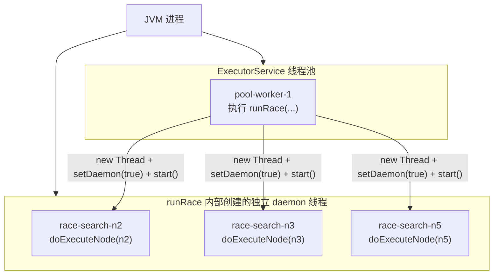
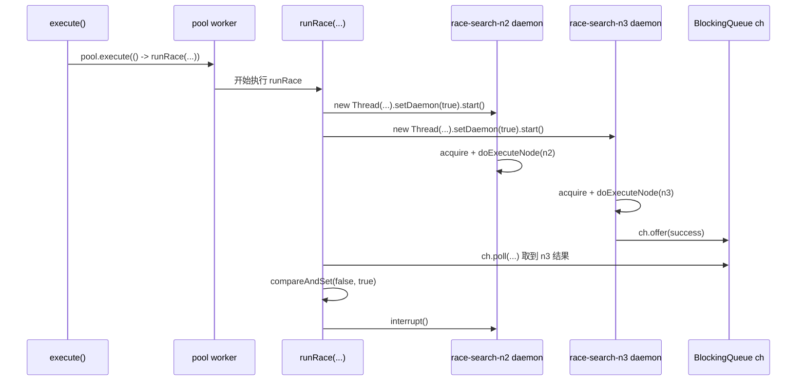

# 27-GraphRuntime-runRace

这一节讲 `GraphRuntime.runRace(ExecutorService pool, RaceGroup g)`。

它负责执行**竞速节点组**：同一层里多个节点属于同一个 `race_group`，它们会一起尝试完成同一个目标，谁先成功就用谁的结果，其余节点被标记为 `SKIPPED`。

源码位置：

```text
AGI-saber-java/src/main/java/com/agi/assistant/application/chat/GraphRuntime.java
```

## 1. runRace 解决什么问题

普通节点是：

```text
n1 执行完，保存 n1 的结果
n4 执行完，保存 n4 的结果
```

竞速节点不是这样。

竞速节点表示：这些节点是同一个任务的不同执行方案，系统只需要一个最快成功结果。

例如：

```text
race_group = "search"

n2: tavily_search
n3: rag_search
n5: local_search
```

这三个节点都在尝试“搜索资料”。

`runRace` 的目标是：

```text
1. 同时启动 n2、n3、n5
2. 谁先成功，谁胜出
3. 胜出节点写入 results
4. 其他节点尽快中断
5. 最后把没胜出的节点标记为 SKIPPED
```

这就是 `first-success-wins`：第一个成功者获胜。

## 2. runRace 在 execute 里的位置

`execute()` 会先把当前层按 `race_group` 分组：

```java
List<RaceGroup> groups = groupByRace(level);
```

如果一个组满足三个条件：

```text
1. raceGroup 不为空
2. cfg.enableRacing == true
3. 组内节点数量 > 1
```

就会走竞速：

```java
pool.execute(() -> {
    try { runRace(pool, g); }
    finally { latch.countDown(); }
});
```

也就是说，`runRace` 本身是被线程池调度的。

但是，`runRace` 内部启动每个候选节点时，不再用 `pool.execute()`，而是自己 `new Thread(...).start()`。

这个原因和 `interrupt()` 有关，下面直接拆开说明。

所以这里有两层线程关系：

```text
第一层：
  execute() 把 runRace 这个“竞速组任务”提交给线程池
  pool worker 线程开始执行 runRace(...)

第二层：
  runRace(...) 里面再给组内每个候选节点创建独立 Thread
  这些 race-* 线程真正执行 doExecuteNode(...)
```

换句话说：

```text
线程池负责启动整个竞速组
runRace 自己负责启动组内候选节点
```

## 3. RaceGroup 是什么结构

源码里有一个内部类：

```java
private static class RaceGroup {
    final String raceGroup;
    final List<String> nodeIds;
    RaceGroup(String rg, List<String> ids) {
        this.raceGroup = rg;
        this.nodeIds = ids;
    }
}
```

它只保存两件事：

```text
raceGroup: 竞速组名
nodeIds: 这个竞速组里有哪些节点
```

例如当前层是：

```text
level = ["n2", "n3", "n8"]

n2.raceGroup = "search"
n3.raceGroup = "search"
n8.raceGroup = ""
```

`groupByRace(level)` 会得到：

```text
RaceGroup("search", ["n2", "n3"])
RaceGroup("", ["n8"])
```

其中：

```text
RaceGroup("search", ["n2", "n3"]) -> 走 runRace
RaceGroup("", ["n8"])              -> 走 runSingle
```

## 4. 方法源码

```java
private void runRace(ExecutorService pool, RaceGroup g) {
    // winnerFound 是“本竞速组是否已经产生赢家”的共享标志。
    // false = 还没人赢；true = 已经有节点先成功了。
    // AtomicBoolean 保证多个线程同时抢赢家时，只有一个线程能把 false 改成 true。
    AtomicBoolean winnerFound = new AtomicBoolean(false);

    // ch 是竞速结果队列，也可以理解成“多个候选线程共用的结果邮箱”。
    // 每个候选节点线程跑完后，不直接决定自己是不是赢家，
    // 而是把自己的尝试结果包装成 RaceAttempt 丢进 ch。
    // runRace 主逻辑再从 ch 里取结果，判断谁先成功。
    //
    // 队列容量是 g.nodeIds.size()，因为每个候选节点最多投递一次结果。
    BlockingQueue<RaceAttempt> ch = new ArrayBlockingQueue<>(g.nodeIds.size());

    // threads 保存“节点 ID -> 该节点对应的 Thread 对象”。
    // 后面某个节点胜出后，runRace 要遍历 threads，把其他候选线程 interrupt 掉。
    Map<String, Thread> threads = new HashMap<>();

    // 给竞速组里的每个候选节点都创建一个独立线程。
    // 例如 g.nodeIds = ["n2", "n3"]，这里会创建两个线程：
    // race-search-n2 和 race-search-n3。
    for (String id : g.nodeIds) {
        // 注意：执行到 new Thread(...) 这一行时，里面的工具调用还没有开始。
        //
        // 这里的 () -> { ... } 是 Runnable，也就是“这个线程将来要执行的代码”。
        // new Thread(...) 只是把这段代码装进 Thread 对象里。
        // 只有后面调用 t.start()，JVM 才会真的创建新执行流，
        // 然后新线程才会从这里的 lambda 代码第一行开始跑。
        Thread t = new Thread(() -> {
            // 第一层检查：线程刚启动时，先看是否已经不需要执行。
            //
            // winnerFound.get() == true:
            //   说明同组别的节点已经赢了，当前节点不用再跑。
            //
            // cancelled.get() == true:
            //   说明用户取消了整张图执行，当前节点也不用再跑。
            if (winnerFound.get() || cancelled.get()) {
                // 把“我被取消了”这个结果投递给 ch。
                // result = null，err = "竞速取消"，表示这不是成功结果。
                ch.offer(new RaceAttempt(id, null, "竞速取消"));
                return;
            }

            // 先抢 Semaphore 许可证。
            // 注意：虽然竞速组里多个线程都启动了，但真正能同时执行工具的数量，
            // 仍然受 cfg.maxParallel 控制。
            acquire();
            try {
                // 第二层检查：拿到许可证后，再检查一次。
                //
                // 为什么要检查两次？
                // 因为当前线程可能在 acquire() 卡了很久；
                // 等它终于拿到许可证时，别的节点可能已经胜出了。
                if (winnerFound.get() || cancelled.get()) {
                    // 这种情况下也不执行工具，直接告诉 ch：当前候选取消。
                    ch.offer(new RaceAttempt(id, null, "竞速取消"));
                    return;
                }

                // 真正执行当前节点。
                //
                // 和 runSingle 不同，这里传 winnerFound，而不是 null。
                // doExecuteNode 内部会检查 winnerFound：
                // 如果别的候选已经赢了，它会提前返回 null，不继续重试。
                String r = doExecuteNode(id, winnerFound);

                // doExecuteNode 返回 null，表示当前候选没有成功结果。
                // 可能原因：工具失败、被取消、线程被 interrupt、别人已经赢了。
                if (r == null) {
                    // errorOf(id) 会从 errors 里取该节点错误；
                    // 如果没有记录，就返回“未知错误”。
                    //
                    // 这里投递的是失败 RaceAttempt。
                    ch.offer(new RaceAttempt(id, null, errorOf(id)));
                } else {
                    // 返回非 null，说明当前候选执行成功。
                    // 这里先把成功结果投递给 ch。
                    // 注意：投递成功结果不等于已经赢了；
                    // 赢家要由下面的 compareAndSet 决定。
                    ch.offer(new RaceAttempt(id, r, null));
                }
            } catch (Throwable ex) {
                // 兜底捕获。
                // 如果候选线程里出现 Throwable，也不要让线程直接炸掉没消息；
                // 而是包装成失败 RaceAttempt 投递给 ch。
                ch.offer(new RaceAttempt(id, null, ex.getMessage()));
            } finally {
                // 只要前面 acquire() 拿过许可证，这里就必须释放。
                // 放在 finally 里，保证成功、失败、异常都会归还许可证。
                sem.release();
            }
        }, "race-" + g.raceGroup + "-" + id);

        // 设置成 daemon 线程。
        // 这些线程是图运行时内部辅助线程，不应该单独阻止 JVM 退出。
        t.setDaemon(true);

        // 保存线程对象，后面确认赢家后要 interrupt 其他候选线程。
        threads.put(id, t);

        // 真正启动线程。
        // 从这一行开始，上面 lambda 里面的代码才会在新线程里执行。
        //
        // 也就是说：
        // new Thread(...) 只是“准备线程”；
        // t.setDaemon(...) 只是“设置线程属性”；
        // threads.put(...) 只是“保存线程引用”；
        // t.start() 才是“开始执行 doExecuteNode / 工具调用”。
        //
        // 这里必须 t.start()，不是 pool.execute(t)。
        // 因为后面要对这个具体 Thread 对象调用 interrupt()。
        t.start();
    }

    // 这个竞速组的总截止时间。
    // cfg.raceTimeoutMs 是整个竞速组最多等待多久，不是每个候选各自等多久。
    long deadline = System.currentTimeMillis() + cfg.raceTimeoutMs;

    // lastErr 保存目前看到的最后一个失败原因。
    // 如果最终没有任何赢家，会把这个错误写到整组节点上。
    String lastErr = null;

    // collected 表示已经从 ch 里取出了几个 RaceAttempt。
    // 最多取 g.nodeIds.size() 个，因为每个候选最多投递一次。
    int collected = 0;
    try {
        // 只要还没有收集完所有候选结果，就继续等。
        // 当然，中途如果超时，也会 break。
        while (collected < g.nodeIds.size()) {
            // 计算距离竞速组 deadline 还剩多少时间。
            long left = deadline - System.currentTimeMillis();

            // 没时间了，停止等待。
            if (left <= 0) break;

            // 从结果队列里取一个 RaceAttempt。
            //
            // poll(left, TimeUnit.MILLISECONDS) 的意思：
            //   最多等 left 毫秒；
            //   如果期间有候选结果入队，就返回；
            //   如果一直没有结果，就返回 null。
            RaceAttempt r = ch.poll(left, TimeUnit.MILLISECONDS);

            // r == null 表示等到超时也没拿到结果。
            if (r == null) break;

            // 成功拿到一个候选结果，收集数量 +1。
            collected++;

            // 判断当前 RaceAttempt 能不能成为赢家：
            //
            // r.err == null:
            //   当前候选执行成功。
            //
            // winnerFound.compareAndSet(false, true):
            //   如果还没有赢家，就把 winnerFound 从 false 改成 true。
            //   这个修改是原子的，所以多个成功候选同时返回时，只有一个能成功。
            if (r.err == null && winnerFound.compareAndSet(false, true)) {
                // 当前 RaceAttempt 成为赢家。
                // 先取出赢家节点，后面要拿 toolName 发事件。
                Node node = graph.getNodes().get(r.id);

                // 写共享状态：results 和 graph 节点状态。
                // 因为可能有多个线程读写共享状态，所以用 mu 加锁。
                synchronized (mu) {
                    // 只把赢家结果写入 results。
                    // 输家的结果不会进入最终结果表。
                    results.put(r.id, r.result);

                    // 赢家节点状态改成 DONE。
                    graph.setNodeStatus(r.id, NodeStatus.DONE);

                    // 赢家节点 result 写成当前成功结果。
                    graph.setNodeResult(r.id, r.result);
                }

                // 推送 race_won 事件：
                // 告诉前端 race_group 里哪个节点赢了。
                onEvent.accept(StreamEvent.raceWon(g.raceGroup, r.id, node.getToolName()));

                // 推送 observation：
                // 竞速节点的 observation 不在 doExecuteNode 里发，
                // 而是在这里确认赢家后，只发赢家结果。
                onEvent.accept(StreamEvent.observation(node.getToolName(), r.result));

                // 赢家已经确定，其他候选线程都可以停了。
                for (Map.Entry<String, Thread> e : threads.entrySet()) {
                    // 不打断赢家自己，只打断其他候选。
                    if (!e.getKey().equals(r.id)) e.getValue().interrupt();
                }
            } else if (!winnerFound.get() && r.err != null) {
                // 当前 RaceAttempt 是失败结果，并且现在还没有赢家。
                // 先记录这个错误。
                // 如果后面有别的候选成功，这个错误不会影响最终胜出。
                // 如果最终全失败，就用 lastErr 写失败原因。
                lastErr = r.err;
            }
        }
    } catch (InterruptedException ignored) {
        // 当前等待 ch.poll(...) 的线程被中断。
        // 恢复中断标记，让上层有机会感知。
        Thread.currentThread().interrupt();
    }

    // 最后结算整个竞速组。
    //
    // 注意：runRace 不是每拿到一个失败就立刻标 FAILED。
    // 它要等整个组结束后，统一判断：
    //   有赢家：赢家 DONE，其他节点 SKIPPED
    //   没赢家：整组 FAILED
    synchronized (mu) {
        if (winnerFound.get()) {
            // 已经有赢家。
            // 遍历组内所有节点，除了 DONE 的赢家，其余都标成 SKIPPED。
            for (String id : g.nodeIds) {
                Node n = graph.getNodes().get(id);
                if (n.getStatus() != NodeStatus.DONE) {
                    // SKIPPED 的含义：
                    // 不是它执行失败，而是同 race_group 里其他节点已经赢了。
                    graph.setNodeStatus(id, NodeStatus.SKIPPED);
                }
            }
        } else {
            // 没有任何候选成功。
            // 整个竞速组失败。
            for (String id : g.nodeIds) {
                graph.setNodeStatus(id, NodeStatus.FAILED);
                if (lastErr != null) {
                    // 当前实现只保存一个 lastErr。
                    // 没有赢家时，把最后看到的错误写给组内所有节点。
                    graph.setNodeError(id, lastErr);
                    errors.put(id, lastErr);
                }
            }
        }
    }
}
```

## 5. 开头三个变量

```java
AtomicBoolean winnerFound = new AtomicBoolean(false);
BlockingQueue<RaceAttempt> ch = new ArrayBlockingQueue<>(g.nodeIds.size());
Map<String, Thread> threads = new HashMap<>();
```

这三个变量是竞速的核心。

### 5.1 winnerFound：有没有赢家

```java
AtomicBoolean winnerFound = new AtomicBoolean(false);
```

`winnerFound` 一开始是：

```text
false
```

表示还没有节点胜出。

当某个节点成功返回时，会执行：

```java
winnerFound.compareAndSet(false, true)
```

这句话的意思是：

```text
如果当前值还是 false，就改成 true，并返回 true
如果当前值已经是 true，说明别人先赢了，返回 false
```

它是原子操作。

原子操作的意思是：多个线程同时抢的时候，这个判断和修改不会被拆开，不会出现两个线程都以为自己赢了的情况。

举个例子：

```text
T1: n2 返回成功
T2: n3 几乎同时返回成功

n2 执行 compareAndSet(false, true) -> 成功，n2 是赢家
n3 执行 compareAndSet(false, true) -> 失败，因为值已经是 true
```

所以整组竞速最多只有一个赢家。

### 5.2 ch：候选节点把结果投递到这里

```java
BlockingQueue<RaceAttempt> ch = new ArrayBlockingQueue<>(g.nodeIds.size());
```

`BlockingQueue` 中文可以叫**阻塞队列**。

它是 Java 并发包里的线程安全队列。

先把名字拆开：

```text
Blocking = 阻塞、等待
Queue    = 队列，先进先出
```

所以 `BlockingQueue` 的意思是：

```text
一个可以在多线程之间安全传数据的队列；
如果队列暂时没有数据，读取方可以等一会儿。
```

在 `runRace` 里，它像一个“结果邮箱”：

```text
候选线程 n2 执行完 -> 往 ch 里塞 RaceAttempt
候选线程 n3 执行完 -> 往 ch 里塞 RaceAttempt
runRace 主逻辑       -> 从 ch 里取 RaceAttempt
```

这里有两个动作：

```java
ch.offer(new RaceAttempt(id, r, null));
```

这是候选线程往队列里放结果。

```java
RaceAttempt r = ch.poll(left, TimeUnit.MILLISECONDS);
```

这是 `runRace` 主逻辑从队列里取结果。

`poll(left, TimeUnit.MILLISECONDS)` 的意思是：

```text
我想从 ch 里拿一个结果；
如果现在队列是空的，我最多等 left 毫秒；
等到了就返回 RaceAttempt；
等不到就返回 null。
```

这就是“阻塞”的意思。

普通 `Queue` 更像这样：

```text
队列空了 -> 立刻告诉你没有
```

`BlockingQueue` 可以这样：

```text
队列空了 -> 先等等，因为别的线程可能马上放结果进来
```

为什么竞速需要这个东西？

因为 `runRace` 里有多个候选线程同时跑：

```text
race-search-n2
race-search-n3
race-search-n5
```

这些线程什么时候结束是不确定的：

```text
n3 可能 100ms 返回
n2 可能 2s 返回
n5 可能失败
```

`runRace` 不能傻等某一个固定线程，它要谁先回来就先处理谁。

所以大家统一把结果投递到 `ch`：

```text
n3 先完成 -> ch.offer(RaceAttempt("n3", result, null))
runRace   -> ch.poll(...) 立刻拿到 n3 的结果
```

一句话：

```text
BlockingQueue 是 runRace 里多个候选线程和主收集逻辑之间传递结果的线程安全“结果邮箱”。
```

队列里的元素类型是：

```java
private static class RaceAttempt {
    final String id;
    final String result;
    final String err;
    RaceAttempt(String id, String result, String err) {
        this.id = id;
        this.result = result;
        this.err = err;
    }
}
```

结构完整展开是：

```text
RaceAttempt {
  id:     哪个节点返回了结果，例如 "n3"
  result: 成功结果，例如 "RAG 搜到 3 条资料"
  err:    失败原因；成功时为 null
}
```

成功结果长这样：

```text
RaceAttempt(
  id = "n3",
  result = "RAG 搜到 3 条资料",
  err = null
)
```

失败结果长这样：

```text
RaceAttempt(
  id = "n2",
  result = null,
  err = "HTTP 429 Too Many Requests"
)
```

取消结果长这样：

```text
RaceAttempt(
  id = "n5",
  result = null,
  err = "竞速取消"
)
```

### 5.3 threads：保存线程对象，方便之后 interrupt

```java
Map<String, Thread> threads = new HashMap<>();
```

这个表保存的是：

```text
{
  "n2": Thread("race-search-n2"),
  "n3": Thread("race-search-n3"),
  "n5": Thread("race-search-n5")
}
```

谁赢了以后，`runRace` 要把其他线程打断：

```java
for (Map.Entry<String, Thread> e : threads.entrySet()) {
    if (!e.getKey().equals(r.id)) e.getValue().interrupt();
}
```

所以必须保存每个候选节点对应的 `Thread` 对象。

## 6. 启动每个候选线程

```java
for (String id : g.nodeIds) {
    Thread t = new Thread(() -> {
        ...
    }, "race-" + g.raceGroup + "-" + id);
    t.setDaemon(true);
    threads.put(id, t);
    t.start();
}
```

假设：

```text
g.raceGroup = "search"
g.nodeIds = ["n2", "n3"]
```

这段代码会创建两个线程：

```text
Thread("race-search-n2")
Thread("race-search-n3")
```

然后：

```text
threads.put("n2", Thread("race-search-n2"))
threads.put("n3", Thread("race-search-n3"))
```

最后分别：

```text
n2Thread.start()
n3Thread.start()
```

两个线程开始同时竞争。

`setDaemon(true)` 表示它们是 daemon 线程。daemon 线程中文通常叫**守护线程**。

守护线程的特点是：它不应该阻止 JVM 退出。这里竞速线程属于运行时内部辅助线程，不是业务主线程，所以设置成 daemon。

### 6.1 JVM 和线程是什么关系

先把大关系说清楚：

```text
Java 程序启动
  -> 操作系统启动一个 JVM 进程
  -> JVM 进程里面可以有很多线程
  -> 每个线程负责执行一条代码执行流
```

所以：

```text
JVM 是 Java 程序运行的“进程容器”
线程是在 JVM 进程里面跑代码的“执行流”
```

例如启动一个 Java 后端服务：

```text
操作系统里看到的是一个 java 进程
这个 java 进程就是 JVM 进程
JVM 里面有 main 线程、线程池 worker 线程、GC 线程、业务线程等
```

可以画成这样：

```text
操作系统
└── java 进程，也就是 JVM
    ├── main 线程
    ├── pool-worker-1 线程
    ├── pool-worker-2 线程
    ├── race-search-n2 线程
    ├── race-search-n3 线程
    └── GC 等 JVM 内部线程
```

`runRace` 创建的线程就在 JVM 里面：

```java
Thread t = new Thread(..., "race-" + g.raceGroup + "-" + id);
t.start();
```

执行后，JVM 里会多出一个线程，例如：

```text
race-search-n2
```

但要注意一件事：

```text
race-search-n2 不是线程池里面的线程。
```

更准确的执行关系是：

```text
execute()
  -> 把 runRace 任务提交给 ExecutorService 线程池
  -> 线程池里的某个 pool worker 线程开始执行 runRace(...)
  -> runRace(...) 方法内部自己 new Thread(...)
  -> new 出来的 Thread 被设置成 daemon
  -> t.start() 后，JVM 里多出 race-* 线程
```

所以不能说：

```text
线程池里面自己创造了一个 daemon 线程
```

更准确地说：

```text
线程池 worker 线程正在执行 runRace；
runRace 这个方法内部自己创建了独立的 daemon 线程；
这些 race-* daemon 线程不属于线程池。
```

关系图是：

```text
JVM
├── ExecutorService 线程池
│   └── pool-worker-1
│       └── 正在执行 runRace(...)
│
├── race-search-n2 daemon 线程
│   └── 执行 n2 的 doExecuteNode(...)
│
└── race-search-n3 daemon 线程
    └── 执行 n3 的 doExecuteNode(...)
```

用 Mermaid 画出来更直观：



注意图里的层级：

```text
pool-worker-1 属于线程池。
race-search-n2 / race-search-n3 / race-search-n5 不属于线程池。
它们只是由正在执行 runRace 的 pool-worker-1 创建出来。
```

再看时间线：



这张图表达的是：

```text
execute 把 runRace 丢给线程池；
线程池 worker 开始跑 runRace；
runRace 再创建多个 race-* daemon 线程；
race-* 线程各自执行工具；
谁先把成功结果放进 BlockingQueue，谁就有机会成为赢家；
runRace 确认赢家后 interrupt 其他 race-* 线程。
```

这个线程和其他线程共享同一个 JVM 进程里的内存，所以它能访问这些对象：

```text
winnerFound
ch
threads
graph
results
errors
sem
cancelled
```

这也是为什么代码里需要：

```text
AtomicBoolean
BlockingQueue
Semaphore
synchronized
```

因为多个线程在同一个 JVM 里同时读写共享对象，如果不控制并发，就可能出现数据错乱。

JVM 什么时候退出，也和线程有关。

简单规则是：

```text
只要 JVM 里还有用户线程活着，JVM 通常不会退出。
如果 JVM 里只剩 daemon 线程，JVM 可以退出。
```

这就是下一节 daemon 线程要解决的问题。

### 6.2 daemon 线程有什么特点

Java 线程从 JVM 生命周期角度看，主要分两类：

```text
1. 用户线程，也叫普通线程、非 daemon 线程
2. daemon 线程，也叫守护线程
```

它们最大的区别是：**JVM 会不会为了等它继续运行而不退出**。

用户线程的特点：

```text
只要还有用户线程活着，JVM 就不会退出。
```

例如：

```java
Thread t = new Thread(() -> {
    while (true) {
        // 一直运行
    }
});
t.start();
```

默认情况下，`t` 是用户线程。

如果这个线程一直不结束，整个 Java 程序也会一直不退出。

daemon 线程的特点：

```text
如果 JVM 里只剩 daemon 线程，没有任何用户线程了，JVM 可以直接退出。
```

例如：

```java
Thread t = new Thread(() -> {
    while (true) {
        // 后台辅助工作
    }
});
t.setDaemon(true);
t.start();
```

这个线程还活着时，如果所有用户线程都结束了，JVM 不会专门等它。JVM 会退出，daemon 线程也会跟着结束。

所以 daemon 线程适合做：

```text
后台辅助任务
监控任务
清理任务
缓存刷新任务
不应该单独撑住整个进程的任务
```

在 `runRace` 里：

```java
t.setDaemon(true);
```

意思是：

```text
这些 race-* 线程只是一次图执行里的辅助竞速线程。
如果主流程都结束了，不能因为某个 race-* 线程还没完全退出，就让 JVM 一直不退出。
```

注意：`setDaemon(true)` 必须在 `start()` 之前调用。

正确：

```java
Thread t = new Thread(task);
t.setDaemon(true);
t.start();
```

错误：

```java
Thread t = new Thread(task);
t.start();
t.setDaemon(true); // 线程已经启动后再设置，会抛 IllegalThreadStateException
```

### 6.3 Java 一共有几种线程

如果按 JVM 生命周期分，主要就是两种：

```text
用户线程
daemon 守护线程
```

但平时还会听到很多线程名字，比如：

```text
main 线程
worker 线程
线程池线程
IO 线程
GC 线程
race-* 线程
```

这些不是同一个维度的分类。

可以这样理解：

```text
用户线程 / daemon 线程：
  是 JVM 生命周期分类，决定 JVM 会不会等它。

main 线程 / worker 线程 / IO 线程 / race-* 线程：
  是线程用途或来源分类，说明它负责干什么、从哪里创建。
```

放到这个项目里：

```text
pool worker 线程：
  来自 ExecutorService 线程池，负责执行 runSingle 或 runRace 这种任务。

race-* 线程：
  runRace 内部 new Thread 创建出来的候选执行线程。
  名字类似 race-search-n2。
  它们被设置成 daemon 线程。
```

所以不要把“线程池线程”和“daemon 线程”当成互斥概念。

一个线程可以同时满足：

```text
它是线程池 worker 线程
它也是 daemon 线程
```

也可以同时满足：

```text
它是 race-* 线程
它也是 daemon 线程
```

`runRace` 里关心 daemon，主要是为了控制生命周期；关心 `race-*` 名字，主要是为了方便调试和 interrupt。

### 6.4 new Thread 不是立刻执行工具

这段代码容易读错：

```java
Thread t = new Thread(() -> {
    String r = doExecuteNode(id, winnerFound);
}, "race-" + g.raceGroup + "-" + id);

t.setDaemon(true);
threads.put(id, t);
t.start();
```

直觉上好像 `doExecuteNode(...)` 写在前面，所以工具调用已经执行完了，后面才 `t.start()`。

但 Java 不是这样执行的。

`new Thread(() -> { ... })` 里面的 `{ ... }` 是一段函数体，也就是线程将来要执行的任务。创建 `Thread` 对象时，这段函数体不会立刻跑。

真实时间线是：

```text
1. Thread t = new Thread(() -> { ... });
   创建线程对象。
   lambda 里面的代码还没有执行。
   doExecuteNode 没有执行。
   工具没有调用。

2. t.setDaemon(true);
   设置这个线程是守护线程。
   lambda 里面的代码仍然没有执行。

3. threads.put(id, t);
   把线程对象保存到 Map 里，方便后面 interrupt。
   lambda 里面的代码仍然没有执行。

4. t.start();
   这一行才真正启动线程。
   新线程开始进入 lambda 里面执行。
   然后才会检查 winnerFound、acquire、doExecuteNode、调用工具。
```

所以不是“工具调用结束后才开启线程”。

正确理解是：

```text
先准备线程要执行的代码
再设置线程属性
再保存线程引用
最后 start
start 之后才真正调用工具
```

可以把它理解成做饭：

```text
new Thread(...)   = 写好菜谱，交给厨师
setDaemon(true)  = 告诉厨师这是后台任务
threads.put(...) = 记下这个厨师是谁
t.start()        = 厨师真正开始做菜
doExecuteNode    = 做菜过程中真正执行的一步
```

## 7. 为什么这里用 Thread.start，不用 pool.execute

源码注释写得很关键：

```java
// 必须用 Thread.start()，不能走 pool.execute(t) ——
// 后者会让 pool 的 worker 调 t.run()，t 自己的线程从未启动，
// 之后对 t.interrupt() 无效，竞速失败者将无法被打断。
```

这句话拆开说。

如果这样写：

```java
Thread t = new Thread(task);
pool.execute(t);
```

线程池不会启动这个 `t` 对象。

线程池会拿自己的 worker 线程去执行：

```java
t.run()
```

此时真正跑任务的是线程池 worker，不是 `t` 这个线程对象。

于是之后你这样写：

```java
t.interrupt();
```

打断的是 `t` 对象。

但 `t` 从来没有 `start()`，它不是正在执行任务的那个线程，所以打断不到真正运行的 worker。

而当前代码这样写：

```java
Thread t = new Thread(task);
t.start();
```

真正执行任务的就是 `t` 本人。

之后：

```java
t.interrupt();
```

就能打断这个候选节点。

这就是为什么 `runRace` 参数里虽然有 `ExecutorService pool`，但候选节点没有用 `pool.execute(t)`。

再强调一遍：

```text
pool 只负责调度 runRace 这个“竞速组任务”。
runRace 内部的 race-* 候选线程，是自己 new Thread 创建出来的独立 daemon 线程。
```

## 8. 每个候选线程内部做什么

候选线程的核心逻辑是：

```java
if (winnerFound.get() || cancelled.get()) {
    ch.offer(new RaceAttempt(id, null, "竞速取消"));
    return;
}
acquire();
try {
    if (winnerFound.get() || cancelled.get()) {
        ch.offer(new RaceAttempt(id, null, "竞速取消"));
        return;
    }
    String r = doExecuteNode(id, winnerFound);
    if (r == null) {
        ch.offer(new RaceAttempt(id, null, errorOf(id)));
    } else {
        ch.offer(new RaceAttempt(id, r, null));
    }
} catch (Throwable ex) {
    ch.offer(new RaceAttempt(id, null, ex.getMessage()));
} finally {
    sem.release();
}
```

按顺序拆开。

### 8.1 第一次检查：还没拿许可证前

```java
if (winnerFound.get() || cancelled.get()) {
    ch.offer(new RaceAttempt(id, null, "竞速取消"));
    return;
}
```

如果线程刚启动就发现：

```text
winnerFound == true
```

说明别人已经赢了。

如果发现：

```text
cancelled == true
```

说明用户取消了整次图执行。

这两种情况都没有必要继续执行工具。

所以它直接往 `ch` 里投递：

```text
RaceAttempt(id, null, "竞速取消")
```

然后 `return`。

### 8.2 acquire：拿并发许可证

```java
acquire();
```

竞速节点也受 `Semaphore` 限制。

例如：

```text
g.nodeIds = ["n2", "n3", "n5"]
cfg.maxParallel = 2
```

实际情况可能是：

```text
n2 acquire 成功，开始执行
n3 acquire 成功，开始执行
n5 acquire 等待，因为许可证没了
```

这说明竞速不是无限制并发。它仍然受全局最大并发数控制。

### 8.3 第二次检查：拿到许可证后

```java
if (winnerFound.get() || cancelled.get()) {
    ch.offer(new RaceAttempt(id, null, "竞速取消"));
    return;
}
```

为什么检查两次？

因为线程可能卡在 `acquire()` 很久。

例如：

```text
n5 等许可证时，n3 已经胜出
n5 后来终于拿到许可证
```

如果不再检查一次，`n5` 会白白调用工具。

所以拿到许可证后必须再看一眼：

```text
是否已经有人赢了
是否已经被用户取消
```

如果是，就不执行工具，直接投递取消结果。

### 8.4 doExecuteNode(id, winnerFound)

```java
String r = doExecuteNode(id, winnerFound);
```

这里和 `runSingle` 不同。

`runSingle` 传的是：

```java
doExecuteNode(nodeId, null)
```

竞速传的是：

```java
doExecuteNode(id, winnerFound)
```

这个 `winnerFound` 会被 `doExecuteNode` 用来判断：

```java
if (winnerFlag != null && winnerFlag.get()) {
    return null;
}
```

意思是：如果别的节点已经赢了，当前节点不再重试，直接返回 `null`。

所以竞速分支里，`doExecuteNode` 会更早停止。

还有一个区别：

```java
if (winnerFlag == null) {
    onEvent.accept(StreamEvent.observation(executor, result));
}
```

普通节点成功后，`doExecuteNode` 直接发 `observation`。

竞速节点成功后，`doExecuteNode` 不直接发 `observation`，因为它还不知道自己是不是最后赢家。竞速的 `observation` 要等 `runRace` 确认赢家后再发。

### 8.5 把结果投递到 ch

成功时：

```java
ch.offer(new RaceAttempt(id, r, null));
```

失败时：

```java
ch.offer(new RaceAttempt(id, null, errorOf(id)));
```

异常时：

```java
ch.offer(new RaceAttempt(id, null, ex.getMessage()));
```

所以候选线程自己不决定谁赢。

它只负责把自己的尝试结果投递到 `ch`：

```text
我成功了，这是 result
我失败了，这是 err
我取消了，这是 err
```

真正判断赢家的是 `runRace` 下面的收集循环。

### 8.6 finally 里释放许可证

```java
finally {
    sem.release();
}
```

这个和 `runSingle` 一样。

候选节点只要调用过 `acquire()`，最后就必须 `release()`。

否则一个失败或被打断的竞速节点可能把许可证永久占住，导致其他节点一直卡住。

## 9. 收集结果和超时控制

启动所有候选线程后，`runRace` 开始等结果：

```java
long deadline = System.currentTimeMillis() + cfg.raceTimeoutMs;
String lastErr = null;
int collected = 0;
```

这三个变量的含义：

```text
deadline: 这个竞速组最晚等到什么时候
lastErr: 目前看到的最后一个失败原因
collected: 已经从 ch 里取到了几个 RaceAttempt
```

循环条件是：

```java
while (collected < g.nodeIds.size()) {
    ...
}
```

意思是：最多收集和候选节点数量一样多的结果。

每次循环先计算剩余时间：

```java
long left = deadline - System.currentTimeMillis();
if (left <= 0) break;
```

如果没时间了，退出。

然后阻塞等待一个结果：

```java
RaceAttempt r = ch.poll(left, TimeUnit.MILLISECONDS);
if (r == null) break;
```

`poll(left, TimeUnit.MILLISECONDS)` 的意思是：

```text
最多等 left 毫秒
如果期间有候选结果进入 ch，就返回这个 RaceAttempt
如果一直没有结果，就返回 null
```

所以 `cfg.raceTimeoutMs` 是整个竞速组的硬超时。

例如：

```text
cfg.raceTimeoutMs = 30000
```

表示这个竞速组最多等 30 秒。

## 10. 判断赢家：compareAndSet

拿到一个候选结果后：

```java
collected++;
if (r.err == null && winnerFound.compareAndSet(false, true)) {
    ...
}
```

这里有两个条件。

第一个：

```text
r.err == null
```

表示这个候选节点成功了。

第二个：

```text
winnerFound.compareAndSet(false, true)
```

表示目前还没有赢家，并且当前线程成功把 `winnerFound` 从 `false` 改成 `true`。

两个条件都满足，当前 `RaceAttempt` 才是赢家。

赢家确认后，代码做四件事：

```java
Node node = graph.getNodes().get(r.id);
synchronized (mu) {
    results.put(r.id, r.result);
    graph.setNodeStatus(r.id, NodeStatus.DONE);
    graph.setNodeResult(r.id, r.result);
}
onEvent.accept(StreamEvent.raceWon(g.raceGroup, r.id, node.getToolName()));
onEvent.accept(StreamEvent.observation(node.getToolName(), r.result));
for (Map.Entry<String, Thread> e : threads.entrySet()) {
    if (!e.getKey().equals(r.id)) e.getValue().interrupt();
}
```

### 10.1 写入赢家结果

```java
synchronized (mu) {
    results.put(r.id, r.result);
    graph.setNodeStatus(r.id, NodeStatus.DONE);
    graph.setNodeResult(r.id, r.result);
}
```

假设赢家是 `n3`：

```text
r.id = "n3"
r.result = "RAG 搜到 3 条资料"
```

写入后：

```text
results = {
  "n3": "RAG 搜到 3 条资料"
}

graph.nodes["n3"].status = DONE
graph.nodes["n3"].result = "RAG 搜到 3 条资料"
```

这里用 `synchronized (mu)` 是因为运行时共享数据可能被多个线程读写。

`mu` 是 `GraphRuntime` 里的锁对象：

```java
private final Object mu = new Object();
```

`synchronized (mu)` 的意思是：进入大括号前先拿到 `mu` 这把锁，离开大括号自动释放锁。这样多个竞速线程不会同时改 `results` 和 `graph` 状态。

### 10.2 发送 raceWon 和 observation

```java
onEvent.accept(StreamEvent.raceWon(g.raceGroup, r.id, node.getToolName()));
onEvent.accept(StreamEvent.observation(node.getToolName(), r.result));
```

前端会看到两类事件：

```text
raceWon: search 组里 n3 胜出
observation: n3 对应工具的最终结果
```

竞速节点的 `observation` 在这里发送，而不是在 `doExecuteNode()` 里发送。

原因是：只有 `runRace` 确认赢家后，才能知道哪个结果该展示给用户。

### 10.3 interrupt 其他候选线程

```java
for (Map.Entry<String, Thread> e : threads.entrySet()) {
    if (!e.getKey().equals(r.id)) e.getValue().interrupt();
}
```

如果 `n3` 胜出：

```text
interrupt n2
interrupt n5
不 interrupt n3
```

`interrupt()` 不是强制杀死线程。

它更像是给线程发一个“请尽快停下”的信号。

当前代码里它主要影响这些地方：

```text
1. doExecuteNode 重试等待 Thread.sleep(retryDelay) 时，可以被打断并返回 null
2. 工具内部如果响应中断，也能更早结束
3. 如果工具正在不可中断的外部 IO 里，可能要等 IO 自己返回
```

所以竞速失败者不是被暴力删除，而是被通知停止。

## 11. 失败结果怎么处理

如果取到的 `RaceAttempt` 是失败：

```java
else if (!winnerFound.get() && r.err != null) {
    lastErr = r.err;
}
```

含义是：

```text
现在还没有赢家
而这个候选节点失败了
那就先记住它的错误信息
```

例如：

```text
n2 -> RaceAttempt("n2", null, "HTTP 429")
n3 -> RaceAttempt("n3", null, "RAG index not ready")
```

循环过程中：

```text
lastErr = "HTTP 429"
lastErr = "RAG index not ready"
```

如果最后一个赢家都没有，结算时会把 `lastErr` 写给整组节点。

## 12. 最后结算：SKIPPED 或 FAILED

收集循环结束后，进入结算：

```java
synchronized (mu) {
    if (winnerFound.get()) {
        for (String id : g.nodeIds) {
            Node n = graph.getNodes().get(id);
            if (n.getStatus() != NodeStatus.DONE) {
                graph.setNodeStatus(id, NodeStatus.SKIPPED);
            }
        }
    } else {
        for (String id : g.nodeIds) {
            graph.setNodeStatus(id, NodeStatus.FAILED);
            if (lastErr != null) {
                graph.setNodeError(id, lastErr);
                errors.put(id, lastErr);
            }
        }
    }
}
```

### 12.1 有赢家

如果 `winnerFound == true`：

```text
n3 赢了
```

结算会遍历所有节点：

```text
n2: 不是 DONE -> SKIPPED
n3: 已经 DONE -> 保持 DONE
n5: 不是 DONE -> SKIPPED
```

最终状态：

```text
graph.nodes["n2"].status = SKIPPED
graph.nodes["n3"].status = DONE
graph.nodes["n5"].status = SKIPPED
```

`results` 只保存赢家：

```text
results = {
  "n3": "RAG 搜到 3 条资料"
}
```

### 12.2 没有赢家

如果超时或全部失败，`winnerFound` 仍然是：

```text
false
```

结算会把整组标记为失败：

```text
n2 -> FAILED
n3 -> FAILED
n5 -> FAILED
```

如果 `lastErr` 有值，也会写入错误：

```text
graph.nodes["n2"].error = lastErr
graph.nodes["n3"].error = lastErr
graph.nodes["n5"].error = lastErr

errors = {
  "n2": lastErr,
  "n3": lastErr,
  "n5": lastErr
}
```

## 13. 完整例子：n2 和 n3 搜索竞速

假设当前层有一个竞速组：

```text
g.raceGroup = "search"
g.nodeIds = ["n2", "n3"]

n2.toolName = "tavily_search"
n2.params = {"query":"GraphRuntime runRace"}

n3.toolName = "rag_search"
n3.params = {"query":"GraphRuntime runRace"}
```

初始状态：

```text
winnerFound = false
ch = []
threads = {}
results = {}
```

### 13.1 启动阶段

```text
for id in ["n2", "n3"]:

创建 Thread("race-search-n2")
threads["n2"] = Thread("race-search-n2")
start n2

创建 Thread("race-search-n3")
threads["n3"] = Thread("race-search-n3")
start n3
```

### 13.2 执行阶段

假设 `n3` 更快：

```text
n2 线程：
  acquire()
  doExecuteNode("n2", winnerFound)
  tavily_search 还在等待外部 API

n3 线程：
  acquire()
  doExecuteNode("n3", winnerFound)
  rag_search 返回 "RAG 搜到 3 条资料"
  ch.offer(RaceAttempt("n3", "RAG 搜到 3 条资料", null))
  sem.release()
```

### 13.3 收集阶段

`runRace` 从队列里拿到：

```text
RaceAttempt("n3", "RAG 搜到 3 条资料", null)
```

判断：

```text
r.err == null
winnerFound.compareAndSet(false, true) == true
```

于是：

```text
n3 胜出
results["n3"] = "RAG 搜到 3 条资料"
graph.nodes["n3"].status = DONE
graph.nodes["n3"].result = "RAG 搜到 3 条资料"
发送 raceWon("search", "n3", "rag_search")
发送 observation("rag_search", "RAG 搜到 3 条资料")
interrupt n2
```

### 13.4 结算阶段

结算时：

```text
winnerFound == true
```

所以：

```text
n2.status = SKIPPED
n3.status = DONE
```

最终：

```text
results = {
  "n3": "RAG 搜到 3 条资料"
}

graph.nodes["n2"].status = SKIPPED
graph.nodes["n3"].status = DONE
```

## 14. 并发上限对竞速的影响

竞速不是说所有候选一定同时开始执行工具。

它还受：

```text
cfg.maxParallel
```

限制。

这里的 `cfg.maxParallel` 不是 `runRace` 自己单独的一套并发上限。

整个 `GraphRuntime` 只有一个 `Semaphore sem`：

```java
this.sem = new Semaphore(this.cfg.maxParallel);
```

普通节点 `runSingle` 会抢这个 `sem`。

竞速候选线程 `race-*` 也会抢这个 `sem`。

所以：

```text
runSingle 和 runRace 候选节点用的是同一个 maxParallel。
它们抢的是同一个许可证池。
```

如果：

```text
cfg.maxParallel = 2
```

意思不是：

```text
runSingle 最多 2 个
runRace 里面再最多 2 个
```

而是：

```text
普通节点 + 竞速候选节点，总共最多 2 个同时真正执行工具。
```

例如：

```text
g.nodeIds = ["n2", "n3", "n5"]
cfg.maxParallel = 1
```

虽然创建了三个线程：

```text
Thread("race-search-n2")
Thread("race-search-n3")
Thread("race-search-n5")
```

但同时只有一个能拿到许可证：

```text
n2 acquire 成功，开始执行
n3 卡在 acquire()
n5 卡在 acquire()
```

如果 `n2` 成功：

```text
winnerFound = true
n3 / n5 之后即使拿到许可证，也会在第二次检查处发现已经有赢家
然后投递 RaceAttempt(id, null, "竞速取消")
```

所以：

```text
maxParallel 越大，竞速越接近真正同时跑
maxParallel 越小，竞速越接近排队尝试
```

再举一个普通节点和竞速节点一起抢的例子：

```text
当前层：
普通节点 n4
竞速组 search = [n2, n3]

cfg.maxParallel = 2
```

可能出现：

```text
n4 runSingle 先 acquire 成功，占 1 张许可证
n2 race 线程 acquire 成功，占 1 张许可证
n3 race 线程卡在 acquire()
```

这时并不是 `runRace` 还有自己的 2 张许可证。

全场只有同一个 `sem`，一共 2 张许可证。

所以 `n3` 必须等 `n4` 或 `n2` 释放许可证后，才可能继续。

## 15. for 循环顺序会不会影响谁赢

会有影响，但不是绝对决定。

源码里启动候选线程是这样：

```java
for (String id : g.nodeIds) {
    Thread t = new Thread(...);
    t.start();
}
```

如果：

```text
g.nodeIds = ["n2", "n3", "n5"]
```

那么启动顺序是：

```text
先 start n2
再 start n3
再 start n5
```

这说明 `for` 循环顺序会影响：

```text
谁先被创建线程
谁先调用 start()
谁先有机会去 acquire()
```

但是它不直接等于：

```text
谁在前面，谁一定赢
谁在后面，谁一定失败
```

真正胜出的条件是：

```java
r.err == null && winnerFound.compareAndSet(false, true)
```

翻译一下：

```text
1. 当前候选必须成功返回，err == null
2. 当前候选必须第一个把 winnerFound 从 false 改成 true
```

所以 `for` 顺序只是影响“起跑顺序”，不是最终裁判。

所以赢家取决于：

```text
线程什么时候真正开始跑
有没有抢到 Semaphore 许可证
工具本身执行快慢
有没有失败
结果什么时候 ch.offer(...)
runRace 什么时候从 ch.poll(...) 取到结果
compareAndSet 谁先成功
```

失败也不是由 `for` 顺序直接决定的。

在 `runRace` 里，一个候选节点会出现三种常见结局：

```text
1. DONE
   它成功返回，并且第一个 compareAndSet(false, true) 成功。

2. SKIPPED
   别的同组节点已经赢了，它自己没有成为赢家。
   这不一定表示它工具执行失败，只表示它的结果不再需要。

3. FAILED
   整个竞速组都没有赢家，最后这组节点统一标记失败。
   常见原因是：所有候选都报错、都被取消、或者超过 raceTimeoutMs。
```

因此：

```text
for 顺序会影响谁更早开始尝试；
但不会直接把某个节点判成成功或失败。
```

### 15.1 maxParallel 比较大时

假设：

```text
g.nodeIds = ["n2", "n3"]
cfg.maxParallel = 2
```

`for` 会先启动 `n2`，再启动 `n3`。

但两个节点都能拿到许可证：

```text
n2 acquire 成功
n3 acquire 成功
```

如果：

```text
n2 调外部搜索，耗时 2 秒
n3 查本地 RAG，耗时 100 毫秒
```

即使 `n2` 先 start，最后也可能是：

```text
n3 先 ch.offer(...)
n3 compareAndSet(false, true) 成功
n3 胜出
```

所以并发足够时，`for` 顺序影响比较小，工具速度影响更大。

### 15.2 maxParallel 很小时

假设：

```text
g.nodeIds = ["n2", "n3"]
cfg.maxParallel = 1
```

`for` 先启动 `n2`，再启动 `n3`。

因为只有 1 张许可证，可能变成：

```text
n2 acquire 成功，开始执行
n3 卡在 acquire()
```

如果 `n2` 成功：

```text
n2 ch.offer(success)
n2 compareAndSet(false, true) 成功
n2 胜出
n3 之后拿到许可证时发现 winnerFound == true
n3 投递 "竞速取消"
```

这种情况下，`for` 顺序影响就更大。

因为排在前面的节点更容易先拿到唯一许可证。

但也不是 100% 绝对。

例如 `n2` 先拿到许可证但失败：

```text
n2 -> RaceAttempt("n2", null, "HTTP 500")
```

那它不会赢。

之后 `n3` 拿到许可证并成功：

```text
n3 -> RaceAttempt("n3", "成功结果", null)
n3 compareAndSet(false, true) 成功
n3 胜出
```

也就是说，`n2` 排在前面只让它先执行；如果它失败，胜利机会仍然会落到后面的 `n3`。

### 15.3 for 顺序对失败有没有影响

有间接影响，但不是直接判失败。

比如：

```text
g.nodeIds = ["n2", "n3"]
cfg.maxParallel = 1
```

执行过程可能是：

```text
1. for 先 start n2
2. n2 先 acquire 成功
3. n3 卡在 acquire()
4. n2 很快成功
5. runRace 确认 n2 是赢家
6. n3 之后被 interrupt 或者拿到许可证后发现 winnerFound == true
7. n3 最后被标记为 SKIPPED
```

这里 `n3` 不是“失败”，而是“被跳过”：

```text
n3 没有输在工具调用失败；
n3 是因为同组已经有赢家，所以不需要继续执行。
```

如果所有候选都失败，才会走整组失败：

```text
n2 -> RaceAttempt("n2", null, "HTTP 500")
n3 -> RaceAttempt("n3", null, "timeout")

winnerFound 仍然是 false
runRace 最后把 n2 / n3 都标记为 FAILED
```

所以，`for` 顺序最多影响谁先拿到执行机会；真正失败来自工具报错、异常、取消、超时，或者整个竞速组没有任何成功结果。

### 15.4 一句话总结

```text
for 顺序会影响启动先后和抢 Semaphore 许可证的机会；
但真正赢家由“谁先成功返回并抢到 winnerFound”决定；
失败不是按 for 顺序判的，而是看工具执行结果和整个竞速组有没有赢家。
```

更口语一点：

```text
排在前面的人更早起跑，但不是一定拿冠军。
排在后面的人可能没来得及跑完就被 SKIPPED，但这不等于工具失败。
```

## 16. runRace 和 runSingle 的核心区别

| 对比项 | runSingle | runRace |
|---|---|---|
| 处理对象 | 一个普通节点 | 一个竞速组 |
| 节点数量 | 1 个 | 多个 |
| 是否抢赢家 | 不抢 | 抢第一个成功者 |
| 执行入口 | `pool.execute(() -> runSingle(id))` | `pool.execute(() -> runRace(pool, g))` |
| 候选节点线程 | 线程池 worker 执行 | `new Thread(...).start()` |
| `doExecuteNode` 参数 | `winnerFlag = null` | `winnerFlag = winnerFound` |
| observation | `doExecuteNode` 直接发 | `runRace` 确认赢家后发 |
| results 写入 | 成功就写当前节点 | 只写赢家 |
| 失败处理 | 当前节点 FAILED | 没赢家时整组 FAILED |
| 非赢家处理 | 不存在 | 标记为 SKIPPED |

## 17. 常见误解

### 17.1 runRace 是不是取最快返回的节点

不是简单取“最快返回”。

它取的是：

```text
最快成功的节点
```

如果 `n2` 最快返回，但它失败了：

```text
RaceAttempt("n2", null, "HTTP 429")
```

那它不会胜出。

只有：

```text
r.err == null
```

的候选结果，才有资格抢赢家。

### 17.2 被 interrupt 的节点是不是立刻消失

不是。

`interrupt()` 是中断信号，不是强杀。

如果节点正在：

```text
Thread.sleep(retryDelay)
```

它会比较快被打断。

如果节点正在某个不可中断的 HTTP 调用里，它可能要等 HTTP 调用自己返回。

所以 `runRace` 会先标记赢家，并在结算时把非赢家标记为 `SKIPPED`，不用等失败者真的“干净退出”才把赢家结果发出去。

### 17.3 raceTimeoutMs 是每个节点的超时吗

不是。

`cfg.raceTimeoutMs` 是整个竞速组的等待上限。

代码是：

```java
long deadline = System.currentTimeMillis() + cfg.raceTimeoutMs;
```

然后每轮用：

```java
left = deadline - now
ch.poll(left, TimeUnit.MILLISECONDS)
```

所以它控制的是：

```text
runRace 最多等这个竞速组多久
```

不是每个候选工具各自独享一份超时时间。

### 17.4 为什么失败时整组都写同一个 lastErr

当前实现只保留：

```java
String lastErr
```

也就是最后一次看到的失败原因。

如果整组没有赢家，结算时会把这个 `lastErr` 写给组内所有节点。

这不是完整错误聚合，只是当前实现的简化策略。

## 18. 一句话总结

`runRace(g)` 是竞速组执行器：

```text
为组内每个节点启动独立线程
  -> 每个线程执行 doExecuteNode(id, winnerFound)
  -> 结果投递到 BlockingQueue
  -> runRace 从队列里取结果
  -> 第一个成功结果通过 compareAndSet 抢到赢家
  -> 写入赢家结果，发送 raceWon/observation，interrupt 其他线程
  -> 最后赢家 DONE，其他节点 SKIPPED；如果没有赢家，整组 FAILED
```
