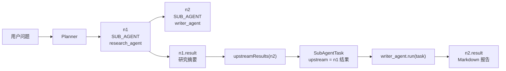

# 29-GraphRuntime-invoke

## 1. 这个方法解决什么问题

`doExecuteNode` 管理状态，但**真正执行工具或子Agent**的是 `invoke`。它按节点类型分发：TOOL 节点走 `t.getExecute().apply(params)`（和单工具模式完全相同），SUB_AGENT 节点走 `sa.run(task, cancelled)`。

### 1.1 子 Agent 是什么东西

子 Agent 不是线程，也不是线程池，也不是普通工具。

在这个项目里，子 Agent 是一个实现了 `SubAgent` 接口的“小型任务执行器”：

```java
public interface SubAgent {
    String name();
    String description();
    String run(SubAgentTask task, AtomicBoolean cancelled) throws Exception;
}
```

它有三件核心能力：

```text
name()
  注册名，比如 research_agent、writer_agent。

description()
  能力描述，给 Planner 看，让 Planner 知道什么时候该用它。

run(task, cancelled)
  真正执行这个子 Agent 的任务。
```

可以把它理解成：

```text
普通工具：
  输入 params
  执行一个明确动作
  返回字符串

子 Agent：
  输入 SubAgentTask
  可以读取上游节点结果
  可以调用 LLM / RAG / 工具 / 文档库
  完成一个更大的阶段性任务
  返回字符串
```

例如：

```text
search_web 工具：
  只负责搜索一次

research_agent 子 Agent：
  可以先改写查询
  再查 RAG 或 search_web
  再整理 evidence
  最后让 LLM 输出结构化研究摘要
```

所以子 Agent 比工具更“高一层”。

工具像一个函数：

```text
get_weather(city) -> 天气结果
```

子 Agent 像一个小工作流：

```text
research_agent(goal)
  -> 规划检索 query
  -> 查 RAG / 搜索网页
  -> 收集证据
  -> 生成研究摘要
```

### 1.2 项目里有哪些内建子 Agent

源码位置：

```text
AGI-saber-java/src/main/java/com/agi/assistant/application/chat/subagent/BuiltinSubAgents.java
```

当前内建了 4 个：

```text
research_agent
  多轮改写、知识库/RAG 检索、网页搜索、证据整理。

writer_agent
  把上游研究结果整理成 Markdown 报告。

review_agent
  检查报告结构、事实一致性、证据覆盖和风险。

doc_agent
  把上游报告保存到本地文档库，并同步写入 RAG。
```

它们通常组成一条链：

```text
research_agent
  -> writer_agent
      -> review_agent
          -> doc_agent
```

这条链常用于：

```text
研究
调研
总结
报告
文档
方案
分析
```

也就是说，用户问一个复杂任务时，Planner 不一定只规划工具节点，也可能规划子 Agent 节点。

### 1.3 子 Agent 是怎么被注册和取出来的

子 Agent 会注册到 `SubAgentRegistry`：

```java
public class SubAgentRegistry {
    private final Map<String, SubAgent> agents = new ConcurrentHashMap<>();

    public void register(SubAgent a) {
        agents.put(a.name(), a);
    }

    public SubAgent get(String name) {
        return agents.get(name);
    }

    public boolean has(String name) {
        return agents.containsKey(name);
    }
}
```

可以把 `SubAgentRegistry` 理解成：

```text
子 Agent 注册表

research_agent -> ResearchAgent 对象
writer_agent   -> WriterAgent 对象
review_agent   -> ReviewAgent 对象
doc_agent      -> DocAgent 对象
```

Planner 规划时看到的是名字：

```json
{
  "id": "n1",
  "type": "sub_agent",
  "agent": "research_agent",
  "goal": "围绕用户任务进行多轮检索和证据整理",
  "depends_on": []
}
```

GraphRuntime 执行时会用这个名字去注册表里取对象：

```java
SubAgent sa = subAgents.get(node.getAgentName());
```

然后调用：

```java
sa.run(task, cancelled)
```

### 1.4 子 Agent 和工具的区别

| 对比项 | 工具 TOOL | 子 Agent SUB_AGENT |
|---|---|---|
| 节点类型 | `NodeType.TOOL` | `NodeType.SUB_AGENT` |
| 规划字段 | `tool` + `params` | `agent` + `goal` |
| 执行入口 | `t.getExecute().apply(params)` | `sa.run(task, cancelled)` |
| 输入对象 | `Map<String,Object>` | `SubAgentTask` |
| 是否读取上游结果 | 通常不直接读 | 会通过 `task.upstream` 读取 |
| 适合做什么 | 单次明确动作 | 多步骤阶段性任务 |
| 例子 | `search_web`、`get_weather` | `research_agent`、`writer_agent` |

### 1.5 SubAgentTask 是什么

子 Agent 执行时拿到的不是简单 `params`，而是一个 `SubAgentTask`：

```java
public class SubAgentTask {
    public final String id;
    public final String goal;
    public final String query;
    public final Map<String, String> upstream;
}
```

四个字段含义：

```text
id
  当前节点 id，比如 n2。

goal
  Planner 给这个子 Agent 的任务目标。
  例如：基于研究结果生成 Markdown 报告。

query
  用户原始问题。

upstream
  上游依赖节点的结果。
  key = "<nodeId>:<executor-name>"
  value = 上游节点 result
```

例如：

```text
n1: research_agent 已经完成
n2: writer_agent depends_on = ["n1"]
```

执行 `writer_agent` 时，`upstream` 可能是：

```text
{
  "n1:research_agent": "## Research Findings\n\n..."
}
```

这样 `writer_agent` 就知道：

```text
我要基于 n1 的研究结果来写报告。
```

## 2. 方法源码

```java
/**
 * 位置：GraphRuntime.java:440-451
 */
private String invoke(Node node) throws Exception {
    if (node.getType() == NodeType.SUB_AGENT) {                  // ① 先判断是否子Agent节点
        // 子Agent：从注册表取 → 收集上游结果 → 构造任务 → 执行
        SubAgent sa = subAgents.get(node.getAgentName());        // ② 取出子Agent执行体
        Map<String, String> upstream = upstreamResults(node);    // ③ 收集依赖节点结果
        SubAgentTask task = new SubAgentTask(node.getId(), node.getGoal(),
                taskQuery, upstream);                           // ④ 构造子Agent任务
        return sa.run(task, cancelled);                          // ⑤ 执行子Agent
    }

    // 工具节点：和单工具模式完全一样的调用
    Tool t = tools.get(node.getToolName());                      // ⑥ 取工具定义
    Map<String, Object> params = new HashMap<>();                // ⑦ 创建 apply 需要的参数 Map
    if (node.getParams() != null) node.getParams().forEach(params::put); // ⑧ 转换参数类型
    return t.getExecute().apply(params);                         // ⑨ 真正执行工具
}
```

### 2.1 逐行解释

**① 先判断是否子Agent节点**

`Node` 有两种执行类型：`SUB_AGENT` 和 `TOOL`。这里先处理子 Agent。如果不是子 Agent，就落到下面的工具分支。

**② 取出子Agent执行体**

根据 `node.agentName` 从 `subAgents` 注册表里取具体执行体。前面的 `doExecuteNode` 已经校验过它存在，所以这里可以直接取。

**③ 收集依赖节点结果**

子 Agent 可能依赖上游节点，比如 writer 依赖 research 的结果。`upstreamResults(node)` 会从 `dependsOn` 指向的节点里读取 `result`。

**④ 构造子Agent任务**

`SubAgentTask` 把四类信息打包：节点 id、子 Agent 目标、用户原始 query、上游结果。这样子 Agent 不只知道“要做什么”，也知道“基于哪些前置结果做”。

**⑤ 执行子Agent**

调用 `sa.run(task, cancelled)`。返回值是子 Agent 的原始结果字符串，`doExecuteNode` 成功结算时会写入节点 result。

这里要注意：

```text
sa.run(...) 不是新开一个子线程。
它就是在当前节点执行线程里同步调用一个 Java 方法。
```

如果当前节点是普通子 Agent 节点：

```text
pool worker
  -> runSingle(id)
      -> doExecuteNode(id, null)
          -> invoke(node)
              -> sa.run(task, cancelled)
```

如果当前节点是竞速子 Agent 节点：

```text
race-* daemon 线程
  -> doExecuteNode(id, winnerFound)
      -> invoke(node)
          -> sa.run(task, cancelled)
```

所以子 Agent 不是“额外的线程类型”。

它只是节点执行到 `invoke` 时，选择了 `sa.run(...)` 这条分支。

**⑥ 取工具定义**

如果不是子 Agent，就按工具节点处理。用 `node.toolName` 从 `tools` 里拿到 `Tool`，里面有 execute lambda。

**⑦ 创建 apply 需要的参数 Map**

工具执行函数的签名是 `Function<Map<String,Object>, String>`，所以这里先创建一个 `Map<String,Object>`。

**⑧ 转换参数类型**

`Node.params` 是 `Map<String,String>`，因为 Planner JSON 解析出来的参数都按字符串保存。工具执行需要 `Map<String,Object>`，所以这里逐个 put 进去完成类型适配。

**⑨ 真正执行工具**

调用 `t.getExecute().apply(params)`。这和单工具模式里的 `tool.getExecute().apply(tc.getParams())` 是同一种执行方式；区别只是参数来源不同：单工具来自 `ToolCallResult`，ReAct 来自 `Node`。

## 3. 工具节点：apply 再次出现

```text
单工具模式（ToolModeHandler.run:49）:
  tool.getExecute().apply(tc.getParams())

ReAct 模式（GraphRuntime.invoke:450）:
  t.getExecute().apply(params)

两者调用的代码完全相同。区别在于：
- params 来源：单工具来自 ToolCallResult，ReAct 来自 Node
- 异常处理：单工具在 ToolModeHandler.run 的 try-catch，
  ReAct 在 doExecuteNode 的重试循环内
```

### 3.1 单工具调用和多工具调用里的工具调用有什么区别

先说结论：

```text
真正执行工具的最后一步是一样的：
  Tool.execute lambda
  -> getExecute()
  -> apply(params)

不一样的是 apply 外面的流程：
  单工具调用 = 选 1 个工具，马上执行 1 次
  多工具调用 = 先规划成多个 Node，再按图调度、并行、竞速、重试、汇总
```

也就是说，多工具调用没有换一套工具执行机制。它还是调用同一个 `Tool` 对象里的 `execute` lambda。

**1. 工具是怎么选出来的不同**

单工具调用：

```text
ToolModeHandler.run
  -> toolService.decide(query, ts)
  -> ToolCallResult tc
  -> tc.toolName 决定调用哪个工具
```

例如：

```text
用户问：上海天气怎么样
decide 返回：
  tc.toolName = "get_weather"
  tc.params = {city:"上海"}
```

多工具调用：

```text
ReActLoop.runStream
  -> planner.planGraph(query, ts, memPrefix)
  -> List<Node>
  -> 每个 Node 里有 toolName / params / dependsOn / raceGroup
```

例如：

```text
n1.toolName = "get_weather"
n1.params = {city:"上海"}
n1.dependsOn = []

n2.toolName = "search_web"
n2.params = {query:"上海小雨出行建议"}
n2.dependsOn = [n1]
```

所以：

```text
单工具：ToolCallResult 决定一次工具调用
多工具：Node 列表决定多次工具调用以及它们之间的依赖关系
```

**2. 参数来源不同**

单工具调用的参数来自 `ToolCallResult`：

```java
String result = tool.getExecute().apply(tc.getParams());
```

`tc.getParams()` 是 `Map<String,Object>`。它通常经过两步：

```text
ToolService.decide    -> 从用户 query 里提取参数
PreferenceFiller.fill -> 尝试用用户偏好补缺失参数
```

多工具调用的参数来自 `Node.params`：

```java
Map<String, Object> params = new HashMap<>();
if (node.getParams() != null) node.getParams().forEach(params::put);
return t.getExecute().apply(params);
```

`Node.params` 是 `Map<String,String>`，因为它来自 Planner 输出的 JSON。`invoke` 会把它复制成 `Map<String,Object>` 再传给工具。

所以：

```text
单工具：
  ToolCallResult.params
  Map<String,Object>
  可能经过 PreferenceFiller 补参

多工具：
  Node.params
  Map<String,String>
  invoke 中转换成 Map<String,Object>
  参数通常由 Planner 写进节点
```

**3. 调用时机不同**

单工具调用是立刻执行：

```text
decide 选出工具
拿到 Tool
PreferenceFiller 补参数
立刻 apply(params)
```

多工具调用不是立刻把所有工具全跑掉，而是先看图：

```text
planGraph 生成节点
TaskGraph 建依赖图
topologicalLevels 算层级
GraphRuntime.execute 按层执行
当前层到达某个节点时，才 doExecuteNode -> invoke -> apply
```

例如：

```text
levels = [[n1], [n2, n3], [n4]]
```

执行顺序是：

```text
n1 apply 完成后
n2/n3 才可能 apply
n2/n3 完成后
n4 才可能 apply
```

**4. 是否并发不同**

单工具调用没有图调度，也没有线程池并发。它就是当前请求线程里同步执行一次：

```text
tool.getExecute().apply(params)
```

多工具调用会把同一层节点提交给线程池：

```text
pool.execute(() -> runSingle(id))
```

所以同一层的普通节点可以并行执行；同一 `raceGroup` 的节点可以竞速执行。

但是并发数量仍然被 `Semaphore sem` 限制：

```text
线程池负责提交并发任务
sem 负责限制最多同时执行几个节点
```

**5. 错误处理不同**

单工具调用只有一层 `try-catch`：

```java
try {
    String result = tool.getExecute().apply(tc.getParams());
    tc.setToolResult(result);
} catch (Exception e) {
    resp.setAnswer("工具执行失败: " + e.getMessage());
    resp.setToolCall(tc);
    return;
}
```

失败后直接返回错误回答，不再继续。

多工具调用是在 `doExecuteNode` 里处理错误：

```text
校验工具是否存在
设置 NodeStatus.RUNNING
按 maxRetries 重试
失败后标 NodeStatus.FAILED
取消时标 NodeStatus.CANCELLED
竞速失败者由 runRace 标 NodeStatus.SKIPPED
```

所以多工具调用的错误处理更复杂，因为它要维护整张图里每个节点的状态。

**6. 状态记录不同**

单工具调用主要记录在：

```text
ToolCallResult.tc
  toolName
  params
  toolResult
```

最后放到：

```java
resp.setToolCall(tc)
```

多工具调用记录在每个 `Node` 里：

```text
Node.status = PENDING / RUNNING / DONE / FAILED / SKIPPED / CANCELLED
Node.result = 工具结果
Node.error  = 错误信息
Node.retryCount = 重试次数
```

最后汇总进：

```text
GraphResult.observations
GraphResult.nodeResults
```

**7. 事件推送不同**

单工具调用没有图事件。它执行完后直接让 LLM 生成回答。

多工具调用会推送节点级事件：

```text
graphReady
nodeStart
toolCall
nodeDone
observation
raceWon
```

所以前端可以看到：

```text
哪些节点开始了
哪个工具被调用了
哪个竞速节点赢了
哪些节点完成/失败/跳过
```

**8. 最终回答生成不同**

单工具调用：

```text
工具返回一个 result
ToolModeHandler.run 拼 userMsg
llm.chat(...) 生成回答
```

代码是：

```java
String userMsg = String.format(
        "用户问：%s\n工具 %s 返回结果：%s\n请根据结果自然地回答用户。",
        query, tc.getToolName(), tc.getToolResult());
resp.setAnswer(llm.chat(sp, List.of(Map.of("role", "user", "content", userMsg))));
```

多工具调用：

```text
多个 DONE 节点结果进入 gr.observations
ChatGenerator.generate(query, gr.observations, ...)
综合多个观察结果生成最终回答
```

代码位置在 `ReActLoop.runStream`：

```java
String answer = generator.generate(query, gr.observations, memPrefix, histMsgs);
```

### 3.2 用一句话记区别

```text
单工具调用：
  ToolCallResult -> Tool.apply(params) -> 一个工具结果 -> LLM 总结

多工具调用：
  List<Node> -> TaskGraph -> GraphRuntime 按层/并行/竞速执行
  -> 每个工具节点最终还是 Tool.apply(params)
  -> 多个 observations -> Generator 总结
```

所以两者“真正工具函数怎么跑”是一样的，都是：

```java
tool.getExecute().apply(params)
```

区别在于：

```text
单工具的 apply 外面只有一次同步 try-catch
多工具的 apply 外面包了一整套图调度、状态机、重试、并发、竞速和结果汇总
```

## 4. 子Agent节点：upstreamResults

```java
private Map<String, String> upstreamResults(Node node) {
    // 收集所有 dependsOn 节点的 result
    for (String depId : new TreeSet<>(node.getDependsOn())) {
        Node dep = graph.getNodes().get(depId);
        if (dep为null或result为空) continue;
        out.put(depId + ":" + dep.executorName(), dep.getResult());
    }
    return out;
}
```

这允许下游的 sub_agent 直接读取上游节点的执行结果。

## 4.1 用 writer_agent 跑一遍

假设 Planner 生成两个子 Agent 节点：

```text
n1:
  type = SUB_AGENT
  agentName = research_agent
  goal = 围绕用户任务进行多轮检索和证据整理
  dependsOn = []

n2:
  type = SUB_AGENT
  agentName = writer_agent
  goal = 基于研究结果生成 Markdown 报告
  dependsOn = [n1]
```

先执行 `n1`：

```text
invoke(n1)
  -> node.type == SUB_AGENT
  -> sa = subAgents.get("research_agent")
  -> upstream = {}
  -> task = SubAgentTask("n1", researchGoal, userQuery, {})
  -> sa.run(task, cancelled)
  -> 返回研究摘要
  -> n1.result = 研究摘要
```

再执行 `n2`：

```text
invoke(n2)
  -> node.type == SUB_AGENT
  -> sa = subAgents.get("writer_agent")
  -> upstreamResults(n2)
       从 n1.result 里取研究摘要
       生成 {"n1:research_agent": "研究摘要..."}
  -> task = SubAgentTask("n2", writerGoal, userQuery, upstream)
  -> sa.run(task, cancelled)
  -> writer_agent 从 task.upstream 取材料
  -> 返回 Markdown 报告
  -> n2.result = Markdown 报告
```

画成图：



## 5. 位置

```text
doExecuteNode
  └── invoke(node)  ← 你在这里
        ├── TOOL → t.getExecute().apply(params)   ← 第15章
        └── SUB_AGENT → sa.run(task, cancelled)
```

## 6. 用 n2(search_web) 的 TOOL 节点跑一遍

```text
invoke(n2):
  type=TOOL → 走工具分支
  t = tools.get("search_web")
  params = {query: "小雨出门建议"}  (from n2.params)
  t.getExecute().apply({query: "小雨出门建议"})
    → search_web execute lambda
    → "小雨天出行建议：带好雨具，注意路面湿滑..."
  return 结果
```

## 7. 常见误解

**误解一："invoke 返回的结果经过 LLM 总结"**

不。invoke 返回的是工具的原始输出。LLM 总结在 `ChatGenerator.generate`（第 16 章）中统一做。

**误解二："Node.params 的类型和 execute.apply 的参数类型不一致"**

`Node.params` 是 `Map<String,String>`，`execute.apply` 接受 `Map<String,Object>`。`invoke` 做了转换——`params.forEach((k,v) -> newParams.put(k,v))`。这是为了兼容：`String` 存入 Map，取出时为 `Object`。

**误解三："子Agent节点的上游结果是从 taskQuery 来的"**

不是。`upstreamResults` 从 `dependsOn` 节点的 `result` 字段读取——这是运行时产生的实际结果。`taskQuery` 是用户的原始 query，不经过工具处理。
