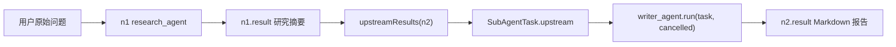

# 29-GraphRuntime-invoke

这一节讲 `GraphRuntime.invoke(Node node)`。

它是 `doExecuteNode` 里面真正执行“节点执行体”的方法。

`doExecuteNode` 负责节点状态机：

```text
取 Node
  -> 推 node_start / step / tool_call
  -> status = RUNNING
  -> 校验工具或子 Agent 是否存在
  -> 重试循环
  -> invoke(node)
  -> 成功 DONE / 失败 FAILED
```

`invoke(node)` 只负责中间这一步：

```text
这个 Node 到底应该怎么被执行
```

它根据 `node.type` 分成两条路：

```text
SUB_AGENT 节点:
  从 subAgents 注册表取 SubAgent
  收集上游 dependsOn 节点结果
  构造 SubAgentTask
  调用 sa.run(task, cancelled)

TOOL 节点:
  从 tools 表取 Tool
  把 Node.params 转成 Map<String,Object>
  调用 t.getExecute().apply(params)
```

## 1. invoke 负责什么

`invoke` 负责把一个已经通过校验的 `Node` 分派到真正执行代码。

具体做这些事：

```text
1. 判断 node.type 是 SUB_AGENT 还是 TOOL
2. 如果是 SUB_AGENT：
   1. 用 node.agentName 从 subAgents 取 SubAgent
   2. 调用 upstreamResults(node) 收集上游结果
   3. 构造 SubAgentTask
   4. 调用 sa.run(task, cancelled)

3. 如果不是 SUB_AGENT：
   1. 用 node.toolName 从 tools 取 Tool
   2. 创建 Map<String,Object> params
   3. 把 node.params 复制进去
   4. 调用 t.getExecute().apply(params)
```

它不负责：

```text
不负责把节点状态改成 RUNNING / DONE / FAILED
不负责推 node_start / node_done / observation 事件
不负责重试
不负责判断工具或子 Agent 是否存在
不负责竞速节点谁赢
不负责把结果写回 Node.result
```

这些都在外层：

```text
doExecuteNode:
  负责状态、事件、校验、重试、成功失败结算

runRace:
  负责竞速赢家确认和失败者 SKIPPED

runSingle:
  负责普通节点成功后把结果写入 results
```

`invoke` 返回的只是“这次执行体的原始结果字符串”。

## 2. 方法源码

源码位置：

```text
AGI-saber-java/src/main/java/com/agi/assistant/application/chat/GraphRuntime.java
```

```java
/** 按节点类型分派：sub-agent 节点跑注册表里的 SubAgent；其余走工具调用。 */
private String invoke(Node node) throws Exception {
    // ① 判断当前节点是不是子 Agent 节点。
    //
    // node.getType() 可能是：
    //   NodeType.SUB_AGENT
    //   NodeType.TOOL
    //   NodeType.THINK
    //   NodeType.AGGREGATE
    //
    // 但当前 invoke 只有两个执行分支：
    //   SUB_AGENT -> 子 Agent 分支
    //   其他类型   -> 工具分支
    if (node.getType() == NodeType.SUB_AGENT) {
        // ② 从子 Agent 注册表里取真正执行体。
        //
        // node.getAgentName() 可能是：
        //   "research_agent"
        //   "writer_agent"
        //   "review_agent"
        //   "doc_agent"
        //
        // doExecuteNode 前面已经校验过 subAgents.has(agentName)，
        // 所以这里直接 get。
        SubAgent sa = subAgents.get(node.getAgentName());

        // ③ 收集当前节点依赖的上游节点结果。
        //
        // 如果当前节点 dependsOn = ["n1"]，
        // 并且 n1 已经执行完成，upstreamResults 会读取 n1.result。
        Map<String, String> upstream = upstreamResults(node);

        // ④ 构造子 Agent 任务对象。
        //
        // SubAgentTask 里放四类信息：
        //   当前节点 id
        //   当前子 Agent 的目标 goal
        //   用户原始问题 taskQuery
        //   上游节点结果 upstream
        SubAgentTask task = new SubAgentTask(
                node.getId(),
                node.getGoal(),
                taskQuery,
                upstream
        );

        // ⑤ 同步调用子 Agent。
        //
        // 这里不是新开线程。
        // 它就是在当前节点执行线程里调用 sa.run(...)。
        //
        // 如果 sa.run 抛异常，异常会向外抛给 doExecuteNode，
        // 由 doExecuteNode 的重试循环处理。
        return sa.run(task, cancelled);
    }

    // ⑥ 非 SUB_AGENT 节点走工具分支。
    //
    // 当前项目里真正会执行到这里的主要是 NodeType.TOOL。
    // THINK / AGGREGATE 虽然在 enum 里预留了，
    // 但这里没有单独实现，会落到工具分支。
    Tool t = tools.get(node.getToolName());

    // ⑦ 创建工具 execute 需要的参数 Map。
    //
    // Tool.execute 的类型是：
    //   Function<Map<String, Object>, String>
    //
    // 所以 apply 需要 Map<String,Object>。
    Map<String, Object> params = new HashMap<>();

    // ⑧ 把 Node.params 复制进 params。
    //
    // Node.params 的类型是 Map<String,String>。
    // 这是 Planner JSON 解析后保存在 Node 里的参数。
    //
    // 复制进去以后，String 值作为 Object 传给工具函数。
    if (node.getParams() != null) node.getParams().forEach(params::put);

    // ⑨ 真正执行工具。
    //
    // t.getExecute() 取出 Tool 里的 execute lambda。
    // apply(params) 调用这个 lambda。
    //
    // 返回值是工具原始结果字符串。
    return t.getExecute().apply(params);
}
```

## 3. 参数和返回值

方法签名：

```java
private String invoke(Node node) throws Exception
```

参数：

| 参数 | 类型 | 含义 |
|---|---|---|
| `node` | `Node` | 当前要执行的任务节点。里面保存节点类型、工具名、子 Agent 名、参数、依赖等信息 |

返回值：

| 返回值 | 含义 |
|---|---|
| 非 `null` 字符串 | 执行体成功返回的原始结果 |
| `""` | 执行体成功返回空字符串 |
| `null` | 理论上可能出现，但 `invoke` 本身没有主动返回 `null` |

异常：

```text
invoke 声明 throws Exception
```

含义是：

```text
工具 execute lambda 抛异常
或者子 Agent 的 run(...) 抛异常
都会向外抛给 doExecuteNode
```

`invoke` 自己不 catch 异常。

异常处理在上一章讲过的 `doExecuteNode` 重试循环里：

```text
invoke(node)
  -> 抛异常
  -> doExecuteNode catch
  -> lastErr = 异常信息
  -> retryCount = attempt + 1
  -> 还没到最大次数就 sleep 后重试
  -> 最终失败则 status = FAILED
```

## 4. invoke 在完整链路中的位置

普通工具节点：

```text
GraphRuntime.execute
  -> runSingle("n1")
      -> doExecuteNode("n1", null)
          -> invoke(node)
              -> t.getExecute().apply(params)
```

竞速工具节点：

```text
GraphRuntime.execute
  -> runRace(group)
      -> doExecuteNode("n2", winnerFound)
          -> invoke(node)
              -> t.getExecute().apply(params)
```

子 Agent 节点：

```text
GraphRuntime.execute
  -> runSingle("n3") 或 runRace(...)
      -> doExecuteNode(...)
          -> invoke(node)
              -> upstreamResults(node)
              -> new SubAgentTask(...)
              -> sa.run(task, cancelled)
```

所以 `invoke` 的直接调用者只有 `doExecuteNode`。

`invoke` 不知道当前节点是普通节点还是竞速节点，因为这个区别是 `doExecuteNode` 的 `winnerFlag` 和外层 `runRace` 负责处理的。

## 5. Node 里哪些字段会被 invoke 使用

`Node` 结构里字段很多，但 `invoke` 直接用到的是这些：

```text
id
type
toolName
agentName
goal
params
dependsOn
```

完整一点看：

```text
Node {
  id: "n1",
  type: TOOL 或 SUB_AGENT,
  name: "Planner 给的展示名",

  toolName: "search_web",
  agentName: "research_agent",
  goal: "围绕用户问题进行研究",

  params: {
    "query": "上海小雨出行建议"
  },

  dependsOn: ["n0"],
  raceGroup: "",

  status: PENDING / RUNNING / DONE / FAILED / SKIPPED / CANCELLED,
  result: "",
  error: "",
  retryCount: 0
}
```

`invoke` 怎么用这些字段：

| 字段 | 谁用 | 用来做什么 |
|---|---|---|
| `type` | `invoke` | 判断走子 Agent 分支还是工具分支 |
| `agentName` | 子 Agent 分支 | 从 `subAgents` 注册表取 `SubAgent` |
| `goal` | 子 Agent 分支 | 放进 `SubAgentTask.goal` |
| `id` | 子 Agent 分支 | 放进 `SubAgentTask.id` |
| `dependsOn` | `upstreamResults` | 找出要读取哪些上游节点结果 |
| `toolName` | 工具分支 | 从 `tools` 表取 `Tool` |
| `params` | 工具分支 | 复制成 `Map<String,Object>` 后传给 `apply` |

`invoke` 不改这些字段。

它只读取字段，然后返回执行结果。

## 6. 子 Agent 分支

源码：

```java
if (node.getType() == NodeType.SUB_AGENT) {
    SubAgent sa = subAgents.get(node.getAgentName());
    Map<String, String> upstream = upstreamResults(node);
    SubAgentTask task = new SubAgentTask(node.getId(), node.getGoal(), taskQuery, upstream);
    return sa.run(task, cancelled);
}
```

### 6.1 子 Agent 是什么

子 Agent 是实现了 `SubAgent` 接口的“小型任务执行器”。

接口源码：

```java
public interface SubAgent {
    String name();
    String description();
    String run(SubAgentTask task, AtomicBoolean cancelled) throws Exception;
}
```

三个方法含义：

| 方法 | 含义 |
|---|---|
| `name()` | 注册名，也是 Planner JSON 里的 `agent` 字段 |
| `description()` | 能力描述，给 Planner 判断什么时候使用它 |
| `run(task, cancelled)` | 真正执行子 Agent 任务 |

子 Agent 不是线程池，也不是线程。

它就是一个 Java 对象，里面有自己的执行逻辑。

执行时是同步调用：

```text
当前节点执行线程
  -> invoke(node)
      -> sa.run(task, cancelled)
```

如果 `sa.run(...)` 内部很慢，当前节点执行线程就会一直等它返回。

### 6.2 项目里有哪些子 Agent

项目里的内建子 Agent 定义在：

```text
BuiltinSubAgents.java
```

注册代码是：

```java
reg.register(new ResearchAgent(cfg, llm, rag, agent));
reg.register(new WriterAgent(cfg, llm));
reg.register(new ReviewAgent(cfg, llm));
reg.register(new DocAgent(library));
```

也就是当前系统内建了 4 个子 Agent：

| 子 Agent | 职责 | 内部主要依赖 |
|---|---|---|
| `research_agent` | 多轮改写、RAG/网页搜索、证据整理 | `LlmService`、`RagService`、`UnifiedAgentService` 里的 `search_web` 工具 |
| `writer_agent` | 把上游研究结果整理成 Markdown 报告 | `LlmService`、`task.upstream` |
| `review_agent` | 检查报告结构、事实一致性、证据覆盖和风险 | `LlmService`、`task.upstream` |
| `doc_agent` | 把上游结果保存到本地文档库，并同步写入 RAG | `DocumentLibraryService` |

它们通常可以组成一条链：

```text
research_agent
  -> writer_agent
      -> review_agent
          -> doc_agent
```

但注意：这只是“可以这样规划”，不是每次都会全部调用。

这 4 个 Agent 的关系是：

```text
注册在 SubAgentRegistry 里
Planner 需要哪个，就在 Node 里写哪个 agentName
GraphRuntime 执行到对应 Node 时，才会调用对应 Agent
```

例如 Planner 只生成：

```text
n1:
  type = SUB_AGENT
  agentName = "research_agent"
```

那这次就只会调用 `research_agent`。

如果 Planner 生成：

```text
n1:
  type = SUB_AGENT
  agentName = "research_agent"
  dependsOn = []

n2:
  type = SUB_AGENT
  agentName = "writer_agent"
  dependsOn = ["n1"]
```

那执行顺序就是：

```text
先 research_agent
再 writer_agent
```

它们不会同时执行，因为 `writer_agent` 依赖 `research_agent` 的结果。

只有当多个 Agent 节点在同一拓扑层、彼此没有依赖时，才可能并行执行。

可以记成：

```text
注册 = 系统有这个可用角色
规划 = 这次任务图决定要不要用它
执行 = GraphRuntime 跑到这个 Node 才调用它
并行 = 它和别的节点在同一层且没有依赖
```

### 6.3 子 Agent 和工具到底像不像

像。

在 `GraphRuntime` 看来，子 Agent 和工具都被当成“节点执行体”：

```text
Node
  -> invoke(node)
      -> 执行某个东西
      -> 返回 String result
```

工具分支：

```java
Tool t = tools.get(node.getToolName());
return t.getExecute().apply(params);
```

子 Agent 分支：

```java
SubAgent sa = subAgents.get(node.getAgentName());
return sa.run(task, cancelled);
```

从外层看，它们都像：

```text
输入一些东西
执行
返回字符串
```

区别在输入和内部能力。

工具更像一个单动作函数：

```text
search_web({"query":"MCP 应用场景"})
  -> 搜索结果字符串
```

子 Agent 更像一个阶段性小工作流：

```text
research_agent(task)
  -> 看 task.goal
  -> 看 task.query
  -> 看 task.upstream
  -> 规划检索 query
  -> 查 RAG 或 search_web
  -> 整理 observations/evidence
  -> 可能调用 LLM 总结
  -> 返回 Research Findings
```

所以可以这样记：

```text
工具 = 一个具体动作
子 Agent = 能读取上游结果、组织多步逻辑的小执行器
```

或者更贴近这套代码：

```text
工具吃 Map<String,Object> params
子 Agent 吃 SubAgentTask
```

`SubAgentTask` 比普通工具参数多了这些东西：

```text
goal     这个阶段要完成什么
query    用户原始问题
upstream 上游节点结果
cancelled 取消信号
```

所以子 Agent 可以理解成“高级工具”，但不是普通工具列表。

### 6.4 SubAgentTask 是什么

`invoke` 不直接把 `Node` 丢给子 Agent。

它会先构造一个 `SubAgentTask`：

```java
SubAgentTask task = new SubAgentTask(node.getId(), node.getGoal(), taskQuery, upstream);
```

`SubAgentTask` 源码：

```java
public class SubAgentTask {
    public final String id;
    public final String goal;
    public final String query;
    public final Map<String, String> upstream;

    public SubAgentTask(String id, String goal, String query, Map<String, String> upstream) {
        this.id = id == null ? "" : id;
        this.goal = goal == null ? "" : goal;
        this.query = query == null ? "" : query;
        this.upstream = upstream == null ? new LinkedHashMap<>() : upstream;
    }
}
```

四个字段含义：

| 字段 | 来源 | 含义 |
|---|---|---|
| `id` | `node.getId()` | 当前节点 id，比如 `"n2"` |
| `goal` | `node.getGoal()` | Planner 给这个子 Agent 的任务目标 |
| `query` | `taskQuery` | 用户原始问题，GraphRuntime 构造时传入 |
| `upstream` | `upstreamResults(node)` | 上游依赖节点已经产生的结果 |

例如：

```text
用户原始问题：
  帮我调研一下 MCP 的应用场景，并整理成报告

当前节点：
  id = "n2"
  type = SUB_AGENT
  agentName = "writer_agent"
  goal = "基于研究结果生成 Markdown 报告"
  dependsOn = ["n1"]

n1 已经完成：
  n1.executorName() = "research_agent"
  n1.result = "MCP 应用场景研究摘要..."
```

构造出来的 `SubAgentTask` 是：

```text
SubAgentTask {
  id: "n2",
  goal: "基于研究结果生成 Markdown 报告",
  query: "帮我调研一下 MCP 的应用场景，并整理成报告",
  upstream: {
    "n1:research_agent": "MCP 应用场景研究摘要..."
  }
}
```

然后：

```java
sa.run(task, cancelled)
```

也就是：

```text
writer_agent.run(task, cancelled)
```

`writer_agent` 就能从 `task.upstream` 里拿到 `research_agent` 的研究结果。

### 6.5 writer_agent.run(task, cancelled) 这行到底在做什么

这行：

```java
writer_agent.run(task, cancelled)
```

对应到源码里，其实就是调用 `WriterAgent` 这个类的 `run` 方法。

源码：

```java
public static class WriterAgent implements SubAgent {
    private final AppConfig cfg;
    private final LlmService llm;

    @Override public String name() { return "writer_agent"; }
    @Override public String description() { return "将上游研究结果整理为 Markdown 报告。"; }

    @Override
    public String run(SubAgentTask task, AtomicBoolean cancelled) {
        String input = SubAgentSupport.upstreamText(task);
        if (!cfg.isRealLLM()) {
            return "# " + SubAgentSupport.safeTitle(task.goal, task.query) + "\n\n" + input;
        }
        return llm.chat(
                "你是 writer_agent。请把输入整理为清晰 Markdown 报告，包含摘要、分析、建议和下一步。",
                List.of(Map.of("role", "user", "content",
                        "写作目标：" + task.goal + "\n\n材料：\n" + input)));
    }
}
```

拆开看：

```java
String input = SubAgentSupport.upstreamText(task);
```

这一步把 `task.upstream` 拼成 Markdown 文本。

例如 `task.upstream` 是：

```text
{
  "n1:research_agent": "MCP 应用场景研究摘要..."
}
```

那么 `input` 会变成类似：

```text
## n1:research_agent

MCP 应用场景研究摘要...
```

然后分两种情况。

**情况一：不是 Real LLM 模式**

```java
if (!cfg.isRealLLM()) {
    return "# " + SubAgentSupport.safeTitle(task.goal, task.query) + "\n\n" + input;
}
```

它不会真的调用大模型，而是直接拼一个 Markdown：

```text
# 基于研究结果生成 Markdown 报告

## n1:research_agent

MCP 应用场景研究摘要...
```

这个返回值会一路回到：

```text
WriterAgent.run
  -> invoke
  -> doExecuteNode
  -> graph.setNodeResult("n2", result)
```

**情况二：Real LLM 模式**

```java
return llm.chat(
        "你是 writer_agent。请把输入整理为清晰 Markdown 报告，包含摘要、分析、建议和下一步。",
        List.of(Map.of("role", "user", "content",
                "写作目标：" + task.goal + "\n\n材料：\n" + input)));
```

它会把两类内容交给 LLM：

```text
system prompt:
  你是 writer_agent。请把输入整理为清晰 Markdown 报告...

user message:
  写作目标：基于研究结果生成 Markdown 报告

  材料：
  ## n1:research_agent

  MCP 应用场景研究摘要...
```

LLM 返回的 Markdown 报告，就是 `writer_agent.run(task, cancelled)` 的返回值。

注意这里的 `cancelled`：

```text
writer_agent.run(task, cancelled)
```

当前 `WriterAgent.run` 源码里没有主动检查 `cancelled.get()`。

但接口把 `cancelled` 传进来，是为了让长时间运行的子 Agent 可以支持取消。

例如 `research_agent` 里就会在循环中检查：

```java
if (cancelled != null && cancelled.get()) break;
```

所以这里要理解成：

```text
cancelled 是传给子 Agent 的取消信号。
具体有没有检查它，取决于每个子 Agent 自己的 run 实现。
```

### 6.6 子 Agent 分支完整调用链

假设当前节点是：

```text
n2:
  type = SUB_AGENT
  agentName = "writer_agent"
  goal = "基于研究结果生成 Markdown 报告"
  dependsOn = ["n1"]
```

调用链：

```text
doExecuteNode("n2", null)
  -> invoke(n2)
      -> node.getType() == SUB_AGENT
      -> subAgents.get("writer_agent")
      -> upstreamResults(n2)
          -> 读取 n1.result
          -> 生成 {"n1:research_agent": "研究摘要..."}
      -> new SubAgentTask("n2", goal, taskQuery, upstream)
      -> writer_agent.run(task, cancelled)
          -> SubAgentSupport.upstreamText(task)
          -> cfg.isRealLLM() ? llm.chat(...) : 拼接 Markdown
      -> "Markdown 报告..."
```

`invoke` 返回：

```text
"Markdown 报告..."
```

然后回到 `doExecuteNode`：

```text
result = "Markdown 报告..."
lastErr = null
status = DONE
node.result = "Markdown 报告..."
```

## 7. upstreamResults：上游结果是怎么收集的

子 Agent 分支会调用：

```java
Map<String, String> upstream = upstreamResults(node);
```

源码：

```java
/** 取所有 depends_on 节点的 result，key = "<nodeId>:<executor-name>"，便于子 Agent 识别。 */
private Map<String, String> upstreamResults(Node node) {
    // ① 创建有顺序的 Map。
    //
    // LinkedHashMap 会保留 put 的顺序。
    Map<String, String> out = new LinkedHashMap<>();

    // ② 如果当前节点没有 dependsOn，直接返回空 Map。
    if (node.getDependsOn() == null) return out;

    // ③ 按 depId 排序后遍历。
    //
    // new TreeSet<>(node.getDependsOn()) 会把依赖 id 排序。
    // 例如 ["n3", "n1", "n2"] 会变成 ["n1", "n2", "n3"]。
    //
    // 这样输出顺序稳定，doc_agent 等节点可以按稳定顺序处理上游材料。
    for (String depId : new TreeSet<>(node.getDependsOn())) {
        // ④ 从任务图里取依赖节点。
        Node dep = graph.getNodes().get(depId);

        // ⑤ 依赖节点不存在、result 为 null、result 为空字符串，都跳过。
        //
        // 也就是说，upstream 只收集已经有非空结果的上游节点。
        if (dep == null || dep.getResult() == null || dep.getResult().isEmpty()) continue;

        // ⑥ 取上游节点的执行体名称。
        //
        // TOOL 节点是 toolName。
        // SUB_AGENT 节点是 agentName。
        String exec = dep.executorName();

        // ⑦ 构造 upstream 的 key。
        //
        // 如果 exec 非空：
        //   key = "n1:research_agent"
        //
        // 如果 exec 为空：
        //   key = "n1"
        String key = exec.isEmpty() ? depId : depId + ":" + exec;

        // ⑧ 保存上游节点结果。
        out.put(key, dep.getResult());
    }

    // ⑨ 返回给 invoke，用来构造 SubAgentTask。
    return out;
}
```

### 7.1 upstream 的 key 为什么是 nodeId:executorName

`upstream` 不是只用 `"n1"` 当 key，而是优先用：

```text
"n1:research_agent"
```

原因是：子 Agent 看到上游结果时，不仅需要知道“来自哪个节点”，还需要知道“这个节点是谁执行的”。

例如：

```text
{
  "n1:research_agent": "研究摘要...",
  "n2:review_agent": "审查意见..."
}
```

`writer_agent` 或 `doc_agent` 看到 key 就能区分：

```text
n1 是研究结果
n2 是审查结果
```

如果只写：

```text
{
  "n1": "...",
  "n2": "..."
}
```

子 Agent 还要额外猜每个结果是什么类型。

### 7.2 upstreamResults 会跳过哪些节点

这行代码决定了跳过规则：

```java
if (dep == null || dep.getResult() == null || dep.getResult().isEmpty()) continue;
```

会跳过：

```text
dependsOn 里写了 n9，但 graph.nodes 里没有 n9
依赖节点存在，但 result == null
依赖节点存在，但 result == ""
```

所以 `upstream` 只包含：

```text
依赖节点存在
并且 result 非空
```

注意：这里不检查 `dep.status == DONE`。

它只看 `result` 是否非空。

在正常执行里，能被下游依赖读取的节点通常已经在上一层完成；但从源码本身看，`upstreamResults` 的筛选条件是 `result` 非空，不是 `status == DONE`。

## 8. 工具分支

源码：

```java
Tool t = tools.get(node.getToolName());
Map<String, Object> params = new HashMap<>();
if (node.getParams() != null) node.getParams().forEach(params::put);
return t.getExecute().apply(params);
```

### 8.1 Tool 是什么

`Tool` 源码：

```java
public class Tool {
    private String name;
    private String description;
    private List<ToolParam> parameters;
    private boolean mcp;
    private transient Function<Map<String, Object>, String> execute;

    public Function<Map<String, Object>, String> getExecute() {
        return execute;
    }
}
```

核心字段：

| 字段 | 含义 |
|---|---|
| `name` | 工具名，比如 `"get_weather"`、`"search_web"` |
| `description` | 工具能力描述，给路由或 Planner 参考 |
| `parameters` | 工具参数定义 |
| `execute` | 真正执行工具的函数 |

`execute` 的类型是：

```java
Function<Map<String, Object>, String>
```

意思是：

```text
输入：Map<String,Object> 参数
输出：String 工具结果
```

所以调用工具的最后一步就是：

```java
t.getExecute().apply(params);
```

这就是 Java 的 `Function.apply(...)`。

### 8.2 为什么要重新创建 params

`Node.params` 的类型是：

```java
Map<String, String>
```

工具执行函数需要的是：

```java
Map<String, Object>
```

所以 `invoke` 做了一次复制：

```java
Map<String, Object> params = new HashMap<>();
if (node.getParams() != null) node.getParams().forEach(params::put);
```

例如 `Node.params` 是：

```text
{
  "query": "上海小雨出行建议"
}
```

复制后：

```text
params = {
  "query": "上海小雨出行建议"
}
```

值还是字符串，但放进了 `Map<String,Object>`，满足工具函数签名。

### 8.3 工具分支完整调用链

假设当前节点是：

```text
n2:
  type = TOOL
  toolName = "search_web"
  params = {
    "query": "上海小雨出行建议"
  }
```

调用链：

```text
doExecuteNode("n2", null)
  -> invoke(n2)
      -> node.getType() != SUB_AGENT
      -> tools.get("search_web")
      -> new HashMap<String,Object>()
      -> node.getParams().forEach(params::put)
      -> params = {"query":"上海小雨出行建议"}
      -> t.getExecute().apply(params)
      -> search_web execute lambda
      -> "小雨天出行建议：带好雨具，注意路面湿滑..."
```

`invoke` 返回：

```text
"小雨天出行建议：带好雨具，注意路面湿滑..."
```

然后回到 `doExecuteNode`：

```text
result = "小雨天出行建议：带好雨具，注意路面湿滑..."
lastErr = null
status = DONE
node.result = result
```

## 9. 单工具调用和多工具调用里的工具调用有什么区别

先说结论：

```text
真正执行工具的最后一步是一样的：

Tool.execute lambda
  -> getExecute()
  -> apply(params)
```

不一样的是 `apply` 外面的流程。

### 9.1 单工具模式

单工具模式在 `ToolModeHandler.run` 里：

```java
ToolCallResult tc = toolService.decide(query, ts);
Tool tool = ts.get(tc.getToolName());
PreferenceFiller.fill(tc, pref);
String result = tool.getExecute().apply(tc.getParams());
tc.setToolResult(result);
```

链路是：

```text
用户 query
  -> ToolService.decide
  -> ToolCallResult {
       toolName: "get_weather",
       params: {"city":"上海"}
     }
  -> PreferenceFiller.fill 补参数
  -> tool.getExecute().apply(tc.getParams())
  -> tc.toolResult = "上海：小雨 20°C"
  -> LLM 根据一个工具结果生成最终回答
```

特点：

```text
一次只选一个工具
没有 TaskGraph
没有拓扑层级
没有竞速组
没有节点状态机
失败后直接返回工具失败回答
```

### 9.2 ReAct / 多工具模式

多工具模式在 `GraphRuntime.invoke` 里：

```java
Tool t = tools.get(node.getToolName());
Map<String, Object> params = new HashMap<>();
if (node.getParams() != null) node.getParams().forEach(params::put);
return t.getExecute().apply(params);
```

链路是：

```text
用户 query
  -> Planner.planGraph
  -> List<Node>
  -> TaskGraph
  -> topologicalLevels
  -> GraphRuntime.execute
  -> doExecuteNode
  -> invoke
  -> t.getExecute().apply(params)
  -> node.result = 工具结果
  -> GraphResult.observations
  -> ChatGenerator.generate 生成最终回答
```

特点：

```text
可以有多个工具节点
节点之间有 dependsOn
同一层普通节点可以并行
同一 raceGroup 节点可以竞速
每个节点有 status/result/error/retryCount
失败会按 doExecuteNode 的重试规则处理
最终会汇总多个 observations
```

### 9.3 参数来源对比

| 对比项 | 单工具模式 | ReAct / 多工具模式 |
|---|---|---|
| 决定调用谁 | `ToolService.decide` | `Planner.planGraph` 生成 `Node.toolName` |
| 参数对象 | `ToolCallResult.params` | `Node.params` |
| 参数类型 | `Map<String,Object>` | `Map<String,String>` |
| 是否补偏好 | 会先走 `PreferenceFiller.fill` | 当前 `invoke` 不补偏好，只复制 `Node.params` |
| 最终调用 | `tool.getExecute().apply(tc.getParams())` | `t.getExecute().apply(params)` |

### 9.4 错误处理对比

单工具模式：

```text
try apply
  成功 -> tc.toolResult = result
  失败 -> resp.answer = "工具执行失败: ..."
```

ReAct / 多工具模式：

```text
doExecuteNode
  -> try invoke
      -> apply 或 sa.run
  -> catch Exception
      -> retryCount = attempt + 1
      -> 没到 maxRetries 就 sleep 后重试
      -> 最终失败 status = FAILED
```

所以：

```text
单工具模式关注“一次工具调用能不能回答用户”
多工具模式关注“整张任务图里每个节点的状态和结果”
```

## 10. 完整例子一：TOOL 节点 search_web

节点：

```text
nodeId = "n2"
type = TOOL
toolName = "search_web"
params = {
  "query": "上海小雨出门建议"
}
dependsOn = ["n1"]
```

执行：

```text
doExecuteNode("n2", null)

1. 前面已经校验：
   tools.get("search_web") != null

2. 进入重试循环：
   invoke(node)

3. invoke 判断：
   node.getType() == TOOL
   不是 SUB_AGENT，所以走工具分支

4. 取工具：
   t = tools.get("search_web")

5. 准备参数：
   params = new HashMap<>()
   node.params.forEach(params::put)

   params = {
     "query": "上海小雨出门建议"
   }

6. 执行工具：
   t.getExecute().apply(params)

7. 工具返回：
   "小雨天出行建议：带好雨具，注意路面湿滑..."

8. invoke return：
   "小雨天出行建议：带好雨具，注意路面湿滑..."

9. 回到 doExecuteNode：
   result = "小雨天出行建议：带好雨具，注意路面湿滑..."
   status = DONE
   node.result = result
```

最终：

```text
graph.nodes["n2"].result =
  "小雨天出行建议：带好雨具，注意路面湿滑..."
```

## 11. 完整例子二：SUB_AGENT 节点 writer_agent

假设有两个子 Agent 节点：

```text
n1:
  type = SUB_AGENT
  agentName = "research_agent"
  goal = "围绕用户任务进行多轮检索和证据整理"
  dependsOn = []
  result = "研究摘要：MCP 主要用于..."

n2:
  type = SUB_AGENT
  agentName = "writer_agent"
  goal = "基于研究结果生成 Markdown 报告"
  dependsOn = ["n1"]
```

执行 `n2`：

```text
doExecuteNode("n2", null)

1. 前面已经校验：
   subAgents.has("writer_agent") == true

2. 进入重试循环：
   invoke(n2)

3. invoke 判断：
   node.getType() == SUB_AGENT
   走子 Agent 分支

4. 取子 Agent：
   sa = subAgents.get("writer_agent")

5. 收集上游：
   upstreamResults(n2)

   n2.dependsOn = ["n1"]
   dep = graph.nodes["n1"]
   dep.executorName() = "research_agent"
   dep.result = "研究摘要：MCP 主要用于..."

   upstream = {
     "n1:research_agent": "研究摘要：MCP 主要用于..."
   }

6. 构造任务：
   task = SubAgentTask {
     id: "n2",
     goal: "基于研究结果生成 Markdown 报告",
     query: 用户原始问题,
     upstream: {
       "n1:research_agent": "研究摘要：MCP 主要用于..."
     }
   }

7. 执行子 Agent：
   writer_agent.run(task, cancelled)

   进入 WriterAgent.run 内部：
     input = SubAgentSupport.upstreamText(task)

   input =
     "## n1:research_agent

      研究摘要：MCP 主要用于..."

   如果 cfg.isRealLLM() == false：
     直接拼 Markdown 返回

   如果 cfg.isRealLLM() == true：
     调用 llm.chat(...)
     让 LLM 把 input 整理成 Markdown 报告

8. 子 Agent 返回：
   "# MCP 应用场景报告\n\n..."

9. invoke return：
   "# MCP 应用场景报告\n\n..."

10. 回到 doExecuteNode：
    status = DONE
    node.result = "# MCP 应用场景报告\n\n..."
```

画成链路：



## 12. invoke 和事件的关系

`invoke` 本身不发事件。

它不会调用：

```java
onEvent.accept(...)
```

事件都在外层 `doExecuteNode` 或 `runRace` 里发。

普通成功路径：

```text
doExecuteNode
  -> node_start
  -> step
  -> tool_call
  -> invoke
  -> node_done
  -> observation
```

竞速成功路径：

```text
doExecuteNode
  -> node_start
  -> step
  -> tool_call
  -> invoke
  -> node_done
  -> return result

runRace
  -> 确认赢家
  -> race_won
  -> observation
```

所以不要把：

```text
工具真正执行
```

和：

```text
事件什么时候推给前端
```

混成一件事。

`invoke` 只做前者。

## 13. 常见误解

### 13.1 invoke 会不会写 Node.result

不会。

`invoke` 只是返回字符串：

```java
return t.getExecute().apply(params);
```

或者：

```java
return sa.run(task, cancelled);
```

真正写 `Node.result` 的地方是 `doExecuteNode`：

```java
graph.setNodeResult(nodeId, result == null ? "" : result);
```

### 13.2 invoke 会不会处理工具不存在

不会。

工具是否存在是在 `doExecuteNode` 前面校验：

```java
if (tools.get(node.getToolName()) == null) {
    graph.setNodeStatus(nodeId, NodeStatus.FAILED);
    ...
    return null;
}
```

`invoke` 默认拿到的节点已经通过校验。

### 13.3 子 Agent 会不会自动开新线程

不会。

这行代码：

```java
return sa.run(task, cancelled);
```

就是普通 Java 方法调用。

它运行在哪个线程，取决于谁调用了 `doExecuteNode`：

```text
普通节点:
  线程池 worker 线程里调用

竞速节点:
  runRace 创建的 race-* daemon 线程里调用
```

子 Agent 自己内部如果再开线程，那是子 Agent 实现类自己的事，不是 `invoke` 做的。

### 13.4 upstream 是不是用户 query

不是。

`task.query` 才是用户原始问题。

`task.upstream` 是上游依赖节点的执行结果：

```text
query:
  "帮我调研 MCP 并写报告"

upstream:
  {
    "n1:research_agent": "研究摘要..."
  }
```

### 13.5 Node.params 和 apply(params) 的 params 是同一个对象吗

不是。

`Node.params` 是：

```java
Map<String, String>
```

`apply(params)` 需要的是：

```java
Map<String, Object>
```

所以 `invoke` 创建了新对象：

```java
Map<String, Object> params = new HashMap<>();
```

再把 `node.getParams()` 复制进去。

### 13.6 THINK / AGGREGATE 节点在 invoke 里怎么处理

`NodeType` 里有：

```text
TOOL
SUB_AGENT
THINK
AGGREGATE
```

但当前 `invoke` 只判断：

```java
if (node.getType() == NodeType.SUB_AGENT)
```

不是 `SUB_AGENT` 的都会走工具分支。

所以按当前源码，`THINK` / `AGGREGATE` 如果真的执行到 `invoke`，也会被当成工具节点处理，需要有对应的 `toolName` 才能正常执行。

## 14. 一句话总结

`invoke` 是节点执行分派器：

```text
SUB_AGENT:
  node.agentName
    -> subAgents.get(...)
    -> upstreamResults(node)
    -> new SubAgentTask(...)
    -> sa.run(task, cancelled)
    -> 返回子 Agent 原始结果

TOOL:
  node.toolName
    -> tools.get(...)
    -> Node.params 复制成 Map<String,Object>
    -> t.getExecute().apply(params)
    -> 返回工具原始结果
```

它只负责“真正调用执行体并拿到结果”。

状态、事件、重试、结果写回、竞速赢家确认，都在外层方法里完成。
