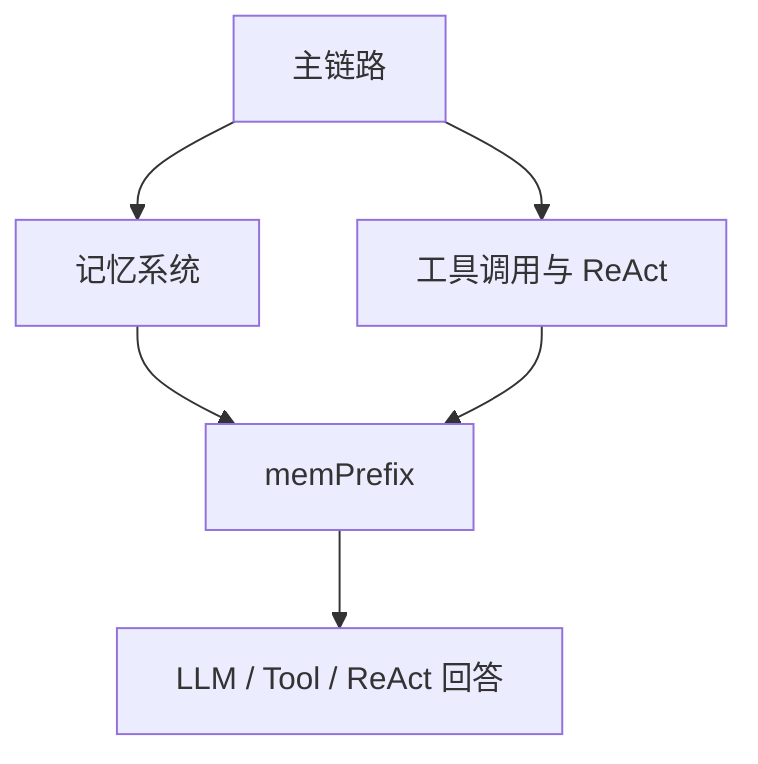

# AGI-saber 教程总目录

## 1. 这个目录是干什么的

这个目录把 AGI-saber 的学习文档按面试学习顺序整理成 4 个模块：

```text
主链路
记忆系统
工具调用与 ReAct
学习路线和总览
```

建议不要从源码随机看。

先按主链路建立全局理解，再深入记忆系统和工具调用。

---

## 2. 推荐学习顺序

### 第一步：主链路教学

路径：

```text
01-主链路教学/
```

目标：

```text
搞清楚一条用户请求从 Controller 进入后，怎么经过 UnifiedAgentService、短期记忆、memPrefix、路由判断、chat/tool/react/rag，最后生成回答。
```

先看重点：

```text
00-主链路学习路线.md
02-一次请求完整时序图.md
09-chatStream主流程.md
11-memPrefix上下文构建.md
12-路由判断-chat-tool-react-rag.md
21-完整例子跑一遍.md
22-主链路常见面试题.md
```

### 第二步：记忆系统完整教学

路径：

```text
02-记忆系统/01-完整教学版/
```

目标：

```text
系统理解短期记忆、偏好记忆、长期记忆、图记忆、MemoryWriter、consolidation、最终一致。
```

先看重点：

```text
00-记忆系统学习路线.md
03-记忆类型总览-短期偏好长期图记忆.md
12-LLM异步偏好抽取-runAsyncPreferenceExtraction.md
19-长期记忆召回-recall.md
26-图记忆召回-邻居扩展.md
31-Consolidation去重合并过期规则.md
32-记忆系统完整例子跑一遍.md
33-记忆系统常见面试题.md
```

### 第三步：工具调用与 ReAct

路径：

```text
03-工具调用与ReAct系统/01-完整教学版/
```

目标：

```text
搞清楚 Tool 对象、工具库 Map<String, Tool>、ToolCallResult、单工具调用、偏好补参、Planner、TaskGraph、GraphRuntime、ReAct。
```

先看重点：

```text
00-工具调用与ReAct学习路线.md
01-UnifiedAgentService-processInternal.md
12-ToolModeHandler-run.md
13-ToolService-decide.md
14-PreferenceFiller-fill.md
15-tool-getExecute-apply.md
17-ReActLoop-runStream.md
24-GraphRuntime-execute.md
32-完整例子一-上海天气怎么样.md
33-完整例子二-天气加搜索从头跑一遍.md
34-面试总结.md
```

### 第四步：记忆系统快速复习

路径：

```text
02-记忆系统/02-快速复习版/
```

目标：

```text
面试前 30 到 60 分钟快速过重点和坑点。
```

先看重点：

```text
00-记忆系统一页总览.md
01-一轮对话完整链路.md
04-长期记忆写入时机-两条异步路径.md
08-面试高频问答速背.md
09-最容易说错的点.md
```

---

## 3. 三个模块之间的关系



说明：

```text
主链路是总入口。
记忆系统负责提供上下文。
工具调用与 ReAct 负责外部能力调用。
```

---

## 4. 面试前最短复习路线

如果时间很少，只看这些：

```text
01-主链路教学/21-完整例子跑一遍.md
01-主链路教学/22-主链路常见面试题.md
02-记忆系统/02-快速复习版/08-面试高频问答速背.md
02-记忆系统/02-快速复习版/09-最容易说错的点.md
03-工具调用与ReAct系统/01-完整教学版/34-面试总结.md
```

---

## 5. 需要背下来的总说法

```text
这个项目我会按主链路讲。用户请求进入 Controller 后，会交给 UnifiedAgentService 统一处理。系统先写短期记忆，再构造 memPrefix 和 histMsgs；memPrefix 包含偏好和长期/图记忆召回结果，histMsgs 是最近聊天历史。之后 ChatRouter 判断走 chat、tool、react 还是 rag。普通 chat 直接调用 LLM，tool 模式调用单个工具，react 模式可以多轮规划和调用工具，rag 模式走知识库检索。回答后再写 assistant 短期记忆，并异步通过 MemoryWriter 写长期记忆，后台 consolidation 做去重、合并和过期清理。
```
